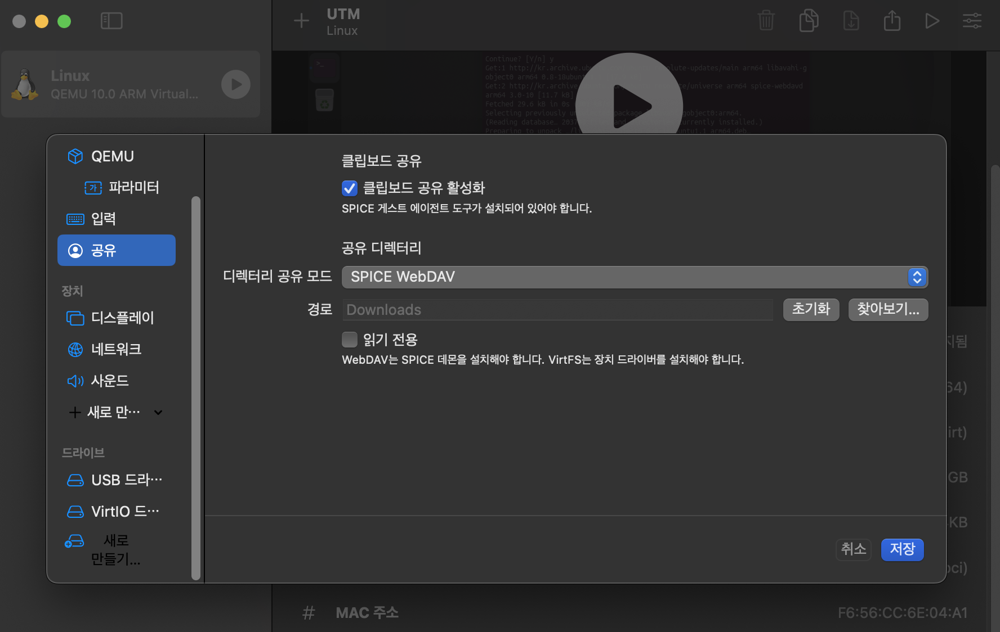

In this post, ros lecture 1 is introduced.


# Linux Installation on Mac

ROS2는 내부적으로 프로세스 생성, 스레드 관리, 공유 메모리, 네트워크 통신, 파일 시스템, 장치 접근 등을 모두 **Linux 커널을 기준으로 개발**했다. (22.04 버전이어야 한다.)

즉 ROS2 개발자는 "이 기능은 Linux 커널에 있으니까 이 시스템 콜을 쓰자." 라고 코드를 작성한다. 그런데 macOS에는 그 Linux 기능이 없는 경우가 많습니다. 그래서 Ubuntu가 필요하다.

가상환경(UTM)은 **macOS 위에 가상의 컴퓨터를 만들어 그 안에서 Ubuntu 같은 다른 운영체제를 그대로 실행할 수 있게 해주는 프로그램**이다. 예를 들어 Ubuntu에서 `apt install ros2`를 실행하면, macOS가 이 명령을 Homebrew 명령으로 바꿔 실행하는 것이 아니라 **Ubuntu의 `apt`와 Linux 커널이 실제로 동작**하여 ROS2를 설치한다. 이 과정에서 Ubuntu가 메모리를 사용하거나 파일을 저장하려고 하면 UTM이 macOS의 실제 메모리와 디스크를 연결해 주고, Ubuntu는 자신이 실제 컴퓨터를 사용하고 있다고 인식한다. 즉, UTM의 역할은 Linux를 macOS로 번역하는 것이 아니라, Linux가 독립된 컴퓨터에서 실행되는 것처럼 가상 하드웨어(CPU, RAM, 디스크 등)를 제공하는 것이다.

Linux 커널은 원래 "디스크에 저장해.", "네트워크 카드로 패킷 보내.", "메모리 할당해." 처럼 **하드웨어를 직접 제어**하려고 한다. 하지만 실제 하드웨어는 macOS가 이미 사용하고 있으므로 Linux가 직접 접근할 수 없습니다. 그래서 UTM이 중간에서

```scss
Linux
  │
  ├── "디스크에 저장!"
  ▼
UTM
  │
  ├── macOS에게 파일 저장 요청
  ▼
실제 SSD
```

처럼 **가상의 디스크·메모리·네트워크 장치**를 제공하고, Linux의 요청을 macOS를 통해 실제 하드웨어에 전달한다.

❓"디스크 컨트롤러의 레지스터 0x1234에 값을 써라." 이런것도 결국 cpu명령어로 바뀌어서 전달되니까 cpu가 그냥 실행하면 모르는거 아님?

**CPU 자체는 그 명령이 macOS용인지 Linux용인지 모릅니다.** 그냥 기계어를 실행합니다. 다만 CPU에는 **현재 실행 권한과 메모리·장치 접근 규칙**이 설정되어 있어서, 아무 명령이나 그대로 허용하지는 않습니다.

예를 들어 Linux 커널이 실제 디스크 장치의 레지스터에 쓰려고 하더라도, VM 안에서 보이는 `0x1234`는 보통 **Mac의 실제 디스크 레지스터 주소가 아니라 UTM이 만들어 놓은 가상 장치의 주소**입니다.

CPU가 해당 명령을 실행하다가 가상 장치 접근을 감지하면, 하드웨어 가상화 기능이 실행을 잠시 멈추고 **UTM 또는 macOS의 하이퍼바이저로 제어를 넘깁니다.** UTM은 그 요청을 해석해서 실제 SSD를 직접 조작하는 대신, macOS에 있는 가상 디스크 파일에 데이터를 기록합니다.

Linux Ubuntu Desktop을 다운로드하여 UTM에서 설치 및 실행 후, `spice-webdavd` 를 설치한다. Mac의 특정 폴더 (공유 디렉터리 설정시 설정)와 Ubuntu 사이에서 파일 공유를 위한 프로그램이다. 



