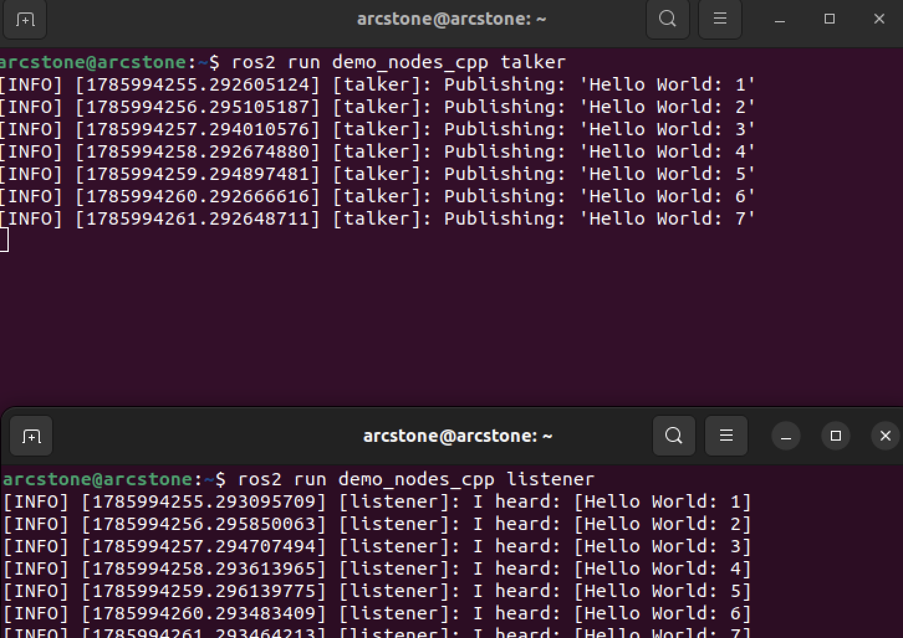
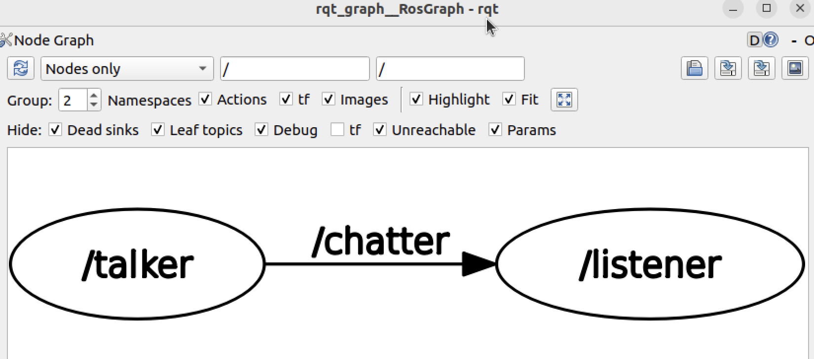
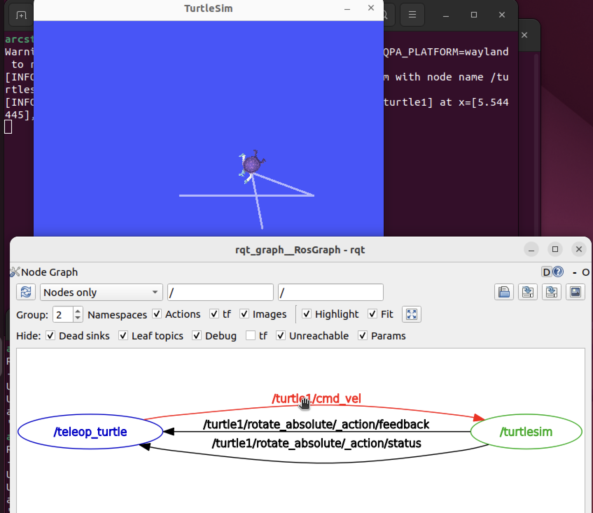

In this post, ros lecture 2 is introduced.


# ROS2 Node

다음 ros2 터미널 명령어를 보자.

```bash
ros2 run demo_nodes_cpp talker
ros2 run demo_nodes_cpp listener
rqt_graph
```

- `ros2 run` : ROS2 패키지 안에 있는 실행 파일을 실행하는 명령어
- `demo_nodes_cpp` : 패키지 이름
- `talker`, `listener` : 실행할 노드 (프로그램) 이름
  - talker는 `/chatter` 라는 토픽에 메시지를 publish 하고, listener는 `/chatter`를 subscribe 중이며, 메시지를 받아 화면에 출력한다. (토픽에 대해서는 나중에 다룬다)
  - 
- `rqt_graph` : ROS2에서 노드들이 어떤 토픽으로 연결되어 있는지를 그래프로 보여주는 gui 프로그램이다.
  - 

다음 터미널 명령어를 보자.

```bash
ros2 run turtlesim turtlesim_node
ros2 run turtlesim turtle_teleop_key
```

- `turtlesim_node` : 거북이를 관리하는 노드
- `turtle_teleop_key` : 키보드 입력 노드
  - 사용자가 방향 키를 누르면 telop 노드가 속도와 각도에 관한 메시지를 토픽에 보내면 turtlesim은 이 메시지를 받아 새로운 위치를 계산한 뒤 화면에 그린다.
  - 


