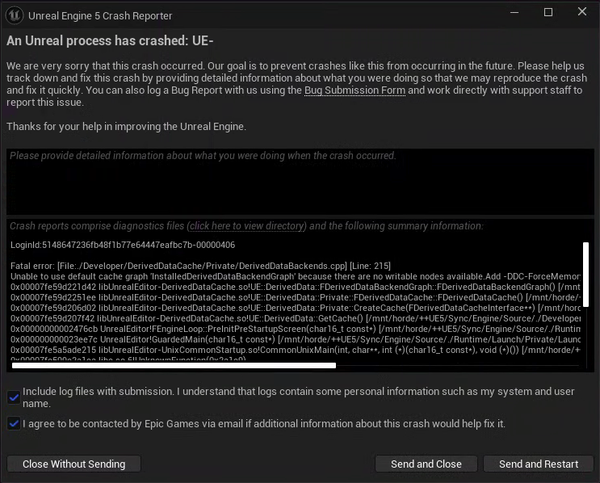

In this post, process of Fixing Unreal Engine Crashes is shown.


# Symtoms

Unreal Editor 아이콘을 눌러 실행하면 다음과 같은 에러와 함께 프로그램이 실행되지 않는다.

```bash
Unable to use default cache graph 'InstalledDerivedDataBackendGraph' because there are no writable nodes available.Add -DDC-ForceMemoryCache to the command line to bypass this if you need access to the editor settings to fix the cache configuration.
```





# Cause

Unreal이 실행되면서 셰이더, 에셋 변환 결과 같은 임시 데이터를 저장할 **쓰기 가능한 DDC 디렉터리를 하나도 찾지 못해서 시작 단계에서 죽은 것**이다. DDC는 Unreal이 생성된 데이터를 캐싱해서 다음 실행을 빠르게 하는 저장소이다. (캐시 데이터가 실제로 저장된 위치는 `~/.cache/Epic/UnrealEngine/Common/DerivedDataCache/` 와 같은 곳이다.) 


# Solution

당장 해결하려면 에러 메시지가 알려주는 해결책처럼 아래와 같이 실행하면 된다.

```bash
/opt/unreal/UE_5.7/Engine/Binaries/Linux/UnrealEditor \
-DDC-ForceMemoryCache
```

이 명령은 **Unreal Editor를 실행하되, 디스크의 DDC 대신 메모리(RAM) 캐시를 강제로 사용해서 실행하라**는 뜻이다. 다만 **임시 우회책**에 가깝다. 프로세스를 종료하면 메모리 캐시는 사라지므로 다음 실행 때 shader 등의 derived data를 다시 만들어야 해서 느려질 수 있다.

따라서 지금 상황에서는 **이 옵션으로 Unreal이 켜진다는 사실 자체가 "DDC의 디스크 저장 경로/쓰기 권한 쪽에 문제가 있다"는 강한 단서**이다. 


지금처럼 여러 Linux 계정이 같은 서버에서 Unreal을 사용하는 환경이면, Unreal의 DDC 폴더가 **다른 사용자 소유로 생성됐거나 현재 계정이 쓸 수 없는 위치로 지정되어 있을 가능성**이 큽니다.

`BaseEngine.ini`는 **Unreal Engine 자체의 기본 설정값들이 들어 있는 텍스트 설정 파일**이다. 아래 명령어를 통해 Unreal의 Installed DDC가 어떤 구조로 설정되어 있는지 확인한다.

```bash
grep -n -A 30 '\[InstalledDerivedDataBackendGraph\]' \
/opt/unreal/UE_5.7/Engine/Config/BaseEngine.ini
```

- `grep`: 파일에서 문자열 검색

- `-n`: 검색 결과에 **줄 번호(line number)**도 출력

- `-A 30`: 일치한 줄 **After 30**, 즉 그 뒤 30줄까지 같이 출력

- `'\[InstalledDerivedDataBackendGraph\]'`: 정확히 `[InstalledDerivedDataBackendGraph]`가 있는 줄 검색 (`[`와 `]`는 정규식에서 특별한 의미가 있어서 `\[` `\]`로 escape한 것입니다.)

- 마지막 경로: 검색 대상인 Unreal의 `BaseEngine.ini`

다음과 같은 결과가 나왔다. 

```bash
2760 - Local=(Type=FileSystem, DeleteOnly=true, UnusedFileAge=8,
Path="%ENGINEVERSIONAGNOSTICUSERDIR%DerivedDataCache",
EnvPathOverride=UE-LocalDataCachePath,
EditorOverrideSetting=LocalDerivedDataCache)
...
2767 - ZenLocal=(Type=Zen, ServerID=Local)
```

`DeleteOnly=true` 인 것으로 보아, 여기의 `Local` 노드는 **쓰기용이 아닙니다.** 삭제/정리용으로만 취급됩니다. 그래서 실제 writable cache는 보통 `ZenLocal=(Type=Zen, ServerID=Local)` 이다. 따라서 현재 에러: there are no writable nodes available는 상당히 높은 확률로 **ZenLocal이 정상적으로 뜨지 못해서 writable backend가 하나도 남지 않은 상황**입니다.

이제, 다음 명령어를 실행하여 `BaseEngine.ini` 전체에서 Local DDC / Zen 관련 줄을 찾는다. 

```bash
grep -nEi 'LocalDataCache|DerivedDataCache|Zen' \
/opt/unreal/UE_5.7/Engine/Config/BaseEngine.ini
```

다음과 같은 결과가 나왔다.

```bash
2658:[Zen.AutoLaunch]
2659-DataPath=%ENGINEVERSIONAGNOSTICINSTALLEDUSERDIR%Zen/Data
```

즉 문제는 **이 매크로가 풀린 실제 디렉터리에 현재 계정이 쓸 수 있느냐**입니다. `~/.cache/UnrealEngine`이 핵심이 아닐 가능성이 큽니다.

한편 현재 설정을 보면 구조는 명확합니다. 

```scss
InstalledDerivedDataBackendGraph
        │
        ├─ Local
        │    └─ DeleteOnly=true
        │       → 쓰기용 아님
        │
        └─ ZenLocal
             │
             └─ ServerID=Local
                    │
                    ↓
              [Zen.AutoLaunch]
                    │
                    ↓
%ENGINEVERSIONAGNOSTICINSTALLEDUSERDIR%Zen/Data
```

- `ZenLocal` : Unreal의 DDC 설정에서 "로컬 Zen 서버를 사용하는 캐시 노드"에 붙인 이름
- `Zen` : 실제로 실행되는 저장 서버 프로그램/시스템
- "`ZenLocal`이라는 DDC 노드는 로컬 Zen 서버를 사용해라. 그 로컬 Zen 서버는 `[Zen.AutoLaunch]` 설정에 따라 Unreal이 자동 실행하고, 캐시 데이터는 `DataPath`에 저장해라."

따라서 현재 크래시는 사실상: **ZenLocal이 writable한 로컬 캐시로 올라와야 하는데, Zen 실행 또는 Zen DataPath 접근에 실패해서 writable DDC가 0개가 된 것**


이제, Unreal을 실행하며 **Zen이 왜 실패하는지 로그를 확인**하기 위해 다음 명령어를 실행한다.

```bash
/opt/unreal/UE_5.7/Engine/Binaries/Linux/UnrealEditor \
-DDC-ForceMemoryCache \
-log 2>&1 | tee /tmp/unreal-ddc.log
```

- `-log` : Unreal의 로그 출력을 활성화한다.
- `2>&1` : 에러 출력(stderr, 2)을 일반 출력(stdout, 1)으로 합친다. 따라서 정상 로그와 에러 로그를 모두 뒤의 `tee`로 보낼 수 있습니다.

- `|` : 왼쪽 명령의 출력을 오른쪽 명령의 입력으로 전달합니다.

- `tee /tmp/unreal-ddc.log` : 로그를 **터미널 화면에도 보여주면서 동시에 `/tmp/unreal-ddc.log`에 저장**합니다.

그리고 다른 터미널에서 다음 명령어를 실행한다. 이건 방금 저장한 엄청 긴 Unreal 로그에서 **DDC 문제와 관련 있을 만한 줄만 골라내는 명령어**입니다.

```bash
grep -Ei 'Zen|DerivedDataCache|DataPath|writable|permission|cache' \
/tmp/unreal-ddc.log
```

- `grep`: 텍스트 검색
- `-E`: 확장 정규식 사용 (`|`를 OR 조건으로 사용하기 위함)
- `-i`: 대소문자 무시
- `'Zen|DerivedDataCache|...'` : Zen **또는** DerivedDataCache **또는** DataPath ... 가 들어간 줄 검색
- `/tmp/unreal-ddc.log` : 검색할 파일


로그상, `/home/arcstone/.config/Epic/UnrealEngine/Common/Zen/Data` Unreal은 현재 계정 홈에 설치된 `zenserver`를 실행하고 있습니다. 그런데 바로 다음에 다음이 반복된다.

```bash
Failed waiting for named event ... (err: 4)
Failed launch service ... zenserver ... on port 8558
```

즉 흐름이 

```scss
Unreal 실행
   ↓
ZenLocal DDC 필요
   ↓
arcstone의 zenserver 실행 시도
   ↓
❌ Zen Server 시작 실패
   ↓
writable DDC 없음
   ↓
Fatal error
```

이제 **Unreal 말고 Zen 자체를 직접 실행해서 왜 죽는지** 봐야 한다. 다음을 실행한다.

```bash
/home/arcstone/.config/Epic/UnrealEngine/Common/Zen/Install/zenserver \
--port 8558 \
--data-dir /home/arcstone/.config/Epic/UnrealEngine/Common/Zen/Data
```


출력을 보니 `Failed to create mutex 'zen_8558': Permission denied (13)`  **DDC 폴더의 쓰기 권한 문제가 아니었습니다.** Zen이 Linux에서 mutex를 만드는 단계에서 권한 문제로 죽고 있습니다.

```scss
Unreal
  ↓
Zen Server 실행
  ↓
zen_8558이라는 프로세스 간 mutex 생성 시도
  ↓
❌ Permission denied
  ↓
Zen 종료
  ↓
writable DDC 없음
  ↓
Unreal Fatal Error
```

📝 **IPC, mutex**

**IPC**는 운영체제가 **프로세스끼리 데이터를 주고받거나 서로 상태를 맞출 수 있는 방법**을 통칭한다. 대표적으로 다음이 있다.

- **Pipe**: 한 프로세스의 출력을 다른 프로세스에 전달
- **Socket**: 프로세스끼리 데이터 통신
- **Shared Memory**: 특정 메모리 영역을 여러 프로세스가 같이 사용
- **Semaphore / Mutex**: 여러 프로세스가 동시에 같은 자원을 건드리지 않도록 동기화

여기서 바로 `chmod`하지 말고 **mutex가 어디에 생성되는지**를 확인하기 위해 다음 명령어를 실행한다.  

```bash
strace -f -e trace=file \
/home/arcstone/.config/Epic/UnrealEngine/Common/Zen/Install/zenserver \
--port 8558 \
--data-dir /home/arcstone/.config/Epic/UnrealEngine/Common/Zen/Data \
2>&1 | grep -E 'EACCES|EPERM|zen_8558|UnrealEngineZen'
```

- `strace` : `strace`는 **프로그램이 Linux 커널에 요청하는 system call을 감시**하는 프로그램입니다.
- `-f` : `zenserver`가 **자식 프로세스/스레드를 생성하더라도 그것까지 따라가며 추적**합니다.
- `-e trace=file` : 모든 system call을 보면 출력이 엄청 많습니다. **파일 경로와 관련된 syscall만 중심적으로 추적**합니다.
- `/home/arcstone/.config/Epic/UnrealEngine/Common/Zen/Install/zenserver` : `strace`가 감시하면서 실행할 대상.
- `--port 8558` :  즉 Zen 서버가 사용할 포트를 `8558`로 지정합니다.
- `--data-dir ...` : Zen이 데이터를 저장할 디렉터리를 명시적으로 지정합니다.
- `EACCES` : Permission denied, `EPERM` : Operation not permitted

```bash
openat(..., "/tmp/zen_8558", O_RDWR|O_CLOEXEC) = 12

openat(..., "/tmp/zen_8558",
       O_RDWR|O_CREAT|O_CLOEXEC, 0666)
= -1 EACCES (Permission denied)
```

즉 Zen이 사용하는 mutex 파일은 `/dev/shm`이 아니라 `/tmp/zen_8558` 

가장 유력한 건 `/tmp/zen_8558`이 **다른 사용자 소유로 이미 존재하는 경우**입니다.

```scss
다른 Linux 사용자
    ↓
Zen 실행
    ↓
/tmp/zen_8558 생성
    ↓
arcstone이 Unreal 실행
    ↓
동일한 zen_8558 사용 시도
    ↓
Permission denied
    ↓
ZenLocal 실패
    ↓
DDC writable node 없음
    ↓
Unreal crash
```

다음 명령어를 실행한다. 

```bash
ls -la /tmp/zen_8558
stat /tmp/zen_8558
ls -ld /tmp
```

결과는 다음과 같다.

```scss
/tmp/zen_8558

owner = cutegorilla
group = cutegorilla
mode  = 0666 (-rw-rw-rw-)
```

그리고 `/tmp` 자체는 정상입니다.

```
drwxrwxrwt root root /tmp
```

또 현재 `ps` 결과상 **실행 중인 `zenserver`나 `UnrealEditor`도 없습니다.**

그런데 왜 `0666`인데 Permission denied냐면, `strace`에서 Zen이 기존 파일을 읽는 첫 번째 `open`은 성공했지만:

```
open("/tmp/zen_8558", O_RDWR) = 성공
```

이후 `O_CREAT`를 포함해 다시 열 때 실패했습니다.

```
open("/tmp/zen_8558", O_RDWR|O_CREAT, 0666)
= EACCES
```

이 패턴은 Ubuntu의 `/tmp`에 적용되는 **protected regular files 보안 설정(`fs.protected_regular`)**과 잘 맞습니다. Sticky-bit 디렉터리(`/tmp`)에서 **다른 사용자가 소유한 기존 파일을 `O_CREAT`로 여는 것을 커널이 막을 수 있습니다.** Ubuntu에서는 보통 `/tmp`처럼 **sticky bit가 설정된 world-writable 디렉터리**에서 다른 사용자가 소유한 기존 regular file을 `O_CREAT`를 포함하여 여는 행위를 제한합니다.

```scss
cutegorilla가 예전에 Unreal 실행
        ↓
/tmp/zen_8558 생성
        ↓
Zen 종료됐지만 파일은 남음
        ↓
arcstone이 Zen 실행
        ↓
똑같은 /tmp/zen_8558 사용
        ↓
파일 owner가 cutegorilla
        ↓
O_CREAT 접근 차단
        ↓
Permission denied
        ↓
Zen 실행 실패
        ↓
DDC 없음 → Unreal crash
```

현재 `ps`상 Zen/Unreal이 아무도 실행 중이지 않으므로, **stale 파일을 지우는 게 해결책**입니다. 다만 `arcstone` 소유가 아니기 때문에 일반 `rm`은 `/tmp`의 sticky bit 때문에 안 될 겁니다. 관리자에게 다음 파일 하나만 삭제해달라고 하면 됩니다.

```bash
sudo rm /tmp/zen_8558
```

`sudo` 권한이 없다면 **직접 삭제할 수 없습니다.** 파일 소유자인 `cutegorilla` 계정에서도 삭제 가능하다.

```bash
rm /tmp/zen_8558
```

**주의:** 지금은 다른 Zen/Unreal 프로세스가 없다는 걸 확인했으니 stale 파일 삭제가 합리적이지만, 앞으로 다른 사용자가 Unreal을 실행 중일 때 이 파일을 무조건 지우면 안 됩니다.

그리고 이 서버는 **여러 Linux 계정이 동일한 Zen port `8558`과 `/tmp/zen_8558`을 공유하면서 같은 문제가 재발할 가능성**이 있습니다. 이번에 실행되는 것까지 확인되면, 다음으로는 사용자별 Zen 충돌을 어떻게 피할지 잡는 게 좋습니다.


Epic 문서까지 확인해보니 Zen AutoLaunch 설정 자체에는 `DesiredPort`라는 포트 설정이 존재합니다. 그리고 8558은 Zen의 기본 포트입니다. 

가장 안전한 테스트는 **공용 `/opt/unreal/.../BaseEngine.ini`를 건드리지 않고**, 네 프로젝트의 `Config/DefaultEngine.ini`에 사용자 테스트용으로 `[Zen.AutoLaunch]` 설정을 덮어쓰는 것입니다. Epic 문서에서도 `[Zen.AutoLaunch]`를 프로젝트의 `DefaultEngine.ini`에서 override하는 방식을 공식적으로 사용합니다. 

다만 여기서 중요한 점이 있습니다. Epic API 문서에는 내부 필드 이름이 `DesiredPort`라고 나오지만, **INI에서 정확히 어떤 키 이름으로 지정해야 하는지 현재 문서만으로는 확정할 수 없습니다.** 그래서 섣불리 `Port=8559` 같은 걸 넣으라고 하면 안 됩니다.

대신 먼저 **네 UE 5.7 바이너리가 지원하는 명령행 포트 override가 있는지** 직접 확인하는 게 안전합니다. 아무것도 수정하지 않는 조회입니다.

```bash
strings /opt/unreal/UE_5.7/Engine/Binaries/Linux/libUnrealEditor-Zen.so \
| grep -Ei 'DesiredPort|Zen.*Port|Port.*Zen' \
| head -50
```


```bash
_ZN2UE3Zen19FZenServiceInstance19GetAutoLaunchedPortEv
DesiredPort
```

이 결과에서 **UE 5.7의 Zen 모듈 안에 실제로 `DesiredPort`라는 설정 키가 존재한다는 것**까지 확인됐어.

따라서 `/tmp/zen_8558`을 지우지 않고 먼저 **arcstone의 Zen만 다른 포트로 띄우는 실험**을 할 수 있어.

가장 안전하게는 Unreal 설정조차 건드리지 말고 **Zen 자체를 8559로 직접 실행**해보자. 이건 다른 사용자에게 영향이 없다.

```bash
/home/arcstone/.config/Epic/UnrealEngine/Common/Zen/Install/zenserver \
--port 8559 \
--data-dir /home/arcstone/.config/Epic/UnrealEngine/Common/Zen/Data
```


```bash
ls -l /tmp/zen_8558 /tmp/zen_8559
ss -ltnp | grep ':8559'
```


결과 **Zen 자체에는 아무 문제가 없고, 8558의 다른 사용자 소유 mutex 파일과 충돌한 게 원인**이라는 게 확실해졌어.

```bash
/tmp/zen_8558 → cutegorilla 소유
/tmp/zen_8559 → arcstone 소유

*:8559 → LISTEN 중
```

그런데 **바로 설정 파일을 수정하기 전에**, UE 5.7이 `DesiredPort`를 어느 INI section에서 읽는지 정확히 확인하자. `strings`에서 `DesiredPort`가 존재한다는 것까진 확인했지만, 이것만으로 `[Zen.AutoLaunch] DesiredPort=8559`라고 단정하면 안 돼.

UE 설치에 소스/설정 문자열이 있는지 다음으로 찾아봐.

```bash
grep -Rni --include='*.ini' --include='*.cpp' --include='*.h' \
'DesiredPort' \
/opt/unreal/UE_5.7/Engine 2>/dev/null | head -50
```


```bash
ReadUInt16FromConfig(
    AutoLaunchConfigSection,
    TEXT("DesiredPort"),
    AutoLaunchSettings.DesiredPort,
    GEngineIni
);
```

좋아. 이 결과로 **`DesiredPort`가 실제로 UE 5.7에서 읽히는 설정값이라는 건 확정**됐어. 즉 Unreal이 `GEngineIni`에서 `DesiredPort`를 읽는다. 이제 딱 하나만 더 확인하면 돼: **`AutoLaunchConfigSection`이 정확히 어떤 섹션 이름인지**.

```bash
grep -n 'AutoLaunchConfigSection' \
/opt/unreal/UE_5.7/Engine/Source/Developer/Zen/Private/ZenServerInterface.cpp \
| head -20
```

확인됐어. 정확히: 

```bash
const TCHAR* AutoLaunchConfigSection = TEXT("Zen.AutoLaunch");
```

이고,

```bash
ReadUInt16FromConfig(
    AutoLaunchConfigSection,
    TEXT("DesiredPort"),
    AutoLaunchSettings.DesiredPort,
    GEngineIni
);
```

이므로 **`[Zen.AutoLaunch]`의 `DesiredPort`가 실제 Zen 포트를 결정**해.

이제 남은 문제는 `arcstone`에게만 적용할 설정 파일을 정확히 찾는 거야. 여기서 경로를 추측해서 만들지 말고, **Unreal이 현재 생성해 둔 사용자별 `Engine.ini`를 먼저 찾자.**

```bash
find "$HOME/.config/Epic" -type f -name '*.ini' \
-print 2>/dev/null | head -100
```

찾았어. 이 파일이 핵심 후보야:

```
/home/arcstone/.config/Epic/UnrealEngine/5.7/Config/DefaultEngine.ini
```

이건 `/home/arcstone` 아래에 있으므로 **arcstone 계정 전용 파일**이야. `/opt/unreal/.../BaseEngine.ini`를 수정하는 것과 달리 다른 Linux 계정의 설정에는 영향 주지 않아.

바로 수정하기 전에 백업하고 현재 내용을 확인하자.

```
cp ~/.config/Epic/UnrealEngine/5.7/Config/DefaultEngine.ini \
   ~/.config/Epic/UnrealEngine/5.7/Config/DefaultEngine.ini.bak
```

그다음:

```
grep -n -A 10 -B 2 '\[Zen.AutoLaunch\]' \
~/.config/Epic/UnrealEngine/5.7/Config/DefaultEngine.ini
```

아무것도 안 나오면 아래를 추가하면 돼.

```
cat >> ~/.config/Epic/UnrealEngine/5.7/Config/DefaultEngine.ini <<'EOF'

[Zen.AutoLaunch]
DesiredPort=8559
EOF
```

추가됐는지:

```
tail -10 ~/.config/Epic/UnrealEngine/5.7/Config/DefaultEngine.ini
```

그러면 끝부분에:

```
[Zen.AutoLaunch]
DesiredPort=8559
```

가 보여야 해.

그 상태에서 **`/tmp/zen_8558`은 삭제하지 말고** Unreal을 평소대로 실행해.

```
/opt/unreal/UE_5.7/Engine/Binaries/Linux/UnrealEditor -log
```

이번에는 `-DDC-ForceMemoryCache`도 붙이지 마.

터미널 로그에서 확인할 것은:

```
# Unreal을 실행한 터미널 로그에서
# "port 8559"가 나오는지 확인
```

또 다른 터미널에서:

```
ss -ltnp | grep -E ':8558|:8559'
ls -l /tmp/zen_8558 /tmp/zen_8559
```

우리가 원하는 최종 상태는:

```
/tmp/zen_8558 → cutegorilla 소유 그대로
/tmp/zen_8559 → arcstone 소유

arcstone Unreal
     ↓
[Zen.AutoLaunch]
DesiredPort=8559
     ↓
ZenLocal
     ↓
localhost:8559
```

야.

**단, 먼저 `grep` 명령 결과를 보여줘.** 이미 `[Zen.AutoLaunch]` 섹션이 들어 있다면 새 섹션을 하나 더 추가하기보다 기존 섹션에 `DesiredPort=8559`만 넣는 게 더 깔끔해.

Unreal Editor를 실행하는 것은 성공했지만 프로젝트를 열면 다시 같은 문제가 발생했다. **사용자 설정의 `DesiredPort=8559`가 CycloEscapePOC (프로젝트 이름) 실행에는 적용되지 않은 것**이야. 그러면 프로젝트 설정 쪽을 8559로 지정해야 해.

```bash
/opt/unreal/UE_5.7/Engine/Binaries/Linux/UnrealEditor \
/home/arcstone/Desktop/robotescape/examples/unreal/CycloEscapePOC/CycloEscapePOC.uproject \
'-ini:Engine:[Zen.AutoLaunch]:DesiredPort=8559' \
-log
```

그래서 **파일을 더 건드리지 않고 가장 안전하게 해결하는 방법은 실행할 때 INI 값을 command line에서 덮어쓰는 것**이야. Unreal은 공식적으로 `-ini:<CATEGORY>:[SECTION]:KEY=VALUE` 형태의 command-line config override를 지원해. 즉 **CycloEscapePOC 프로젝트 쪽 설정이 8558을 다시 덮어쓰고 있을 가능성이 매우 높아.**


**문제 요약**

`/tmp/zen_8558` **자체가 포트도 아니고 서버도 아니야.** 포트 `8558`을 사용하는 Zen 인스턴스를 식별/동기화하기 위해 Zen이 사용하는 **파일 기반 mutex의 backing file**이라고 이해하면 돼.

그래서 8559로 바꾸니까 자동으로:

```
--port 8559
     ↓
mutex 이름 zen_8559
     ↓
/tmp/zen_8559
```

가 생긴 거고/

여러 Linux 계정이 `/tmp`는 공유해.

```
                 /tmp
                  │
        ┌─────────┴─────────┐
        │                   │
 cutegorilla             arcstone
 Unreal 실행             Unreal 실행
     │                       │
 Zen :8558               Zen :8558
     │                       │
     └────── 둘 다 ──────────┘
               ↓
        /tmp/zen_8558
```

그런데 먼저 실행했던 `cutegorilla`가:

```
/tmp/zen_8558
owner = cutegorilla
```

를 만들어 놓았어.

이후 `arcstone`의 Zen도 기본 포트가 8558이니까 **동일한 `zen_8558` mutex를 사용하려고 했고**, 거기서:

```
Failed to create mutex 'zen_8558':
Permission denied (13)
```

가 발생한 거야.


이렇게 해서 Unreal이 실행되지 않는 문제는 해결했으나, 조금만 사용하면 꺼지는 문제가 있었다.

```bash
/opt/unreal/UE_5.7/Engine/Binaries/Linux/UnrealEditor \
-log 2>&1 | tee ~/unreal_crash_watch.log
```


```bash
grep -Ein \
'Fatal|Error|GPU|Vulkan|Device Lost|VK_ERROR|Segmentation|Signal 11|Out of memory|OOM|ensure|assert' \
~/unreal_crash_watch.log | tail -100
```

