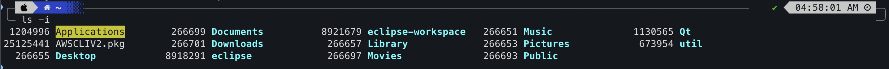
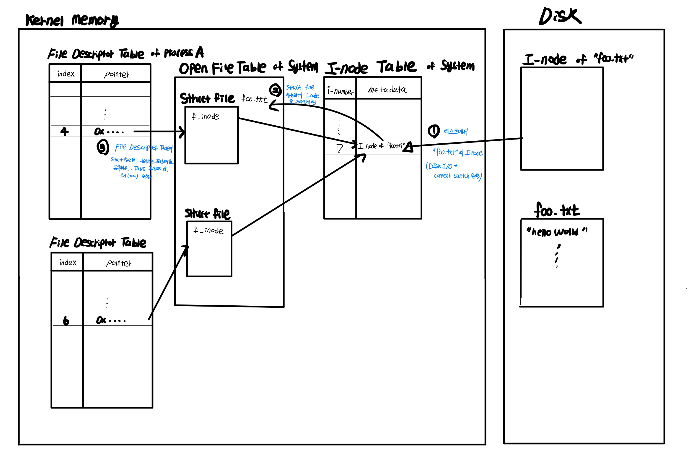
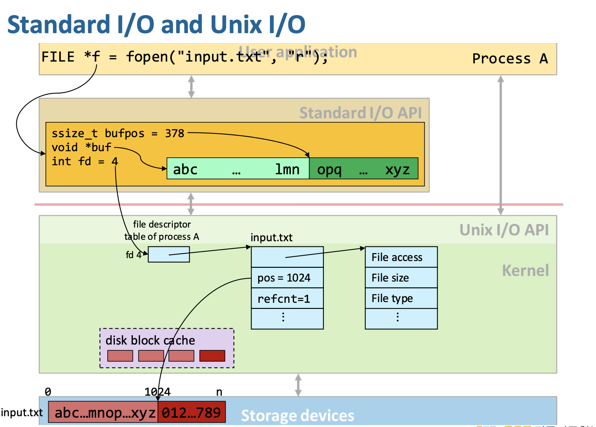
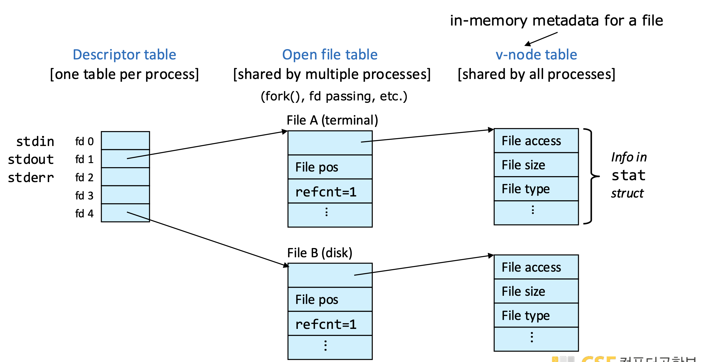
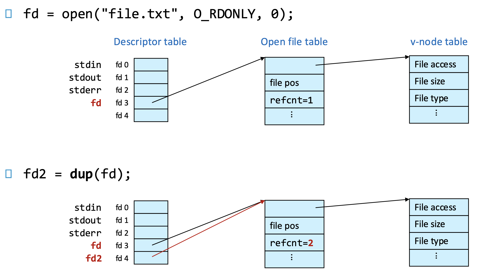
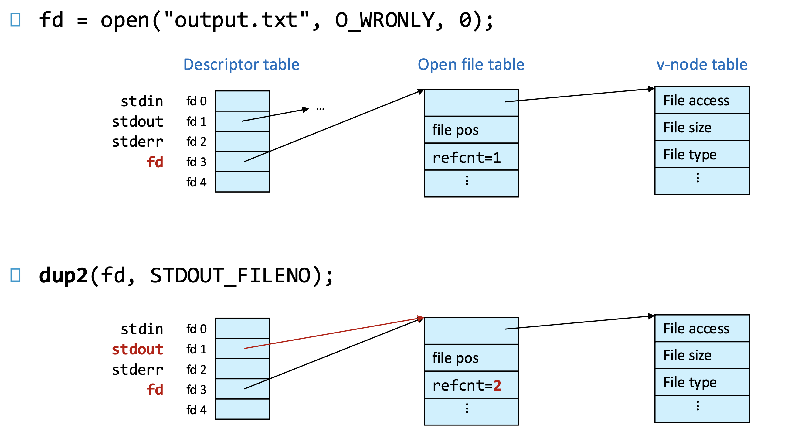

In this post, 04~06 System Programming lecture is introuduced. 


# Unix Filesystem Concepts

Unix system 에서는 모든 것이 file로써 다루어진다. Unix File Type에는 다음이 있다. 

- **Regular File** 
- **Directory File** 
- **Device File**
- **FIFO**
- **Socket**


각 파일들은 위와 같이 특정 user 와 group에 의해 소유되어 있다.

## Directory File

Directory file은 다음의 정보를 담고 있다. 

- names : 해당 directory 안에 있는 file들의 이름

- i-number : 해당 directory 안에 있는 각 file들에 대해, file들의 i-node index.

  - i-node란 file에 관한 여러 정보(metadata)를 저장하고 있는 자료구조이다. 파일 유형(일반 파일, 디렉터리, 링크 등), 접근 권한(`rwx`), 소유자/그룹(UID, GID), 파일 크기, 생성/수정/접근 시간(`ctime`, `mtime`, `atime`), 데이터 블록 포인터 (실제 데이터가 저장된 디스크 블록의 주소), 링크 개수 등의 정보를 저장한다. 

  - i-node에는 file의 name과, 실제 데이터는 저장하지 않는다. 

  - `ls-i` 명령어를 입력하면, 현재 디렉터리 안에 있는 각 file들에 대한 i-number를 보여준다. i-number는 i-node 테이블(i-node table)에서 i-node를 식별하는 인덱스로서 이용된다. 

    

## Unix I/O

c 프로그램에서 다음의 코드가 실행되었을 때 어떤일이 일어나는지 알아보자. 

```c
// pwd : ~/Systemprogramming
int fd = open("foo.txt", O_RDONLY);
ssize_t n = read(fd, userbuf, count);
close(fd);
```

- open() 함수는 glibc 에서 유저가 그 구현을 확인할 수 있는 함수로, 내부적으로 syscall() 함수를 호출한다. syscall() 함수까지도 glibc에서 유저가 그 구현을 확인할 수 있는 함수로, 해당 함수는 직접적으로 cpu의 `syscall` 명령어를 수행한다. 
- open() 의 결과로 system call이 발생하면, system call은 trap이므로, CPU는 특정 예외 벡터 주소로 PC를 변경한다. 이 예외 벡터 주소에는 OS 커널의 예외처리 루틴 코드(이 경우 `sys_read()`의 시작 위치가 들어 있음). 
- 커널 메모리 영역에 각 프로세스의 현재 디렉터리(~/SystemProgramming)의 i-node에 대한 포인터가 저장되어 있다. 이를 이용해 디렉터리의 i-node에 접근하면(디렉터리의 i-node는 디스크에서 inode cache로 이미 캐싱되어 있다고 가정하자) 디렉터리의 컨텐츠의 주소를 알 수 있으므로 컨텐츠를 읽어 "foo.txt"의 i-number를 알아낸다. 이 i-number가 5172라 해보자. 커널은 inode cache에서 5172를 검색한다(시스템 전체에서 i-number가 unique 하지는 않다, 추가로 다른 값을 이용한다, 여기선 설명 생략). 없다면, 디스크에서 해당 inode 블록을 읽어와(이 때, 디스크 I/O에 따른 context switch가 일어날 수 있다) **struct inode** 를 생성하여 I-node table에 등록한다.(아래 그림 1️⃣)
- 프로세스마다, 커널 메모리 영역에 **File Descriptor Table**이 존재한다. `sys_read` 파일 상태를 관리하는 커널 내부 구조체(`struct file`)을 생성한다.(아래 그림 2️⃣) 그리고 File Descriptor Table에 이 구조체를 가리키는 포인터를 등록하고, Table의 인덱스 값에 해당하는 **fd**를 유저에게 반환한다.(아래 그림 3️⃣)
- 이제 두 번째 줄의 read() 함수를 실행하면, 마찬가지로 CPU가 syscall 명령을 통해 커널 모드로 전환되어 `sys_read()` 함수로 진입한다. 커널은 현재 프로세스의 File Descriptor Table을 참조하고 fd 인덱스를 통해,  `struct file *file` 포인터를 얻는다. `file->f_inode` 와 `file->f_pos`(현재 읽기 위치)를 확인한다. `file->f_inode` 가 가리키 inode 내부에는 실제 데이터 블록들의 디스크 주소가 기록되어 있다. 

- 커널은 먼저 **page cache (파일의 메모리 캐시)** 에 해당 파일의 데이터 블록이 이미 적재되어 있는지 확인한다. (명령어를 MMU를 통해 VA->PA로 변환하고 이 PA가 캐시에 있는지 확인하는 작업은 순수 하드웨어가 담당함을 <a href = "https://arcstone09.github.io/study/2025-06-21-ca-1"> 여기 </a> 에서 베웠다. 반편 파일의 디스크 블록의 경우에는 시스템콜 호출시 커널이 직접 수행한다.) 캐시에 없다면 디스크 I/O가 발생하여(커널이 Block device driver를 통해 I/O 요청을 보내고 쭉쭉 하드웨어 작업이 일어난다) 컨텍스트 스위치가 일어난다. 

- Page Cache에 "foo.txt"가 올라오면 커널은 page cache에 있는 데이터를 userbuf로 복사한다 (CPU의 `ld`, `sw` 의 조합으로 수행됨) 복사가 끝나면 `f_pos`(파일 오프셋)를 count만큼 증가시키고  실제로 읽은 바이트 수(`n`)를 리턴하고, CPU가 **커널 모드 → 유저 모드**로 복귀한다.



File Descriptor는 open file을 나타내는 하나의 프로세스 내에서 unique한 non-negative integer이다. 즉, process A의 fd=10과 process B의 fd=10은 다른 파일을 가리킨다. 각 프로세스는 시작 시점에 기본적으로 3개의 file descriptor를 갖는다. 

- 0 : STDIN_FILENO standard input
- 1 : STDOUT_FILENO standard output
- 2 : STDERR_FILENO standard error

STDIN, STDOUT, STDERR은 각각 fd 0, 1, 2에 붙여진 별칭이다. 기본적으로 이 fd가 가리키는 파일은 `/dev/tty` 이다. 새로 만들어진 파일의 fd는 smallest unused fd 값으로 배정된다. 

dev 디렉터리의 파일 내용은 디스크에 저장되어 있으며 거기에는 filename tty와 그 i-number가 저장되어 있을 것이다. i-number를 통해 얻은 tty의 i-node에는 일반 파일의 i-node와 다르게 데이터 블록 포인터 대신 major/minor 번호가 있다. read("input.txt")를 하면 디스크 I/O가 발생한다. 그러나 read("dev/tty") 하면 커널이 i-node를 보고 major=5, minor=0을 확인 후, 해당 번호에 등록된 tty 드라이버 함수를 호출한다. tty 드라이버는 실제 터미널 장치에서 데이터를 가져온다. 이때, 디스크 I/O가 아니라 드라이버(그리고 HW)에서 수행된다.

다음의 코드를 보자.

```c
char str[] = "Hello, world\n";
write(STDOUT_FILENO, str, strlen(str)); // sizeof가 아닌 Null을 포함하지 않는 strlen 써야함.

int fd = open("./output.txt", O_WRONLY|O_CREAT|O_APPEND, S_IRUSR|S_IWUSR|S_IRGRP|S_IROTH);
// 쓰기전용, 없으면 생성, 이어쓰기, rw-r--r-- 의미.
write(fd, str, strlen(str));
write(fd, "A", 1);
lseek(fd, 1024*1024, SEEK_SET);
write(fd, "B", 1);
```

file에 write을 하면, struct file에서 `f_pos` 가 업데이트 된다. `lseek`는 이 현재 포지션을 원하는 만큼 이동 시켜주는 함수인데, 1024*1024 만큼 포지션을 이동시키고 B를 적으면 A와 B사이 1MB 공간에는 실제로 디스크에 데이터가 저장되지 않는다. 이를 **hole** 이라고 한다. 

`lseek` 는 

**Short count**는 Unix I/O로 read/write를 수행할 때, 요청보다 적은 byte가 read/write 되었으나 에러가 발생하지 않은 경우를 의미한다. 다음의 상황들에서 발생할 수 잇다. 

- read 중 EOF에 도달했을 때
- 파일시스템 공간 부족하여 write가 일부만 기록
- 터미널 입력시 사용자가 엔터를 누르기 전까지 데이터가 일부만 들어옴
- 파이프(pipe)/소켓(socket) : 커널 버퍼에 지금 시점에서 일부 데이터만 존재
- 시그널/인터럽트 발생 : `read()`가 도중에 인터럽트돼 중단됨 (ex. Ctrl+C 신호)

요약하면 Unix I/O는 **리눅스 커널의 시스템콜(sys_read, sys_write 등)** 을 직접 래핑한 함수 집합이다. 즉, `read()` 를 호출하면 바로 커널에 `sys_read` 시스템콜이 발생한다.

## Standard I/O

위에서 알아본 바에 따르면 한번의 Unix I/O 함수 호출은 1번의 system call을 발생시킨다. system call은 많은 clock cycle을 소모하는 느린 작업이므로 이는 손해이다. 또한, string handling 과정도 번거롭다. **CHECK**

Standard I/O는 C 표준(`stdio.h`)의 I/O는 UNIX I/O 위에 만들어진 고수준 계층이다. 즉, 내부적으로는 `read()`와 `write()`를 사용하지만 사용자 입장에서는 버퍼링 + 포맷 기능을 제공한다.

다음 C 코드를 보자.

``` C
FILE *fp = fopen("foo.txt", "r");         
size_t n = fread(userbuf, 1, count, fp); 
fclose(fp);                               
```

- fopen() 함수는 먼저 FILE 구조체를 할당 및 초기화한다. 이 FILE 구조체는 유저 메모리 영역에 존재하며 유저 공간 버퍼의 정보를 가지고 있다. 기본 버퍼링 정책을 결정하는데, TTY에 연결된 stdout은 line-buffered, 일반 파일은 fully buffered, stderr은 unbuffered를 적용한다. 
- 이후 fopen() 은 내부에서 open() 함수를 실행하여 시스템 콜을 호출한다. 이 과정은 위와 같다. `FILE *fp` 는 반환된 fd를 내부적으로 보관한다. 
- 이제 fread()를 수행하면, 먼저 유저 내부 버퍼에 읽을 데이터가 남아 있는지 확인한다. 남아있다면 거기서 CPU `ld`, `sw` 명령어를 이용해 `userbuf` 로 내용을 복사하면 된다. 내부 버퍼가 부족/비어있으면, 버퍼 채우기(fill) 를 시도한다. 커널에 `read()` 시스템콜을 요청하여 위에서 정리한 것처럼 **page cache 조회 → 없으면 블록 I/O(DMA) → page cache 적재**를 수행한다. 이후 `copy_to_user()` 함수를 통해, 커널 메모리 영역의 데이터를 유저 공간 버퍼에 복사한다.  

- `read()`가 반환되면, `fread()`는 이 유저 공간 버퍼 중 일부를 사용자 인자가 넘겨준 `userbuf`로 복사해야 한다. 이 복사는 같은 유저 공간 안에서 일어나므로, 커널 보호 함수(`copy_to_user`)가 아니라 일반 `memcpy()`로 충분하다.

이제 3가지 buffering 방식에 대해서 알아보자. Standard I/O에서 printf()와 같이 쓰기와 관련된 함수를 수행하면, 유저 내부 버퍼에 내용이 저장된다. 유저 내부 버퍼에는 read/write 버퍼가 따로 존재한다. 이때, `fflush(stdout)` 을 해야 내부적으로 `write()` system call이 호출되어 stdout에 출력이 되게 된다. 이 때, 언제 flush 할 것인지에 대해 다음 3가지 방법이 있다.

- Fully buffered : 버퍼가 가득차야 flush가 일어난다. 파일에 출력시 기본 동작이다.

- Line buffered : 버퍼에 `\n`이 들어올 때마다 flush 한다. stdout에 출력시 기본 동작이다. 

  - input operation이 요청될 때, flush가 된다. 

    ```c
    printf("write your name: ");
    scanf("%s", name);
    ```

    위 코드에서 첫 줄만 있었다면 `\n` 이 없으므로 터미널에 출력되지 않을 수 있다. 하지만 뒤이어 입력함수를 호출하게 되면 line buffering인 경우 호출 전에 출력 버퍼를 자동으로 flush 하게 된다. 

- Unbuffered : 버퍼 없이 곧바로 출력한다. (즉, printf는 바로 write를 호출한다.) stderr에 출력시 기본 동작이다. (곧바로 출력한다는 것이 한 글자씩을 의미하는 것은 아니다.)

- 프로그래머는 `setvbuf()` 함수를 통해 특정 출력 스트림의 버퍼링 모드를 변경할 수 있다. 예를 들어, `setvbuf(stdout, NULL, _IONBF, 0);` 을 하면 stdout을 unbuffered로 전환하게 된다. Fully buffered는 `_IOFBF`, Line buffered는 `_IOLBF`, Unbuffered는 `_IONBF` 를 이용한다. 

- 기본적으로 버퍼가 가득차거나, 유저가 fflush를 호출하면 버퍼링 방식에 상관없이 flushing이 발생한다. 

다음은 몇가지 Unix I/O 함수들의 pseudo code이다. 

```c
FILE* fopen(char *path, char *mode){
  int fd = open(path, ...);
  if (fd == -1) return NULL;
  
  FILE *stream = malloc(sizeof(FILE));
  stream->fd = fd;
  stream->bufpos = 0;
  stream->bufsize = 0;
  return stream;
}

int refill_buffer(FILE *stream){
  int res = read(stream->fd, stream->buffer, BUFSIZE);
  stream->bufpos = 0;
  stream0->bufsize = res > 0 ? res : 0;
  return res;
}

int fclose(FILE *stream){
  close(stream->fd);
  free(stream->buffer);
  return 0;
}

size_t fread(void *ptr, size_t size, size_t nmemb, FILE *stream){
  ...
  while (len > 0) {
    if (stream->bufsize == 0)
      if (refill_buffer(stream) <= 0) return read_bytes;
    ...
  }
  return read_bytes
}
```




## Standard I/O - Directory

Standard I/O에서 fopen으로 일반 파일을 열고, FILE 구조체를 유저 메모리 영역에 얻었다면 디렉터리의 경우에는 opendir을 이용하여 열고 DIR 구조체를 유저 메모리 영역에 얻게 된다. 디렉터리도 커널 입장에서는 특수한 파일이므로 open() 하면 일반 파일과 똑같이 file table entry가 생긴다. 단, 이를 유저 메모리에서 관리할 때는 FILE 구조체 대신 DIR 구조체로 관리한다. 디렉터리를 다루는 주요 함수들은 다음과 같다.

```c
DIR* opendir(const char *name); // file의 fopen에 대응
struct dirent* readdir(DIR *dirp); // fread에 대응
int closedir(DIR *dirp); // fclose에 대응
int dirfd(DIR *dirp);x
ink mkdir(const char *pathname, mode_t mode)
```

다음은 커널 메모리 영역에서 저장되는 directory file 구조이다. 위에서 본 file과 유사하다.



다음은 모두 가능하다.

- 하나의 process 내에서 여러 개의 fd가 같은 file table entry를 가리킨다.
  - dup(), dup2()를 이용한 경우
- 여러 process 내에서 여러 개의 fd가 같은 file table entry를 가리킨다.
  - fork() 를 이용한 경우 (나중에 다룸)
- 하나의 process 내에서 같은 파일에 대한 별도의 file table entry를 갖는다. 
  - open() 을 여러 번 호출한 경우
- 여러 process 내에서 같은 파일에 대해 프로세스마다 별도의 file table entry를 갖는다.
  - 각자 open() 을 호출한 경우

## I/O Redirection

Stdout, fd=1, 터미널 출력이 모두 같은 뜻이라고 오해하기 쉽다. 실제로 stdout과 fd=1은 동의어이다. 하지만, 터미널 출력의 경우, 기본적으로 프로세스가 시작될 때 fd=1이 연결된 파일이 /dev/tty 이기 때문에 대체로는 맞지만, I/O redirection을 이용하면 연결된 파일을 얼마든지 바꿀 수 있다.

```bash
ls > output.txt # stdout(fd=1) 을 터미널 (/dev/tty) 대신 output.txt 파일에 연결
ls | sort -R # ls의 stdout을 pipe에 연결. sort -R의 stdin이 이 파이프를 읽음. 즉, 두. 프로세스 입출력이 이어짐
cat < input.txt # stdin(fd=0)을 키보드 대신 input.txt 파일에 연결. cat은 파일 내용을 읽어서 출력.
```

I/O Redirection은 어떻게 가능할까? C standard library는 다음의 함수들을 제공한다. 

- `int dup(int oldfd)` : oldfd와 같은 file table entry를 가리키는 fd를 반환한다. 
- `int dup2(int oldfd, int newfd)` : newfd가 가리키는 file table entry가 oldfd가 가리키는 file table entry로 같아진다. 





```c
fd1 = open(...);
write(fd1, "CSAP", 4); // output : CSAP

fd3 = open(fname, O_APPEND|O_WRONGLY, 0);
write(fd3, "M1522", 5); // output : CSAPM1522

fd2 = dup(fd1);
write(fd2, "SNU", 3); // output : CSAPSNU22
write(fd3, "800", 3); // output : CSAPSNU22800
```


## File Metadata

filename을 제외한 file의 metadata는 i-node 즉, 커널 메모리 영역에 존재한다. 이때, `stat` 계열 함수를 이용하면 이를 유저 메모리 영역에서 구조체 형식으로 확인할 수 있다.

```c
int stat(const char *pathname, struct stat *statbuf);
```

위 함수는 `sys/stat.h` 에 선언되어 있으며, pathname에 해당하는 파일의 메타데이터를 읽어와서 struct stat 구조체에 채워준다. 커널 메모리 영역에 접근하므로 standard I/O가 아닌 unix I/O 시스템 콜이다. 

## Hard & Soft links

파일들은 Hard, Soft link에 의해 관계를 맺을 수 있다.

- Hard link로 연결된 두 파일은 같은 i-node를 공유한다. 

  ```bash
  # pwd : TestDir
  printf "hello" > hello.txt
  ln hello.txt hello_hard.txt # hard link 생성
  
  ls -i
  27537622 hello_hard.txt 
  27537622 hello.txt # 같은 i-number (i-node) 가짐.
  ```

- Soft link (Symbolic link)로 연결된 두 파일은 다른 i-node (i-number)를 가지는 독립된 파일이다. 예를 들어, a.txt에 대해 soft link b.txt를 만들면, b.txt의 i-node에 "a.txt"의 경로 문자열이 저장된다. 프로그램이 b.txt를 열면 커널이 a.txt를 가리킨다고 이해하고 a.txt를 열어준다. 

  ```bash
  ln -s hello.txt hello_soft.txt # soft link 생성
  
  27537622 hello_hard.txt 
  27538330 hello_soft.txt # 다른 i-node의 hard link 생성
  27537622 hello.txt
  ```

- `ls -l` 명령어를 수행하면, 현재 디렉터리 내의 각 파일들에 대해 이 파일들에 연결된 hard link의 개수를 보여준다. 

  ```bash
  # pwd : SystemProgramming (TestDir)의 상위 폴더
  ls -l
  drwxr-xr-x   2 arcstone  staff  160 10 25 17:16 TestDir
  ```

  (Mac OS 에서는 다른 숫자가 나온다. 이는 무시하자.) SystemProgramming 디렉터리의 파일에는 TestDir 이라는 hard link가 자명하게 있을 것이고, TestDir 디렉터리 파일 자체에는 `.` 이라는 hard link가 있다. 또한, TestDir이 하위 디렉터리를 가진다면 각 디렉터리 파일에는 `..` 이라는 TestDir에 대한 hard link가 있다. 따라서, 디렉터리의 hard link 개수는 다음 공식으로 구할 수 있다. 

  - 1(부모 디렉터리에서 자신을 가리키는 hard link) + 1(`.`) + sub 디렉터리의 개수

- ❗️Hard links can't cross filesystem boundaries, can't link to directories (soft link can) **CHECK**

- ❗️디렉터리의 하드 링크를 만들 수 없다. (즉, `ln a b` 에서 a가 디렉터리가 될 수 없다.) 디렉터리 트리가 순환(cycle) 될 위험이 생기기 때문이다. 예: `/a/b` 가 `/a` 를 하드링크로 가리키면 `..` 이동이 무한루프 가능. 그래서 커널이 금지한다. **CHECK**

- ❗️a.txt와 b.txt가 hard link로 연결되어 있는데 a.txt를 삭제하더라도 b.txt가 남아있기 때문에 inode와 데이터는 그대로 남아 있지만 soft link의 경우, b가 a의 soft link라면, a를 삭제했을 때 b는 **broken link** 가 된다.

## Filesystems and Security

일반 파일에 대해서 `rwx` 권한은 각각 읽기/수정/실행의 가능성을 나타낸다면, 디렉터리 파일에 대해서 `rwx` 권한은 각각 다음의 의미를 갖는다. 

- r (read) : 디렉터리의 파일 이름 목록을 볼 수 있음. 즉, `ls dir` 가능.
- w (write) : 디렉터리 안에서 파일 생성, 삭제, 이름 변경 가능. 즉, touch, rm, mv 등 가능.
- x (execute) : 디렉터리 진입(접근) 가능. `cd dir`, `ls dir/file` 가능

**sticky bit**은 디렉터리에 적용되는 특별 권한 비트로서 `drwxrwxrwxt` 와 같이 마지막에 t가 붙는다. 디렉터리의 i-node의 `S_ISVTX` flag에 sticky bit 여부가 저장된다. 디렉터리에 sticky bit이 설정되어 있으면, 그 안의 파일은 파일의 소유자(owner), 디렉터리의 소유자(owner), root (관리자) 만이 삭제/이름 변경할 수 있다.

- /tmp 에서 sticky bit이 필요한 이유 **CHECK**
- **World-writbale** directory란, other에게 wrtie 권한이 있는 디렉터리를 의미한다. 여기에 더해 other에게 execution 권한까지 있게 된다면, 누구나 해당 디렉터리에 파일을 만들어(write) 이를 실행할 수(execution) 있게 되고 이는 보안상의 위험이 된다. `struct stat`은 i-node의 내용을 복사해 사용자 공간에 전달한 구조체인데, `fstatfs()` 함수를 이용하여 이 구조체의 `S_IWOTH` 필드를 확인하여 world-writable 인지 여부를 우선 확인할 수 있고, `ST_NOEXEC` flag 가 설정되어 있다면 실행 권한이 있어도 실행되지 않도록 설정된 것임을 알 수 있다. 

**SUID/SGID** bit은 sticky bit과 마찬가지로 i-node에 저장된 bit이며 struct stat에서 유저가 확인할 수 있는데, SUID가 설정된 파일의 경우, 해당 파일을 실행할 때, 현재 사용자의 권한이 아닌 파일 소유자의 권한으로 실행되게 된다. SUID가 설정된 파일의 경우 `rwx` 대신 `rws` 로 나타난다. SGID의 경우 동일한 개념이지만 그룹의 권한으로 실행되게 된다. 

- 사용자가 `sudo` 명령을 실행한다. → 커널이 `sudo` 실행 파일의 inode를 읽는다. → sudo 파일의 권한 비트 중 **SUID**가 켜져 있고, **소유자가 root**임을 확인한다. → 프로세스의 실행 유저 ID(`euid`)를 root UID(0) 로 바꾼 후 프로그램 실행한다. → 따라서 사용자는 root 권한으로 명령 수행 가능하다.
- /usr/bin/password는 유저가 비밀번호를 바꾸는 프로그램이다. 이 프로그램은 내부적으로 /etc/shadow를 실행하는데 /etc/shadow는 실행을 위해 root의 권한이 필요하다. 따라서 password는 SUID bit를 설정하여 소유자인 root로 실행되어야 한다.    
- 굳이 SUID를 설정하지 않고 chmod a+x 를 통해 모든 유저가 해당 파일을 실행할 수 있게 하면 되지 않을까? 실행권한은 단순히 실행할 수 있음을 의미하고 실제 프로그램의 실행 동작은 어떤 사용자(일반 사용자, 소유자)의 권한으로 실행하느냐에 따라 차이가 있기 때문에 SUID를 사용해야 한다.                                             

# Other topics

- Mount (03. 11~13)
- (03. 35~39)

## Device file, FIFO, Socket

Unix File types 중 regular file과 directory file 외에 device file, fifo, socket 이 있다. 

Device file은 파일의 내용이 디스크에 저장된게 아닌, OS가 장치 driver와 연결해둔 가짜 파일이다. 여기서 OS driver란, OS z커널 내부에서 특정 하드웨어 장치를 제어하는 소프트웨어 모듈을 의미한다.  Device file을 열고 읽으면, 커널이 해당 장치 드라이버를 통해 데이터를 읽어온다. Device file에 쓰면, 커널이 데이터를 장치로 보낸다. Device file은 다시 Character special file과 Block special file로 나뉜다. 

- Character special file 
  - 데이터를 연속된 byte/stream 단위로 처리하는 장치이다. 키보드, 마우스 등의 물리적 장치를 데이터 처리 방식에 따라 나눈 논리적 분류이다. 
  - sequential access(처음부터 차례대로 읽거나 쓰기만 가능하고, 중간 위치로 점프(seek)할 수 없음)
  - no buffering(커널이 내부적으로 페이지 캐시(Page Cache)를 사용하지 않음), real-time interaction, variable data rates
  - Ex. terminals, serial ports, keyboards, mice, sound cards
  - ls -l /dev/tty0
- Block special file
  - Blocked-based access(데이터를 블록(예: 4KB) 단위로 전송), random access(임의 위치의 블록 접근 가능), buffered I/O(커널의 페이지 캐시를 통한 버퍼링)
  - Ex. hard disks, USB drives, CD/DVD drives
  - ls -l /dev/sda

FIFO(named pipe)는 한쪽 process가 FIFO 파일에 쓴 데이터를 다른 process가 순서대로 읽을 수 있다.

- 실제 데이터는 disk에 젖아되지 않고, 메모리에만 존재한다.

- FIFO파일은 단순히 데이터가 오가는 통로일뿐, 내용이 남지 않는다.

- 단방향 통신만 지원한다. 

- ```bash
  mkfifo abc # abc : 채널이름 
  gzip -c < abc > abc.gz& # abc 채널에 input오면 compress 해서(-c)abc.gz(regular file)에 output 한다.
  cat document.txt > abc # generate content, feed it to 채널 abc. 이제 gzip process가 동작하게 됨.
  rm abc # 즉, abc는 cat 과 gzip 이라는 프로세스를 연결.
  ```

Socket은 네트워크 통신, local communication(같은 머신 내 프로세스 사이 통신) 모두를 지원하는 파일이며, 양방향 통신을 지원한다.


# Exam Preparation 

Below is the quiz problems in 25-1.

**Q1 : Why is gets() deprecated?**

1. As it does not take the size of the buffer as a parameter
2. As it does not take a stream pointer as a parameter
3. As it may block if the input is redirected
4. As it returns a character pointer as the return value
5. As it may crash at random due to a wrong implementation

**A1 : 1**

```c
char *gets(char *s);
char buf[5];
gets(buf); // 사용자가 100글자 입력하면 메모리 깨짐 → 보안 취약점 발생

char *fgets(char *s int size, FILE *stream);
fgets(buf, sizeof(buf), stdin);
```

`gets`는 stdin에서 한 줄을 읽어와, s에 저장한다. (\n은 버리고, \0을 마지막에 붙인다.) 이 때, 몇 byte를 읽어올지 정할 수 없기 때문에 overflow가 발생할 수 있다. 

`fgets` 를 이용하면, 읽어올 size를 정할 수 있고, \n을 버리지 않는다.

보기 2에서 stream pointer란 FILE* 을 의미하는데, 기본으로 FILE *stdin이 적용되므로 문제가 되지 않는다.

보기 3에서 모든 입력 함수(`scanf`, `fgets`, `read`, `gets`)는 입력이 도착하지 않으면 block(대기)한다. 이는 입출력 함수의 일반적인 특성이므로 문제가 되지 않는다. 

보기 4에서 gets는 성공시 입력받은 문자열의 주소 s, 실패시, NULL을 반환하는데 이는 문제가 되지 않는다.

(null character, NUL, NULL의 차이는 <a href = "https://arcstone09.github.io/study/2025-09-02-systemprogram-1"> 여기 </a> 참조.)

보기 5는잘못된 구현이 아니라, 위험한 설계가 원인으로 틀린 선지이다.


**Q2 : Which of the following is not stored in an inode of a regular file?**

1. File size
2. File name
3. Last access time
4. File access permission
5. Inode number

**A2 : 2**


**Q3 : In an nempty directory, I just did**

```bash
mkdir a
ls -ld a
```

and the terminal shows

```bash
drwxr-xr-x __ kyoungsoo kyoungsoo 4096 Mar 24 23:55 a
```

what does '__' in the above show?

**A3 : 2** 

hard link의 개수로서, 부모 디렉터리에서 a라는 hard link와 자기 자신에서 . 라는 hard link 가 존재한다.


**Q4 : I compile and run the code (like $ ./a.out) above. Which of the following is correct?**

```c
int main(){
  write(1, "hello world", 5);
  write(1, "good", 4);
  sleep(10); // the process lseeps for 10 seconds
  write(1, "\n", 1);
  return 0;
}
```

1. I don't see any characters printed out for 10 seconds 
2. I see "Hello wor" among


