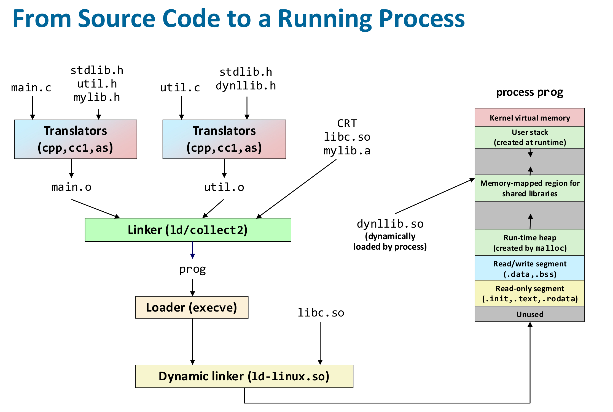

In this post, 11~14 System Programming lecture is introuduced. 

# Overview

오브젝트 파일에는 다음 3가지 종류가 있다. 

- **Relocatable object file (.o file)** : 컴파일(컴파일러+어셈블러) 단계의 결과물. 각 .o 파일은 정확히 하나의 .c 파일로부터 만들어진다. 
- **Executalbe object file (a.out file)** : 링커의 결과물. 실행가능한 오브젝트 파일이다.
- **Shared object file (.so file)** : load-time이나 run-time에 동적으로 링킹 되는 라이브러리로, 특별한 타입의 relocatable object file이다.

이 파일들은 모두 **ELF** (Executable and Linkable Format)이라는 공통된 파일의 포맷을 따르고 있으며, ELF 파일의 형식은 아래와 같다. 

- ELF header : word size, byte ordering, file type (.o, exec, .so), machine type 등의 정보가 기록된다.
- Segment header table : executbale object file에서만 사용되는 부분으로, 메모리에 프로그램을 load할때, 어느 부분(각 섹션)을 어떤 주소(가상 주소)로 복사할지 기술한다. OS loader가 이 정보를 보고 ELF 파일의 내용을 적절히 메모리에 배치한다.
- .text section : 프로그램 코드가 기록된다.
- .rodata section : string constants, jump tables 등 read only data가 저장된다.
- .data secton : 초기값이 있는 global variable이 저장된다.
- .bss section : 초기값이 0이거나 초기화되지 않은 global variable이 저장된다. 어짜피 값이 0이므로 디스크 상에 일일이 값을 저장하여 공간을 차지하여 저장하지는 않는다. 
- .symtab section : 오브젝트 파일 안에 정의된 함수, global variable, static variable 등의 이름과 위치 정보를 저장한다.
- .rel.text section : 함수 호출, 전역 변수 접근 등 명령어에서 사용될 주소 값이 확정되지 않은 명령어들이 저장된다.
- .rel.data section : 주소가 아직 결정되지 않은 global/static variable의 정보가 저장된다.
- .debug, .line section : 디버깅 관련 정보가 저장된다.
- section header table : 각 section의 offset과 size가 저장된다.

프로그램을 compile, linking 하여 얻는 이러한 오브젝트 ELF 파일은 디스크에 저장될 것이다. 프로그램 실행 시, OS의 loader가 ELF 파일을 읽어서, ❓을 한다. 아래 그림처럼 가상 메모리가 관리되도록 컴파일/링킹 되는 것이라고 이해할 수 있다. 프로그램 실행 중 모든 가상 주소의 내용이 현재 물리 메모리에 있는 것은 아니다. 예를 들어, 프로그램 수행 중. rodata의 상수를 참조 시, 해당 가상주소를 이용하여 물리주소를 얻고, 내용을 disk에서 RAM으로 가져올 것이다. 

# Linker

Linking 과정을 통해 executable object file ELF를 얻는 과정은 크게 2단계로 이루어진다. 

- **Symbol resolution** : 이 심볼(함수/변수)이 실제로 어느 객체 파일(.o/.so)에 있는지 찾아 연결하는 과정.
- **Symbol relocation** : 찾아낸 심볼의 실제 주소를 코드/데이터의 해당 위치에 채워 넣어 실행 가능한 형태로 만드는 과정.

❗️linker가 관심을 가지는 variable은 global variable과 static local variable 뿐이다. 일반 local variable의 경우는 

# Loader

# Library

- how does the compiler know about functions and variables defined in other files to make sure the type matches?
- how can we generate addresses to call functions / access variables if we do not know where they are located in memory?
- how does the system know which dynamic libraries to load when executing a binary?
- how does the application know how to call functions from dynamic libraries?
- why linkers? (10장 12,13 pg)
