In this post, 11~14 System Programming lecture is introuduced. 


# Basic

다음 기본적인 내용들을 상기하자.

**header file**의 역할

헤더 파일에는 함수, 변수의 **선언(declaration)**이 담겨 있다. header file의 내용은 주로 `#include` 문을 통해 전처리기에 의해 소스코드에 복사되므로 결과적으로 컴파일러에게 함수, 변수 선언을 알려주는 역할을 한다고 볼 수 있다. 

그렇다면 왜 `.c` 파일에 함수 선언을 적고 `#include` 하지 않고 헤더 파일에 적어야 할까? 

- 링크 단계에서 중복 정의(multiple definition) 문제가 생기기 때문이다. 

  - 다음의 상황을 생각해보자.

  - ```c
    // main.c
    #include "math_utils.c"  
    
    // math_utils.c
    int add(int a, int b) { return a + b; }
    ```

  - 이렇게 되면 `main.o` 와 `math_utils.c`를 링크 시, `add` 함수의 중복 정의 에러가 생긴다. 

- `.c` 는 컴파일 단위이기 때문이다. 

  - 위에서 include하는 `.c` 파일에는 정의 없이 함수의 선언만 적으면 중복 정의 에러는 발생하지 않을 수 있다. 그러나, 개발자 입장에서 어떤 `.c` 는 컴파일 대상이고, 어떤 것은 그저 함수 선언의 인터페이스 역할이라면 혼란이 생길 수 있다.

**extern**의 역할

extern은 "이 변수(또는 함수)는 다른 파일(같은 파일도 가능)에 정의되어 있음"을 컴파일러에게 알려주는 선언용(declaration) 키워드이다. 다음의 상황을 생각해보자.

```c
// config.h
int global_count;  
```

헤더 파일에 extern 없이 변수를 선언해놓고, 여러 `.c` 에서 위 헤더파일을 include 했다고 해보자. 그러면 중복 정의(multiple definition) 에러가 링크 시 발생한다. (정의가 아니라 선언이 아니냐고 생각할 수 있다. c에서는 정확히는 extern이 없으면 정의이고 이렇게 초기값이 없는 경우를 **tentative definition (잠정적 정의)** 라고 한다. 아직 초기값은 없지만, 전역 객체를 하나 만들고 실제 메모리를 차지한다.)  

중복정의 문제를 해결하기 위해서는 extern을 사용해야 한다.

```c
// config.h
extern int global_count;

// config.c
int global_count = 0;

// main.c
#include "config.h"

void foo() {
    global_count++;
}
```

그렇다면 함수에는 왜 extern을 거의 쓰지 않을까?

```c
int add(int a, int b); //extern int add(int a, int b); 와 동일
```

이 선언 자체가 **암묵적으로 extern** 을 내포한다. 


# Overview

오브젝트 파일에는 다음 3가지 종류가 있다. 

- **Relocatable object file (.o file)** : 컴파일(컴파일러+어셈블러) 단계의 결과물. 각 .o 파일은 정확히 하나의 .c 파일로부터 만들어진다. 
- **Executalbe object file (a.out file)** : 링커의 결과물. 실행가능한 오브젝트 파일이다.
- **Shared object file (.so file)** : load-time이나 run-time에 동적으로 링킹 되는 라이브러리로, 특별한 타입의 relocatable object file이다.

이 파일들은 모두 **ELF** (Executable and Linkable Format)이라는 공통된 파일의 포맷을 따르고 있으며, ELF 파일의 형식은 아래와 같다. 


- ELF header : word size, byte ordering, file type (.o, exec, .so), machine type 등의 정보가 기록된다.
- Segment header table : executbale object file에서만 사용되는 부분으로, 메모리에 프로그램을 load할때, 어느 부분(각 섹션)을 어떤 주소(가상 주소)로 복사할지 기술한다. OS loader가 이 정보를 보고 ELF 파일의 내용을 적절히 메모리에 배치한다.
- .text section : 프로그램 코드가 기록된다.
- .rodata section : string constants, jump tables 등 read only data가 저장된다.
- .data secton : 초기값이 있는 global variable이 저장된다.
- .bss section : 초기값이 0이거나 초기화되지 않은 global variable이 저장된다. 어짜피 값이 0이므로 디스크 상에 일일이 값을 저장하여 공간을 차지하여 저장하지는 않는다. 
- .symtab section : 오브젝트 파일 안에 정의된 함수, global variable, static variable 등의 이름과 위치 정보를 저장한다.
- .rel.text section : 함수 호출, 전역 변수 접근 등 명령어에서 사용될 주소 값이 확정되지 않은 명령어들이 저장된다.
- .rel.data section : 주소가 아직 결정되지 않은 global/static variable의 정보가 저장된다.
- .debug, .line section : 디버깅 관련 정보가 저장된다.
- section header table : 각 section의 offset과 size가 저장된다.

프로그램을 compile, linking 하여 얻는 이러한 오브젝트 ELF 파일은 디스크에 저장될 것이다. 프로그램 실행 시, OS의 loader가 ELF 파일을 읽어서, ❓을 한다. 아래 그림처럼 가상 메모리가 관리되도록 컴파일/링킹 되는 것이라고 이해할 수 있다. 프로그램 실행 중 모든 가상 주소의 내용이 현재 물리 메모리에 있는 것은 아니다. 예를 들어, 프로그램 수행 중. rodata의 상수를 참조 시, 해당 가상주소를 이용하여 물리주소를 얻고, 내용을 disk에서 RAM으로 가져올 것이다. 


앞으로 우리가 알아볼 개념들을 통해 다음의 질문들에 대해 답할 수 있을 것이다. 

- How does the Compiler know about functions and variable defined in other files to make sure the type mathes? (컴파일러는 다른 파일에 정의된 함수와 변수에 대해, 타입이 올바른지 어떻게 알고 검증할 수 있을까?)
- How can we generate addresses to call functions / access variables if we do not know where they are located in memory? (메모리에서 그 함수나 변수가 정확히 어디에 위치하는지 모르는 상태에서, 어떻게 함수 호출이나 변수 접근을 위한 주소를 생성할 수 있을까?)
- How does the. ystem know which dynamic libraries to load when executing a binary? (실행 파일을 실행할 때, 시스템은 어떤 동적 라이브러리들을 로드해야 하는지 어떻게 알까?)
- How does the application know how to call functions from dynamic libraries? (애플리케이션은 동적 라이브러리에 들어 있는 함수들을 어떻게 호출하는 방법을 알까?)


# Linker

Linking 과정을 통해 executable object file ELF를 얻는 과정은 크게 2단계로 이루어진다. 

- **Symbol resolution** : 이 심볼(함수/변수)이 실제로 어느 객체 파일(.o/.so)에 있는지 찾아 연결하는 과정.
- **Symbol relocation** : 찾아낸 심볼의 실제 주소를 코드/데이터의 해당 위치에 채워 넣어 실행 가능한 형태로 만드는 과정.

❗️linker가 관심을 가지는 variable은 global variable과 static local variable 뿐이다. 일반 local variable의 경우는 stack에서 관리된다.

## Symbols

c에서 symbol은 3종류가 있다. 

- **Global symbols** 
  - 현재 모듈에서 symbol이 정의되어 있는데, 현재 모듈외에 다른 모듈에서 접근 가능한 symbol을 의미한다.
  - non-static function, non-static global variable 이 있다. 
  - static function과 static global variable은 symbol이 정의된 모듈외에 다른 모듈에서 접근이 불가능하다. 앞에 static 키워드를 붙인다. 
- **External symbols**
  - 현재 모듈에서 symbol에 접근하는데, 다른 모듈에서 정의되어 있는 symbol을 의미한다.
  - 현재 모듈에서 선언시, extern 키워드를 붙여야 한다.
- **Local symbols**
  - 현재 모듈에서 정의되어 있고, 현재 모듈에서만 접근 가능한 symbol을 의미한다.
  - static function, static global variable이 있다. 
  - local varialbe과 다른 개념이다. local variable은 local (linker) symbol이 아니다. 

다음과 같은 코드를 보자.

```c
// main.c
#include <stdio.h>
void swap();
int buf[2] = {1, 2};

int main(void){
    printf("%d, %d\n", buf[0], buf[1]);
    swap();
    printf("%d, %d\n", buf[0], buf[1]);
    return 0;
}

// swap.c
extern int buf[];

int *bufp0 = &buf[0];
static int *bufp1;

void swap(){
    int temp;

    bufp1 = &buf[1];
    temp = *bufp0;
    *bufp0 = *bufp1;
    *bufp1 = temp;
}
```

여기서 global, external, local linker symbol을 구분하면 아래와 같다. 

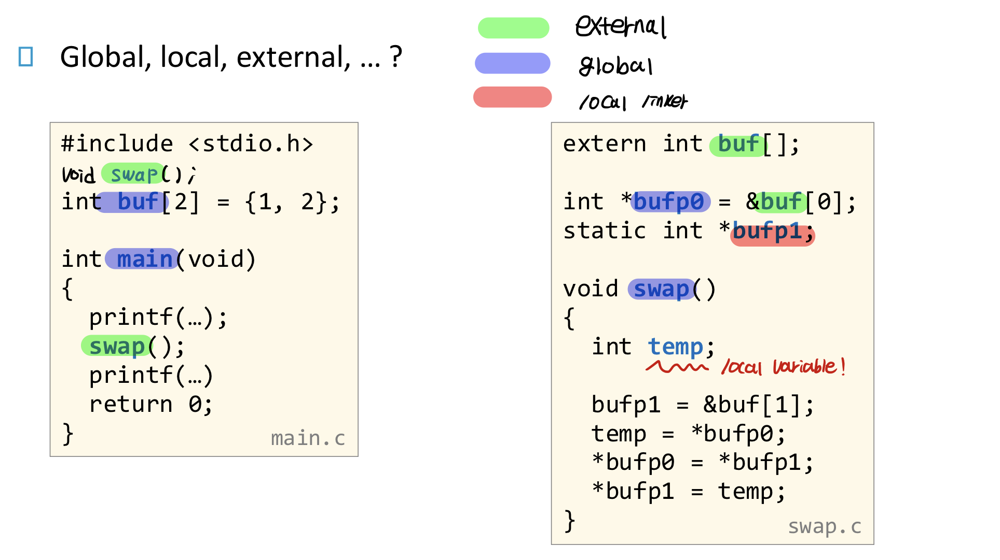

각 파일을 `gcc-c`로 컴파일(컴파일+어셈블, 링킹은 X) 하여 `readlf -s` 로 ELF에 있는 symbol table을 보면 아래와 같다.

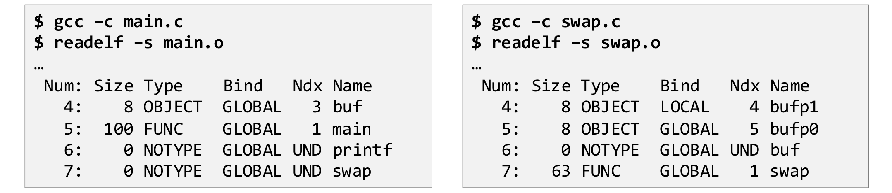

- Num : 심볼 테이블에서의 **인덱스 번호**
- Size : 심볼이 차지하는 **바이트 크기**. Ndx가 UND인 심볼은 0.
- Type : 심볼의 종류. 
  - `OBJECT` : 변수 (전역/정적 변수)
  - `FUNC` : 함수
  - `NOTYPE` : 타입 미정 (외부 참조 등)
  - `SECTION` : 섹션 자체
  - `FILE` : 파일 이름

- Bind : Linkage, 결합 범위
  - `LOCAL` : 파일 내부 전용 (static)
  - `GLOBAL` : 외부 참조 가능
  - `WEAK` :  약한 심볼 (의미는 뒤에 설명)

- Ndx : 심볼이 속한 섹션 번호
  - 숫자 : 해당 섹션 번호 (ex. 3  → .data 섹션)
  - `UND` : 정의 안 됨(외부 참조)
  - `ABS` : 절대 주소
  - `COMMON` : tentative definition

- Name : 소스 코드에서의 **식별자 이름**
- Value 
  - Relocatable .o 파일인 경우 : 해당 symbol이 속한 섹션(ex. .data)  기준의 (가상) 주소(offset)
  - Executable .o 파일인 경우 : 해당 symbol의 가상 절대 주소


## Symbol Strength

모든 symbol은 strong 이거나 weak이다. symbol strength는 같은 이름의 심볼이 여러 개 있을 때, 링커가 어떤 정의를 채택할지 결정하는 우선순위가 된다. 

- 같은 이름의 symbol에 대해 strong symbol은 하나만 존재해야 한다. 그렇지 않으면 링크 에러 발생.
- Strong vs Weak → Strong 정의 기준으로 링킹 된다
- Weak vs Weak → 임의로 하나가 선택된다.

Strong/weak symbol을 만드는 방법은 다음과 같다. 

- 기본적으로 모든 symbol은 strong이다. 함수, initialized/uninitialized global variable 모두 strong이다. 

- 다음과 같이 `#pragma weak` 를 이용해야 weak 심볼로 만들 수 있다. 

  - ```c
    #pragma weak weak_global_initialized
    int weak_global_initialized = 5;
    ```

  - ```c
    int global_initialized = 7; // 초기화된 gb variable -> strong
    int global_zero_initialized = 0; // 0으로 초기화된 gb -> strong
    int global_not_initialized; // 초기화안된 gb(선언x, 잠정적 정의o) -> strong
    static int global_static_initialized = 77; // strong이긴 한데 LOCAL 심볼이라 다른 파일과 충돌 자체가 없음. strength 논쟁에서 거의 제외
    static int global_static_not_initialized; // 마찬가지
    extern int extern_variable; // 정의 아님. strong/weak 아님. UND 심볼.
    
    #pragma weak weak_global_initialized
    int weak_global_initialized = 5;
    
    #pragma weak weak_local_initialized
    static int weak_local_initialized = 5; // LOCAL + weak 이므로 의미 없음
    
    #pragma weak weak_function
    int weak_function(int a, int b){
      return a + b;
    }
    int regular_function(int a, int b){
      return a + b;
    }
    int extern_function(int a, int b);
    ```

  - weak 심볼로 함수 기본 구현을 제공해 두면, 사용자가 같은 이름의 함수를 정의했을 때(Strong) 자동으로 적용되는 함수가 바뀌는 override 기능처럼 사용할 수 있다. 

## Assignment of Symbols to Sections

심볼이 어디 섹션(.text/.data/.bss/COMMON/UNDEFINED)에 들어가느냐는 “정의됐는지, 초기화됐는지, 링커가 아직 결정을 미뤘는지”에 따라 결정된다.

- 정의된 함수는 항상 .text 영역에 저장된다. 
- Global 변수의 경우 초기값이 0이 아닌 경우 .data 섹션, 초기값이 0인 경우 .bss 섹션 (0인 경우를 따로 분리하는 이유는 값이 0이면 0이라고 기록만 해두고 ELF 파일 상에서 실제 값을 저장하기 위한 메모리 영역을 아낄 수 있기 때문이다)요즘 컴파일러는 `fno-common` 옵션이 default이므로, 초기값이 없는 경우도 .bss 섹션에 저장된다.
- 과거 컴파일러의 경우 `-fcommon` 옵션이 default 였으므로, 초기값이 없는 경우 COMMON 섹션에 두었다. 링커가 나중에 하나로 합쳐 .bss 섹션에 기록하게 된다. 따라서 예전 컴파일러에서는 `int x;` 처럼 잠정적 정의를 해도, 중복 정의 문제가 발생하지 않았다. (.bss 섹션에 해당 x는 기록되지 않았으므로) 
- COMMON 섹션은 요즘 컴파일러에서는 사용되지 않지만 relocatable object file (컴파일까지 된, 링킹 전 단계 파일) 에서 초기화되지 않은 global symbols 들을 저장했다. 

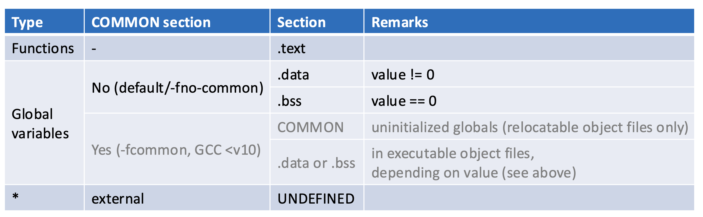

## Step 1. Symbol Resolution

프로그램 코드 상에서 모든 symbol 이름은 정의(defnition)될 때와 참조(reference)될 때 등장한다. 그리고 이에 대한 기록이 각 .o 파일에 섹션 영역과 symbol table에 저장되어 있다. Symbol Resolution은 모든 symbol reference를 정확히 하나의 symbol definition에 연결하는 과정이다.

"연결한다"의 구체적 의미는 ~

이 때, 링커는 다음의 규칙에 따라 symbol을 선택한다. 

- 같은 이름의 **strong 심볼**이 여러 개 링커 에러가 난다. (단, COMMON 섹션은 예외)
- strong 심볼 + COMMON 심볼이 같이 있으면 **strong을 선택**
- COMMON만 여러 개 있고 strong이 없으면 **하나를 “아무거나” 고른다**
  - `-fno-common` 을 사용하지 않은 상태에서 여러 파일에 `int x;` 라는 잠정적 정의를 해놓은 경우를 생각할 수 있다.
  - 이는 굉장히 위험하다. 한 파일에서 `int x;` 를 잠정적 정의하고, 다른 파일에서 `double x;`를 잠정적 정의해도 링킹 에러가 발생하지 않게되고, 런타임에서 메모리 깨질 수 있다.
  - `-fno-common` 옵션을 쓰면 링킹 단계에서 COMMON 섹션에 기록되지 않고, strong이 2개이므로 중복 정의 오류가 생기므로 에러를 미리 찾을 수 있다.
- strong 심볼이 있으면, weak 심볼은 **strong으로 재배치(relocate)**. 이것이 바로 예를들어 사용자가 lib.c의 특정 함수의 “default implementation을 제공하고, override 할 수 있는 이유이다. 

아래 그림과 같이 linking.c, chksum.c를 컴파일 하고 각각의 오브젝트 파일의 심볼 테이블을 확인하면 다음과 같다.

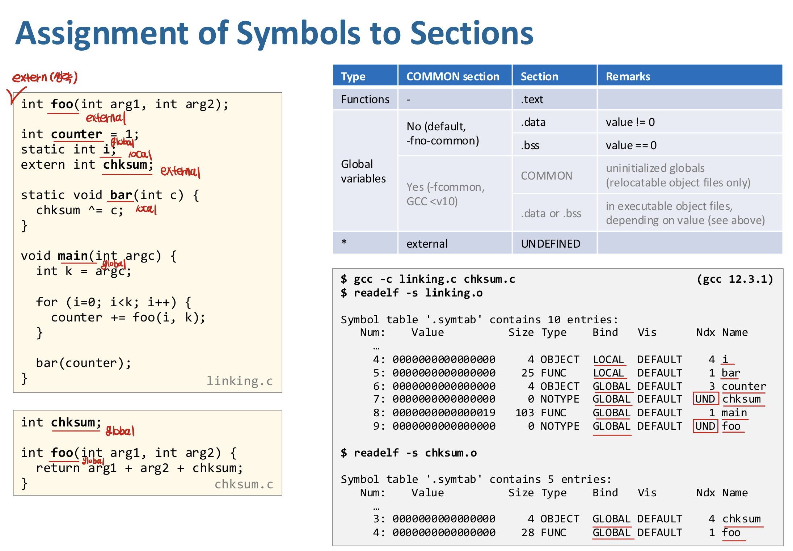

눈 여겨볼 것은 linking.c에서 외부 참조인 심볼 chksum, foo의 경우 symbol table의 Ndx가 UND로 나타난다는 점, 그리고 local인지 global 인지 여부에 따라 symbol들의 bind가 달라진다는 점이다.

이제 linking을 한 후 linking ELF파일의 섹션 헤더와 sym table을 보자. 

- 섹션 헤더에는 섹션에 대한 여러 메타데이터가 저장되어 있다. 
  - 그 중, 섹션의 **가상**절대주소와(아래 .data의 0~04000) ELF 파일 내에서 각 섹션이 시작되는 파일 내부 위치 offset에 대한 정보도 담겨 있다.(아래 .data의 0~03000)
-  sym table의 value에는 다음의 값이 저장되어 있다. 
  - Relocatable .o 파일인 경우 : 해당 symbol이 속한 섹션(ex. .data)  기준의 (가상) 주소(offset)
  - Executable .o 파일인 경우 : 해당 symbol의 가상 절대 주소

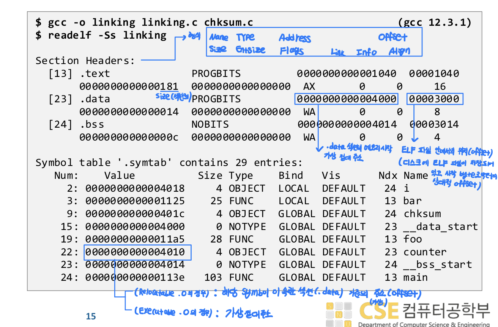

linking의 전체 과정 중 symbol resolution 단계에서는 다음의 일들이 일어났다고 이해하면 된다. 

- 두 .o 파일의 sym table을 바탕으로, global symbol table(GST)을 만든다. 이 때 다음을 고려한다. 
  - Ndx가 UND로 기록되었던 symbol들이 다른 파일의 symbol table에 있는지 확인하여 Ndx 부여
  - symbol 선택 규칙(strong 2개 이상이면 안됨, Bind가 weak인 symbol은 strong 존재시 대체 등)에 따라 GST 구성
  - 즉, 위 GST의 colum 중, Bind, Ndx에 해당하는 부분이 올바르게 결정되었다고 보면된다.

## Step2. Layout

Symbol Resolution을 통해서 링커는 이제 

- 모든 섹션을 다 알고 있고

- 누가 어느 섹션에 속하는지도 알고 있음

Layout 과정을 통해서는, section header에서 section header에서 Address(각 섹션의 가상 절대 주소)와 section offset(ELF 파일 안에서의 위치 offset) 정해진다고 이해할 수 있다. 


## Step3. Symbol Relocation

- Layout 단계 이후에, 각 .o 파일의 sym tablem의 Value(섹션으로부터의 offset)을 이용해, 각 symbol의 통합된 offset을 계산하는 과정이 수행된다. (step 2.5)
- Step2에서 각 섹션의 가상 절대 주소 정보를 구했다.
- Step1에서 각 symbol이 속하는 섹션을 구했다.

Symbol Relocation 과정을 통해서는, symbol table에서 Value (가상 절대 주소)를 계산한다.

- `symbol.Value` = `section.sh_addr` (step 2) + `symbol.offset` (step 2.5)


그리고 코드/데이터 내 주소 참조를 패치한다. 예를 들어, `int *p = &x;` 라는 코드에 대해 지금까지 한 일은, p라는 symbol의 가상 절대 주소를 정한 것이다. 그렇다면 symbol p가 가지는 값 (= symbol x의 가상 절대 주소)은 어디에 어떻게 저장될까?

다음 예시를 보자.

```c
int foo(int arg1, int arg2);
... 
void main(int argc){
  ...
   counter += foo(i, k);
}
```

현재 파일에서 `foo` 는 extern symbol 함수이다. 위 파일이 어떻게 컴파일(링킹 X) 되는지 생각해보자.

`foo` 함수를 call 하는 부분의 어셈블리 코드는 다음의 형식일 것이다.

```assembly
call <PC-relative offset>
```

call instruction은 jump할 주소의 계산인자로 pc-relative offset 값을 요구한다. 그러나, 컴파일 시점에서는 `foo` 함수의 절대 가상 주소를 모르므로 pc-relative offset 값 또한 알 수 없다. 따라서, assembly를 아래와 같이 PLT를 이용하여 작성한다.

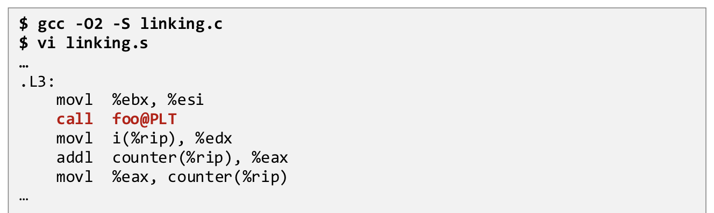

즉, `call foo`가 아니라 `call foo@PLT` 로 assembly를 작성한다. **PLT** 란, Procedure Linkage Table로, ELF 파일에 .plt 섹션이 존재한다. 컴파일러는 처음부터 PLT를 경유할 것을 전제로 assembly를 만든다. 실제 `foo`의 주소는 지금까지 본 것처럼 링킹(정적 링킹을 사용하는 경우)/로딩(동적 링킹을 사용하는 경우) 후에야 결정된다. 

위 파일의 .o 파일(머신코드)를 보면 다음과 같다. 

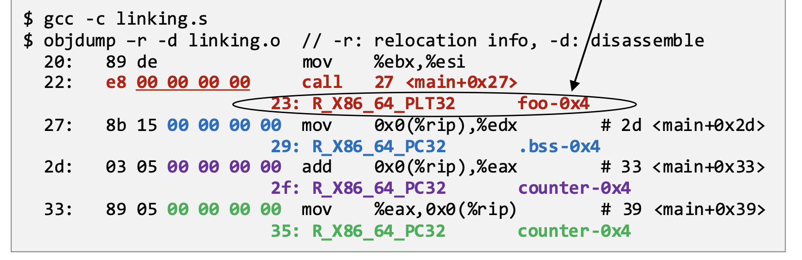

다음 2줄을 해석해보자.

22에 해당하는 부분은 ELF 파일의 .text 섹션에 저장되어 있다. 23에 해당하는 부분은 ELF 파일의 .rela.text 섹션에 저장되어 있다.(정확히 위 형태로 저장되는 것은 아니지만 objdump가 적당히 보여주는 것) 

.text 섹션은 코드 명령어를 담고 있고, .rela.text 섹션은 코드 명령어가 아니라 "이 코드의 일부를 나중에 고쳐라" 라는 항목들이 들어 있다. 각 항목을 **relocation entry** 라 하며, relocation entry는 다음의 구조체로 구성된다.

```c
struct Elf64_Rela {
    r_offset;  // .text의 어느 위치를 고칠지
    r_info;    // 어떤 심볼 + 어떤 relocation 타입인지
    r_addend;  // 보정값
}
```


```assembly
22: e8 00 00 00 00      call   27 <main+0x27>
23: R_X86_64_PLT32      foo-0x4
```

- `22` : .text 섹션으로 부터의 offset. `.text + 0x22` 위치에 instruction byte가 존재한다는 의미

- `e8` : x86-64에서 call instruction의 opcode

- `0~0` : call instruction의 pc-relative offset 값. 아직 `foo`의 주소를 모르므로 일단 0으로 채우게 된다.

- `<main+0x27>` : objdump가 제공하는 값으로 실제 머신코드에는 존재하지 않는다. cpu가 이대로 수행될때(imm값을 나중에 대체하지 않고 그대로 0으로) jump할 위치를 보여주는 것으로 중요하지 않다.

  

- `23` : .text 섹션으로 부터 0x23 offset 위치에 있는 instruction byte 부터 수정하라는 의미 (구조체에서 `r_offset`)

- `R_X86_64_PLT32` : relocation type이 PLT32 라는 것은, 32비트 pc-relative 값으로 패치하되, 대상 심볼은 foo가 아니라 foo@PLT로 잡으라는 뜻이다. foo라는 이름은 `r_info` 값에 저장된 정보로 sym table에서 확인 가능하다.

- `foo-0x4` : `r_info`를 통해 알 수 있는 foo. `0x4`는 `r_addend` 값을 의미한다.

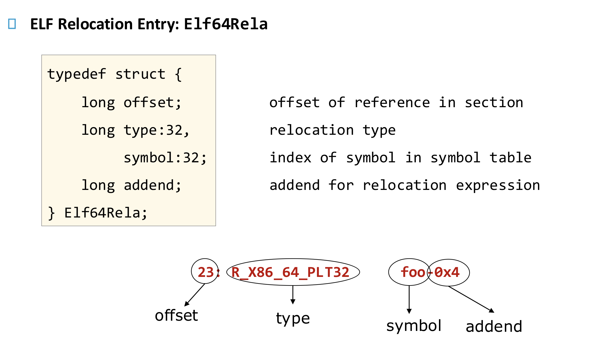


Relocation type에는 다음이 있다. 

- `R_X86_64_64 / R_X86_64_32[S]` : 바꿀 자리에 **심볼의 절대 가상주소 자체**를 쓰라는 뜻. 그 값이 S는 sign-extend.

- `R_X86_64_PC32` : 바꿀 명령어를 실행할 때, CPU는 “다음 명령어 주소(next RIP)”에 기계어 안에 들어 있는 4바이트 값을 더해서 그 결과 주소로 메모리에 접근한다. 그 결과가 심볼의 주소가 되도록 링커가 4바이트 값을 계산해 넣는다.

  - ```assembly
    value = S + A - P
    
    S : symbol 주소 (예: counter)
    A : addend (보통 -4)
    P : relocation 필드 주소
    ```

  - value는 relocation이 끝난뒤, 실제로 채워넣을 값이다. 

    - A는 구조체에 `r_addend` 값이다. 
    - P = (대상 섹션 .text의 시작 주소, 링커가 계산) + `r_offset` (0x23)  값이다. 
    - S는 `r_info` 값을 이용해 링커가 계산해내는 symbol의 최종 가상 절대 주소이다. 
    - 따라서, 다음 pc값에서 value 만큼 이동하면 해당 symbol의 최종 가상 절대 주소를 얻게 된다.

- `R_X86_64_PLT32` : PC-relative 값으로 패치하되, **심볼 자체가 아니라 `심볼@PLT`로 가게 해라**는 의미이다. 

  - ```assembly
    value = PLT(S) + A - P
    
    PLT(S) : foo@PLT의 주소
    ```

각 case를 예시와 함께 살펴보자. 그 전에, 어떤 경우에 .text를 수정해야 하고 어떤 경우에 .data를 수정해야 하는지(이 경우 .rel.data에 relocation entry가 존재한다) 알아보자.

**.text를 수정하는 경우**

- 명령어 자체가 (imm 값으로) 어떤 주소 정보를 담고 있을 때 .text를 수정한다.

- 함수 호출, 전역 변수 접근, RIP-relative load/store, jump/call 대상 등이 있다. 

- ```c
  // case 1. 함수 호출
  // c code
  extern int foo(int);
  foo(3);
  
  // asssembly
  call foo
  
  // machine code
  e8 00 00 00 00
  ```

  - `00 00 00 00` = **call의 imm32 (PC-relative displacement)** 인데 이 값이 **명령어 안에 있음**

- ```c
  // case 2. 전역 변수 접근
  // c code
  extern int counter;
  int x = counter;
  
  // asssembly
  mov counter(%rip), %eax
  ```

  - `mov counter(%rip), %eax` : “이 명령어 다음 주소(RIP)를 기준으로 disp32를 더해 얻은 메모리 주소에 있는 4바이트 값을 읽어서 그 값을 `%eax`에 넣어라.”
  - 이 때, 주소 정보에 해당하는 disp32 값이 머신코드 상에서 명령어 안에 존재한다.

**.data를 수정하는 경우**

- 변수의 “초기값”이 주소일 때

- 포인터 초기화, 함수 포인터, 전역 구조체 안의 주소 필드 등이 있다.

- ```c
  // case 1. 포인터 초기화
  // c code
  extern int buf[];
  int *p = &buf[0];
  
  // assembly
  .data:
  p:  00 00 00 00 00 00 00 00   // placeholder
  ```

  - 변수의 초기값은 프로그램 실행 중, 레지스터에 값을 담아 메모리에 저장하도록 명령어(.text 섹션)로 적혀 있는 것이 아니다. 컴파일 단계에서 .data 영역에 미리 저장해 놓는다. 다만 위 경우 external symbol인 `buf` 의 값(주소)을 알 수 없으므로 0으로 채워넣게 된다. 

- ```c
  // case 2. 함수 포인터
  // c code
  extern int buf[];
  int *p = &buf[0];
  
  // assembly
  ```

각 Relocation Type을 쓰는 상황의 c코드 - objdump의 .data.rel 출력 - .data.rel의 relocation entry 구조체 - 그에 따라 수정해야 하는 값과 위치를 한 번에 나타내면 아래와 같다.

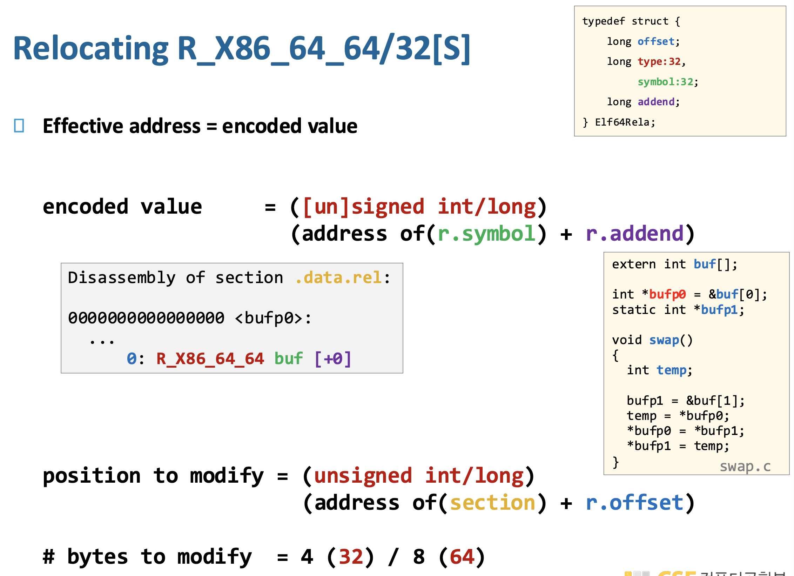

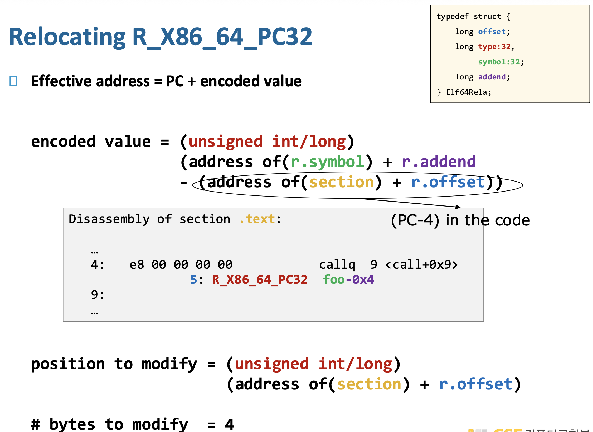


PLT는 동적 링킹을 사용할 때 이용되고 정적 링킹일 경우 사용하지 않는다.

우선, 정적 링킹(`R_X86_64_PLT32` 사용 X) 인 경우에 다음의 relocation 예시를 보자. 

왼쪽은 c 코드, 오른쪽은 swap.c의 컴파일 결과 .o 파일이다. 여러 위치에서 relocation entry가 등장함을 알 수 있다. (자세한 설명은 그림의 파란 글씨 참조)

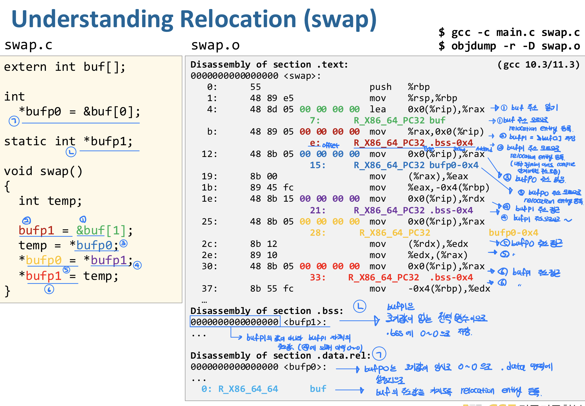

링킹 결과, .data 영역에 올바른 주소의 초기값이 입력된다.

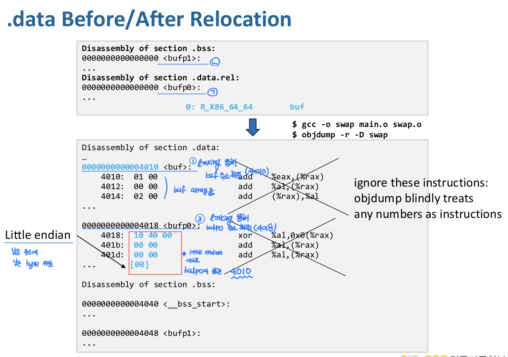

.text 영역에도 relocation entry를 바탕으로 명령어에 맞는 imm값이 올바르게 채워진다.


# Static vs Dynamic Libraries

개발자들에게 널리 쓰이는 library를 어떻게 패키징할까? 다음 두 가지 방법은 간단하지만 문제가 있는 방식이다. 

- 모든 함수를 하나의 소스 파일에 넣는다.

  - ```shell
    lib.c
     ├ printf
     ├ malloc
     ├ free
     ├ strcpy
     ├ strlen
     └ ...
    ```

  - 컴파일하면 **거대한 object file 하나**

  - ```shell
    gcc main.c lib.o
    ```

  - 위와 같이 링킹하면 프로그램이 `printf`만 써도 `malloc`, `sin`, `strcpy`까지 전부 링크된다. 따라서, 실행 파일 커지고, 링크/로드 시간 증가하여 **공간·시간 모두 비효율적**

- 함수 하나당 소스 파일 하나를 만든다.

  - ```shell
    gcc main.c printf.o malloc.o free.o
    ```

  -  필요한 함수만 링크하여 공간 효율적이다.

  - 프로그래머가 “내가 어떤 함수 썼지?”, “어떤 .o를 링크해야 하지?” 매번 직접 관리해야 한다.

## Static Library

static Library는 위 문제의 하나의 solution이다. .a파일은 여러 개의 **relocatable object file (`.o`)**을 **그대로 묶어둔 컨테이너** 이다.

```shell
libc.a
 ├ printf.o
 ├ malloc.o
 ├ free.o
 ├ strcpy.o
 └ strlen.o
```

- ```shell
  ar r libc.a printf.o malloc.o free.o // libc.a 생성
  ```

- 이렇게 하면 libc.a는 아직 tar 같은 묶음일 뿐이다.

- ```shell
  ar s libc.a // symbol table 생성
  ```

- 위 명령어를 실행하면 .a 파일 안에 **심볼 이름 → 어떤 `.o`에 들어 있는지**를 알려주는 테이블을 만들어준다.

다음과 같이 main.o를 링킹하는 과정을 생각해보자.

```shell
gcc main.o
```

main.o에서 printf를 사용하는데 정의를 찾지 못하였다.

그러면 링커는 `libc.a`의 **index**를 검색하여 `printf.o` 에 있음을 찾고 `printf.o`만 링킹한다.

만약, `printf.c`를 수정한 경우 전체 라이브러리의 `.c` 파일을 재 컴파일 할 필요 없다.

```shell
gcc -c printf.c        # printf.o 재생성
ar r libc.a printf.o   # libc.a 안에서 printf.o만 교체
```

libc.a와 libm.a는 널리 쓰이는 library이다.

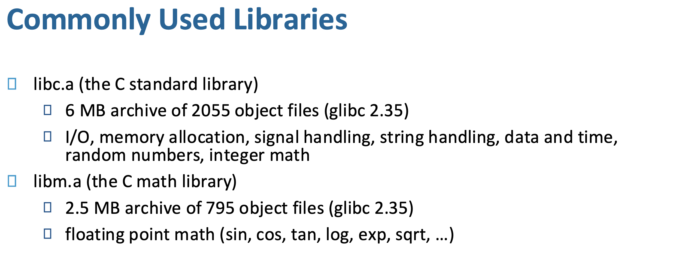

아래 그림은 개발자가 `main2.c` 에서 addvec.c에 정의되어 있던 특정 함수를 쓰기 위해 `#include vector.h` 를 하였을 때 링킹 과정을 보여준다.

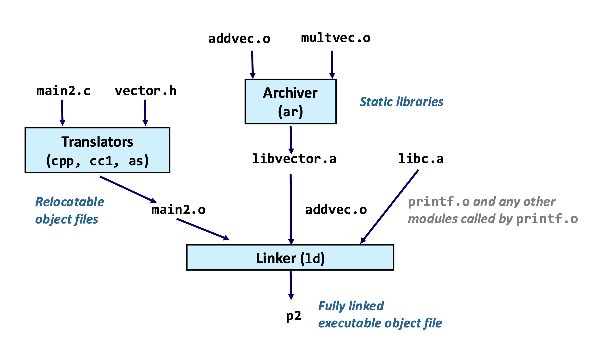

정적 라이브러리를 사용할 경우 링커가 하는 일을 나타내면 다음과 같다. 링커는 **왼쪽 → 오른쪽**으로 명령줄을 **한 번만** 스캔한다.

1. **명령줄에 나온 순서대로** `.o`와 `.a`를 스캔한다.
2. 스캔 중에 → “아직 정의되지 않은 심볼 목록(unresolved list)”을 유지한다.
3. 새 파일을 만날 때마다→ 그 파일이 **현재 unresolved 심볼을 해결할 수 있는지** 확인한다.
4. 끝났는데 unresolved가 남아 있으면→ **링크 에러**

문제점은 커맨드에서 입력하는 인자 순서가 중요하다는 점이다.

```shell
gcc -L. -lmine libtest.o // -lmine은 libmine.a(또는 .so)를 -L 옵션에서 지정된 경로 (.)로부터 찾으라는 의미
```

위 경우 링크 에러가 발생할 것이다. 반면 아래는 링크에 성공할 것이다.

```shell
gcc -L. libtest.o -lmine
```


## Shared Libraries

정적 라이브러리는 다음의 문제점을 가지고 있다. 

- 저장된 실행 파일에서 중복 (disk duplication)

  - ```shell
    app1  ── libc 코드 포함
    app2  ── libc 코드 포함
    app3  ── libc 코드 포함
    ```

  - `printf`, `malloc`, `exit` 같은 코드가 **모든 실행 파일 안에 복사됨**

  - 디스크 낭비, libc가 크면 클수록 심각함

- 실행 중 메모리에서 중복 (RAM duplication)

  - ```shell
    Process A: libc 코드 메모리 로드
    Process B: libc 코드 메모리 로드 (또 복사)
    ```

  - 코드가 read-only라도 **각 프로세스마다 따로 존재**

  - 메모리 낭비, 캐시 효율 ↓

- libc 버그 하나 고치면 모든 프로그램 재링크 필요

  - `printf`에 버그 발견하여`libc.a` 수정했다고 가정하자.

  - 기존 실행 파일은 옛 libc 코드를 기반으로 링킹 되었으므로, **모든 프로그램을 다시 컴파일 & 링크**해야 한다.

이에 대한 해결책으로 나온 **Shared Library**는 실행 파일에 복사하지 않고, 실행 시점에 “참조만” 하는 라이브러리이다. 리눅스에선 .so, 윈도우에서는 .dll이다. **Dynamic Link Library** 라고도 한다.

그렇다면 공유 라이브러리는 언제, 누가, 어떻게 링크할까? 2가지 방식이 있다. 

**Load-time linking**

- **프로그램이 처음 실행될 때**, 아직 `main()`도 시작하기 전에 필요한 shared library들을 로드하고 심볼을 연결한다.
- 리눅스에서 /lib64/ld-linux-x86-64.so.2 에 위치한 dynamic linker가 수행한다. 커널이 실행 파일을 로드할 때 **자동으로 호출**된다.
- Standard C library `libc.so`는 보통 load-time dynamically linked 된다.

📝 **Loader**

**Loader**는 커널이 실행 파일(ELF)을 RAM에 올려서 실행 가능 상태로 만드는 커널 코드이다. Linux 기준으로는 커널의 시스템 콜 **execve** 이 수행하는 기능 중 일부이다. `execve`는 **현재 프로세스의 메모리 공간을 완전히 새로운 프로그램으로 교체**하는 시스템 콜이다.

유저가 `execve("/bin/ls", argv, envp);` 와 같은 코드를 작성하면, 

- child의 기존 주소 공간(PTE)을 삭제한다. 해당 프로세스가 차지하던 유저 메모리 영역도 삭제한다. 
- 인자로 주어진 ELF 파일의 헤더를 바탕으로 새로운 PTE를 만든다. pc를 entry point로 설정한다.

```scss
유저 프로그램
  ↓ execve()
커널 진입
  ↓
do_execve()
  ↓
load_elf_binary()   ← 여기서 로딩
```

이 과정에서 loader가 하는 일을 순서대로 나타내면 다음과 같다. 

1. ELF 파일인지 확인
2. ELF 파일의 PHDR (헤더) 정보를 바탕으로, 가상주소 영역 정보를 담는 VMA list와, 가상주소-물리주소 매핑을 위한 PTE 포인터를 담는 프로세스 관리 커널 자료구조 `mm_struct` 를 만든다.

- ELF 안에는 **Program Header (PHDR)** 가 있다. 

  - ```scss
    PT_LOAD
      offset = 0x0 // 파일 안에서의 위치
      vaddr  = 0x400000 // 매핑될 가상 주소
      filesz = 0x1200 // 파일에서 가져올 크기
      memsz  = 0x1200 // 메모리에서 차지할 크기
      flags  = R-X
    ```

  - 위 헤더의 뜻은 “파일의 offset 0부터 0x1200 바이트를 가상주소 0x400000에 읽기+실행 가능하게 매핑해라” 라는 뜻이다.

- 로더는 이 정보대로 `mm_struct` 를 생성한다. `mm_struct`는 **한 프로세스의 가상 메모리 전체를 관리하는 커널 자료구조**다. 

  - `mm_struct` 는 PTE 포인터와, VMA list를 가지고 있다. VMA list는 각 영역(text, data, heap, stack) 등의 가상주소 범위를 저장하는 리스트이다. 

  - ```scss
    task_struct
       │
       ▼
    mm_struct
       │
       ├── page table (pgd)
       │
       ├── VMA list
       │       ├── [0x400000 - 0x401000]  text
       │       ├── [0x600000 - 0x601000]  data
       │       ├── heap
       │       ├── stack
       │       └── shared libs
       │
       └── heap/stack 경계값
    ```

  - PTE은 아직 비어 있는 상태이다. 

- ```scss
  // loader 요약
  load_elf_binary()
    ├─ PT_LOAD 읽음
    ├─ mm_struct 생성
    ├─ VMA 생성 (가상 메모리 영역)
    └─ 페이지 테이블은 아직 비어 있음
  ```

3. ELF의 INTERP 섹션을 확인하여, 동적 링커를 실행 흐름에 넘긴다.

- ELF 파일에는 PHDR에 `PT_INTERP` type이 있을 수 있다. 안에 들어있는 내용은 `/lib64/ld-linux-x86-64.so.2`  와 같은 식인데, "이 프로그램은 동적 링크된 실행파일이므로 실행 전에 이 동적 링커를 먼저 실행시켜라" 는 뜻이다. 
- 즉, 정적 링크 실행 파일이면, `PT_INTERP` 가 없으므로 바로 entry point (main 함수)로 점프한다. 동적 링크 파일이면 `PT_INTERP` 가 있어 먼저 `ld-linux`를 실행한다.
- 보통의 시스템콜은 시스템콜이 끝나고 원래 유저 코드로 돌아간다. execve는  **아예 다른 프로그램의 entry point로 복귀(새로 시작)하는 시스템콜**이다.

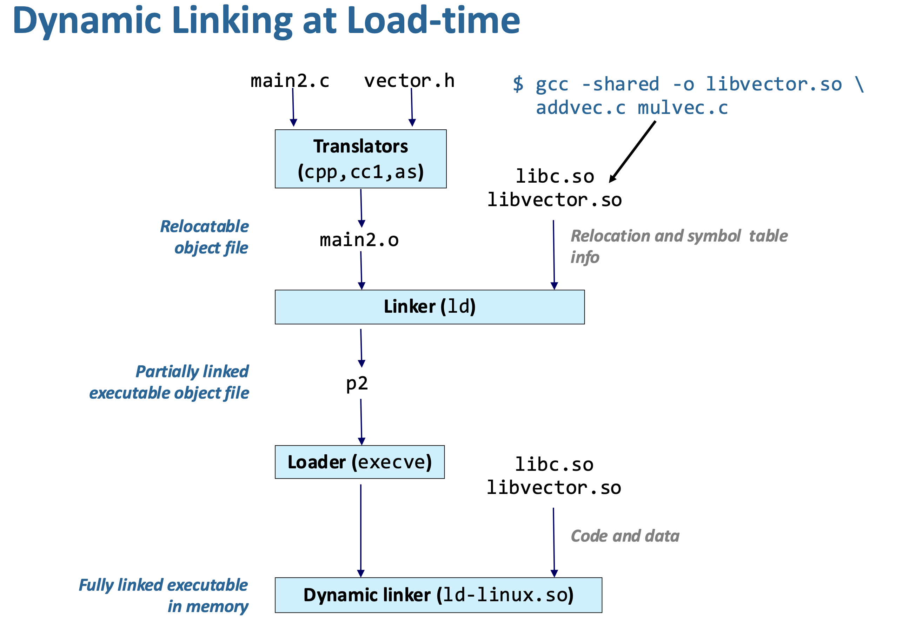


```bash
gcc -shared -o libvector.so addvec.c mulvec.c
```

위 명령어에서 `-shared`  공유 라이브러리(.so) 생성한다는 옵션이고 `-o libvector.so` 가 출력 파일 이름이다. 

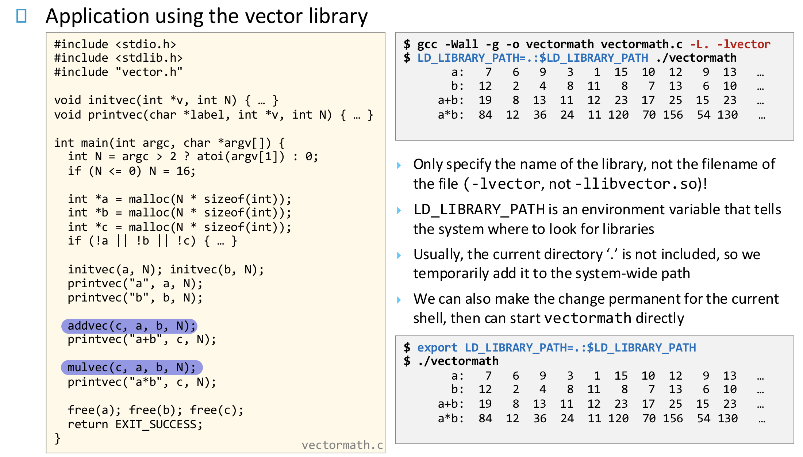

main 함수에서 호출하고 있는 addvec, mulvec의 실제 코드는 이 파일에 없고, libvector.so 안에 있다. 

```bash
gcc -Wall -g -o vectormath vectormath.c -L. -lvector
```

위 컴파일/링킹 명령어에서  `-L.` 은 현재 디렉토리에서 라이브러리 찾기를 의미하고,  `-lvector` libvector.so를 사용하겠다는 의미이다. 앞에 lib 뒤에 .so는 자동으로 붙으므로 "vector"만 쓴다. 
이후 `./vectormath` 로 실행하면 에러가 난다. OS는 기본적으로 현재 디렉토리 `.`를 라이브러리 검색 경로에 포함하지 않기 때문이다. 그래서 dynamic loader(ld.so)에게 "여기서 라이브러리 찾아라"라고 알려주는 환경 변수에 `.` 을 아래와 같이 추가한다.

```bash
LD_LIBRARY_PATH=.:$LD_LIBRARY_PATH ./vectormath
```

로딩 과정을 요약하면 다음과 같다. 

① OS가 vectormath 실행 파일을 메모리에 로드
② ELF 헤더의 DT_NEEDED 항목 확인
③ "libvector.so 필요" 정보 발견
④ dynamic loader(ld-linux.so)가 실행
⑤ LD_LIBRARY_PATH 참고하여 libvector.so 찾음
⑥ libvector.so를 메모리에 매핑
⑦ addvec, mulvec 주소를 해결 (relocation)
⑧ main 시작


**Run-time linking** (**Manually Loading Shared Libraries**)

- **프로그램이 이미 실행 중인데**, 그 도중에 라이브러리를 “나중에” 불러서 연결한다.

Load-time dynamic linking에서는 실행 파일이 시작될 때 loader(ld.so)가 자동으로 .so를 로드한다. 반면, 프로그램 실행 중에 개발자가 직접 라이브러리를 로드하는 **Manual loading (Runtime loading)** 방식도 있다. 

```c
void *handle = dlopen("libvector.so", RTLD_LAZY);
```

이 방식의 장점은 아래와 같다. 

1. 플러그인 시스템에서는 프로그램을 다시 컴파일하지 않고 새로운 기능을 추가할 수 있어야 한다. **플러그 인 (Plug In)** 이란, 기존 프로그램에 “꽂아서(plug in)” 기능을 추가하는 별도의 모듈을 의미한다. 크롬 브라우저에서 광고 차단기, 번역기를 추가하는 것, 게임에서 새로운 캐릭터를 추가하는 것, VSCode Python extension을 설치하는 것이 그 예시이다. 

   ```c
   DIR *d = opendir("./plugins");
   struct dirent *entry;
   
   while ((entry = readdir(d)) != NULL) {
       if (is_so_file(entry->d_name)) {
           char path[256];
           sprintf(path, "./plugins/%s", entry->d_name);
   
           void *handle = dlopen(path, RTLD_LAZY);
           ...
       }
   }
   ```

   위 코드에서 main은 "plugins 폴더를 스캔한다" 그리고 그 안의 모든 .so 파일을 로드한다. **Load-time Linking** 방식에서는 `gcc main.c -lplugin_math`와 같이 컴파일 시 plugin_math.so 가 필요하다. 따라서, `plugin_math.so`를 수정하면 main을 재컴파일 해야 한다. 

   반면, 위 코드를 이용하면, main은 그냥 plugins 폴더를 스캔하므로, 나중에 .so 파일만 폴더에 추가하면 된다. (`dlopen`은 실행 중(runtime)에 공유 라이브러리(.so)를 메모리에 로드하는 함수이다.)

2. (생략)


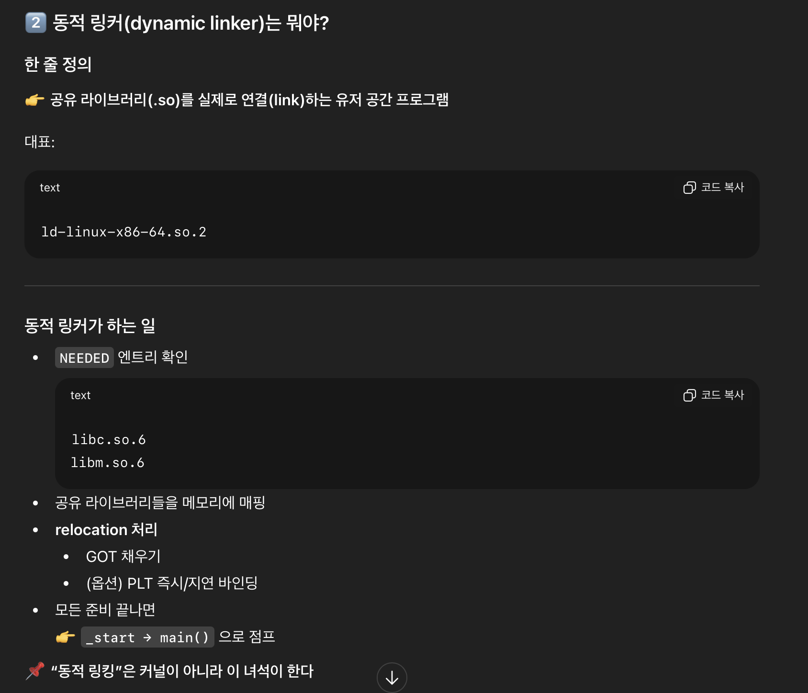


# 


- why linkers? (10장 12,13 pg)


프로그램이 프로세스로서 실행되면

os 코드에 의해 RAM메모리로 코드가 적재되고 명령어의 절대 가상주소가 확정됨.

CPU에서 한줄씩 명령어를 읽어와 수행함.

