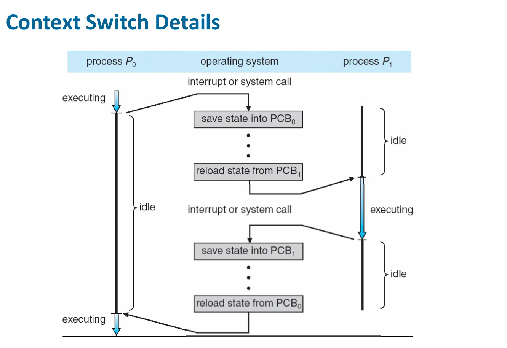
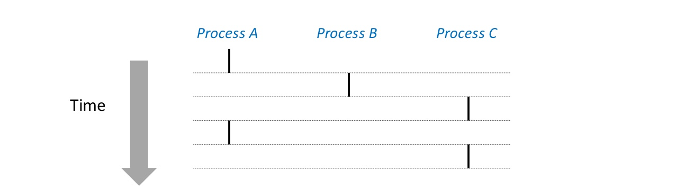
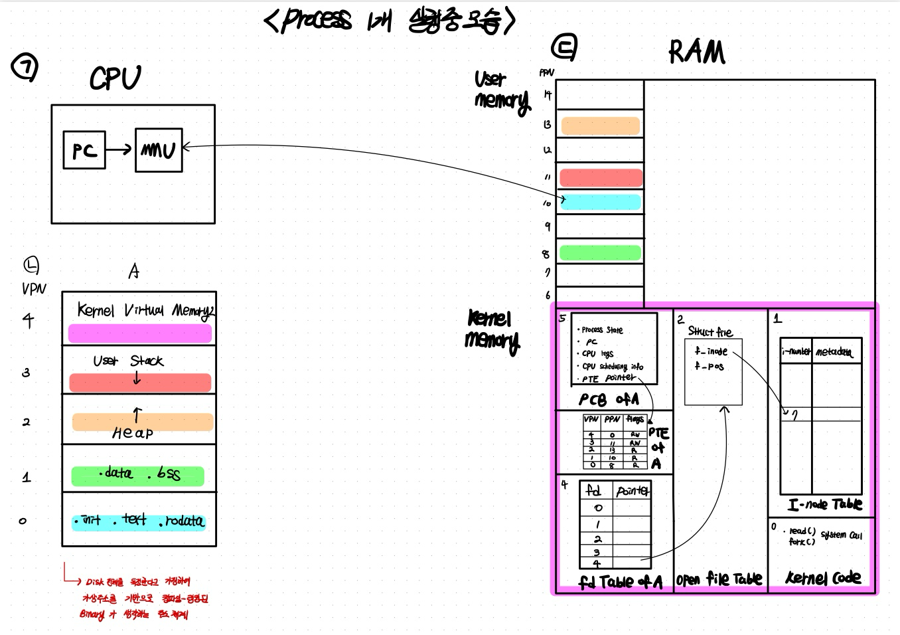
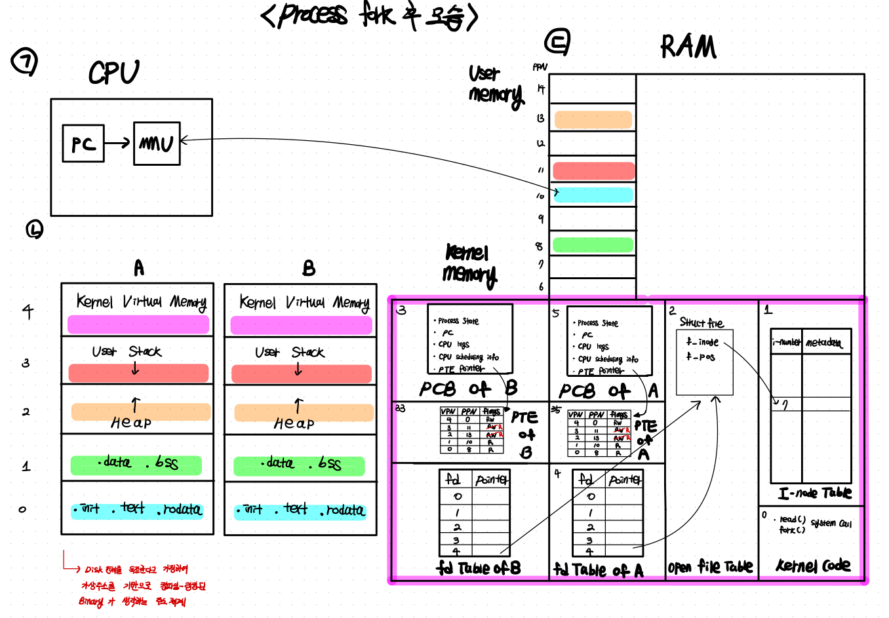
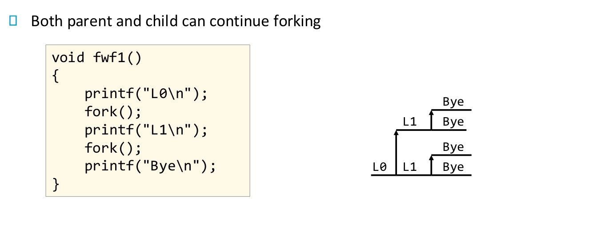
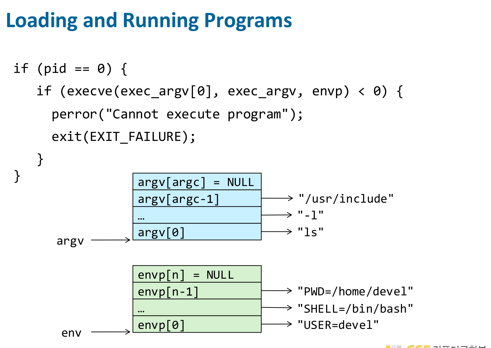
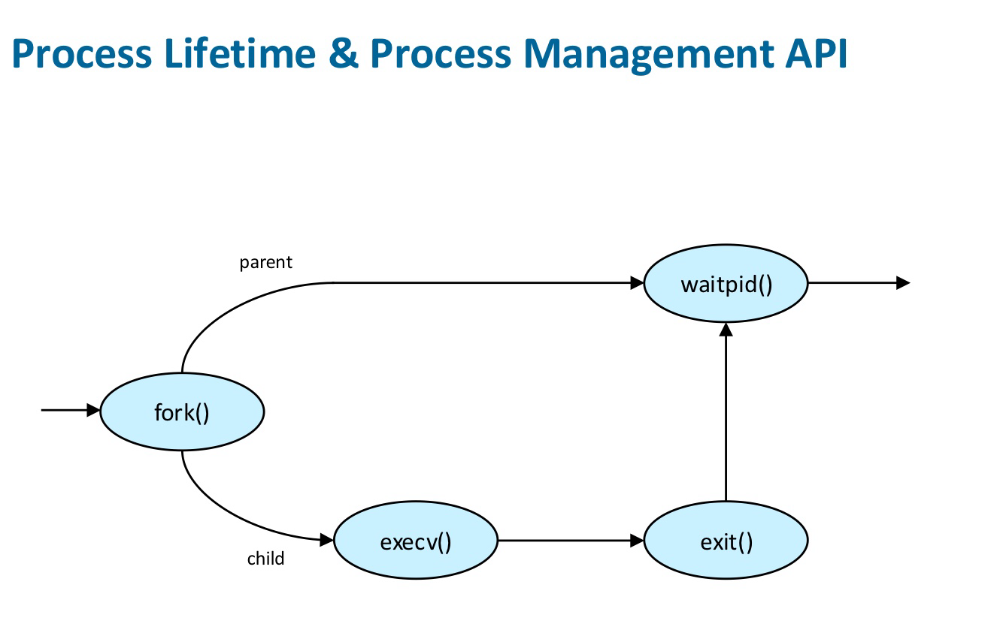

In this post, 15 System Programming lecture is introuduced. 


# Process Concept

Process는 실행 중인 program을 의미한다. Process는 다음의 두 가지 특징을 프로그램에 제공한다. 

- **Logical control flow** : 각 program은 CPU를 독점적으로 사용한다고 생각할 수 있다. 이는 여러 process가 순서대로, interleaved 되어 수행되거나, 여러 core에서 수행됨으로써 가능하다.
- **Private virtual address space** : 각 program은 RAM을 독점적으로 사용한다고 생각할 수 있다. 이는 virtual memory system에 의해 가능하다.

각 process는 다음의 요소들을 포함한다. 

- private CPU state (각 프로세스는 다음 상태를 **논리적으로** 가지고 있다)
  - Program Counter
  - CPU registers
- private address space
  - text and data sections
  - stack
- kernel data structures
  - open files
  - management information
    - scheduling
    - I/O, memory

## Process States

Process가 실행되면서 state을 바꾸는데 다음의 state들이 있다. 

- **new** : process가 처음 create되면 new state가 된다. 초기 start-up utilization을 수행하고, 아직 main code를 수행하지는 않는다.
- **running** : process가 현재 CPU를 차지하여 instruction을 수행하고 있는 상태이다.
- **waiting** : process 수행 중 I/O 등의 block (어떤 외부 이벤트를 기다려서 멈춘 상태. 즉, 프로세스가 CPU를 줘도 진행할 수 없는 상태)이 발생하면 process는 waiting 상태가 되고, CPU는 다른 process를 수행
- **ready** : CPU를 받으면 바로 수행될 수 있는 상태이지만 아직 CPU를 받지 못한 상태이다. 이 경우, process는 **RunQueue** 에 존재한다. (OS는 ready 상태의 process를 RunQueue에 관리한다.)
- **terminated** : 실행이 끝난 process이다. 더 이상 수행할 명령어는 없지만 system을 떠나지 않는 이유는 parent process가 terminate process에 대한 정보를 필요로 할 수 있기 때문이다. parent process는 child process를 create한 process를 의미하며, 가장 처음의 process를 제외한 모든 process는 parent process를 가진다. parent process가 terminated process인 child process가 떠나도 좋다고 허락하기 전까지는 terminated state 상태로 남아있는다. 이를 **zombie process** 라고도 한다.


📝 **Blocking / Non-Blocking System call**

Process State Diagram을 설명하는 과정에서 교수님께서 blocking / non-blocking system call에 대해 간단히 설명하셨다. 

Blocking System call은 해당 명령의 작업이 끝날 때까지 process가 blocked 된다(waiting 상태). 그동안은 다른 process에게 CPU가 넘어간다. 예를 들어, `read(fd, buf, 100);` system call을 호출하면 I/O가 발생하고 데이터가 disk에서 커널 메모리로 들어올 때까지 read 함수의 값이 return 되지 않고 process가 block 된다. 

반면, 아래와 같이 read를 non-blocking으로 만들 수 있다.

```c
fcntl(fd, F_SETFL, O_NONBLOCK);

read(fd, buf, 100);
```

I/O 요청을 했는데 지금 당장 수행할 수 없으면 바로 -1을 return 한다. 프로세스는 절대 block되지 않는다. 즉, 프로세스는 **running 상태 유지**, waiting으로 가지 않는다. 그렇다면 프로세스 실행 중, 데이터가 도착함을 어떻게 알고 처리를 할까? 파일 디스크립터에 데이터가 도착하면 커널은 내부 자료구조에서 “fd readable” 상태로 표시해둔다. 이 때 process는 이벤트 감시를 한다. (Non-blocking I/O는 반드시 event-driven API와 함께 사용해야 한다) 아래와 같은 코드를 추가로 적는다.

```c
int n = epoll_wait(epfd, events, MAX, -1);
```

프로세스는 `read`에서 -1을 반환하고 `epoll_wait` 라는 시스템 콜 함수를 실행한다.(그리고 프로세스는 waiting 상태가 된다.) 이 시스템콜은 커널이 fd들을 감시하여 fd에서 데이터 도착 or 이벤트 발생하면 해당 process를 waiting->ready로 깨우고 events 배열에 어떤 fd에서 어떤 이벤트가 발생했는지 채워준다. 사용자는 이벤트가 발생한 fd만 처리(다시 read를 수행)하면 된다. 

어짜피 process는 blocking 에서와 마찬가지로 중간에 waiting 상태가 되는데 어떤 장점이 있는지 헷갈릴 수 있다. blocking I/O는 “특정 fd 하나” 때문에 프로세스가 멈춘다. 그러나 epoll_wait = “여러 fd 중 아무나 이벤트가 오면 깨워라" 는 시스템 콜이므르 동시에 수백~수만 개 fd 를 효율적으로 처리할 수 있다.

## Process Control Block (PCB)

처음에 Process는 1. private CPU state, 2. private address space, 3. kernel data structure 를 가진다고 했다. 이 때 3. kernel data structure 중 하나가 PCB이다. 그리고 PCB에는 1. private CPU state의 내용이 저장되어 있고, 2. private address space는 PCB에 저장되지 않고 실제 메모리(physical memory)와 page table에 존재하지만, PCB는 이에 대한 포인터를 가지고 있다. 

- Process state(new, ready, ...)
- Program Counter(정확히는 pc에 대한 포인터)
- CPU registers
- CPU sheduling information(priority, time quantum, ...)
- Memory-management information(Page tabe, boundaries...)
- Accounting information(CPU/real time used, ...)
- I/O status information

Linux에서는 `task_struct`, `thread_struct` 구조체에 위 정보가 저장된다.

❗️PCB에 PTE가 저장되는 것이 아니라 PTE 포인터가 저장된다. 

# Context Switching

Processs는 OS code의 일부인 kernel에 의해 관리된다. kernel은 별도의 process가 아니라 user process의 일부로 동작한다. process가 system call을 호출하면 kernel code가 수행되는데 이 kernel code가 process의 PID 하에서 수행된다. 

한 process에서 다른 process로 CPU가 넘겨지는 것을 context switching 이라고 하는데, 이때 old process의 상태(수행 중이던 PC값 등)를 **PCB**에 저장해둔다. (PCB는 커널 데이터 구조로 디스크로 가지 않는다.)  이 context switching 시간은 hardware에 의존하는 순수 오버헤드 시간이다.




시작-끝 timeline이 overlap 되는 process들을 **concurrent processes** 라고 한다. concurrent 하지 않으면 sequential하다고 한다. 아래 그림에서 A-B, A-C는 concurrent 하고, B-C는 sequential 하다. Single core CPU에서는 concurrent processes들이 물리적으로 disjoint in time이지만 multi-core에서는 병렬적으로 동시에 수행될 수 있다.



# Process Creation

아래 그림은 한 개의 process가 실행 중일 때의 모습이다.



(ㄴ)은 프로세스의 가상주소 체계를 보여준다. 컴파일러와 링커가 프로그램이 disk 전체를 독점한다고 가정하여 가상주소 체계를 기반으로 binary 파일을(ELF 파일)만들어 낸다.(ELF의 .text 섹션의 instruction들이 stack, heap 영역의 주소를 포함하고 있을텐데 이때 위 주소 체계가 존재한다고 생각한다.) 프로세스 실행 중 CPU인 (ㄱ)은 pc register가 가지고 있는 가상주소 값을 MMU를 이용하여 물리주소 값으로 바꾸어 RAM(실제로 많은 경우 cache일 것이다. 여기서 cache의 존재는 고려하지 않는다.) 에서 명령어를 fetch 해오고 실행한다. 

kernel 메모리 영역에는 프로세스마다, PCB와 fd Table 등이 존재한다. PCB에는 PTE의 포인터가 저장된다. 

❗️ PTE에는 유저 메모리 영역의 VPN에 대한 PPN과 더불어 커널 메모리 영역에 대해서는 PCB, PTE, fd Table 등을 각각 entry에 저장하는게 아니라 커널 전체 공간에 대한 하나의 entry가 존재한다. 커널은 현재 실행중인 프로세스의 PCB 주소를 알 수 있으므로(어떻게는 여기서 생략) 이를 통해 PCB, PTE, fd Table 등에 접근한다. 

. `read()`, `fork()` 등의 system call 함수에 대한 코드는 kernel code 영역에 존재하며 모든 프로세스가 공유한다. 이렇게 process가 수행 중일때의 모습을 알아봤는데 다음의 질문이 생긴다. 

- 프로세스 수행 중의 모습을 봤는데 애초에 프로세스가 어떻게 만들어지고 시작되는가? 이와 관련해서 앞 장에서 loader에 대해 배웠지만 더 구체적으로 알아보고자 한다. 

하나의 process 내에서 `fork()` 라는 system call을 호출하여 child process를 만들게 된다. `fork`의 동작 흐름은 다음과 같다. 

1. 부모의 PTE의 flag 중 `RW` 인것이 있다면 `R` (read-only)로 바꾼다. 이때, kernel virtual memory에 해당하는 entry는 `RW` 상태로 놔둔다.
2. 자식 process에 대한 PCB, PTE, fd Table을 생성한다. 이 때, 부모 process의 내용을 그대로 복사한다. 
   - 따라서, 자식 process는 부모 process가 현재 수행 중인 코드 line (즉, PC값), PTE 등을 그대로 물려받게 된다.
   - 실제 memory page는 복사되지 않는다. PTE의 flag를 토대로 COW(copy-on-write) 로 마크 된다.
3. 위 과정을 성공하면 parent process에는 child process의 PID, child process에는 0을 return 한다. 

Context-switching을 통해 자식-부모-기타 process가 수행되던 중, COW page에 write 하려고 하면, fault가 발생한다. 그러면, page handler가 실행되어 다음을 수행한다.

1. 새로운 physical page를 할당
2. PTE의 PPN, flag 수정
3. write 진행



### Process creation Example

아래 예시를 이해해보자.

`echo` 는 인자에 `\n`을 붙여 stdout에 출력한다. `|` 는 echo process의 stdout을 fork3 process의 stdin에 연결한다. 아래 예제에서 parent/child process의 stdin이 공유되므로 다음과 같은 출력 결과가 나타난다.


아래 예시도 쉽게 이해가능하다. 



만약 위 예시에서 코드가 아래와 같다면 출력 결과가 어떻게 될까?

```c
void fwf1(){
  printf("L0");
  fork();
  printf("L1\n");
}
```

`printf`는 standard I/O이므로 유저 메모리 영역의 버퍼(in RAM)에 쓰는데, line-buffered 이므로 flush되지 않은 상황이다. 이 상태에서 fork를 하면, 해당 버퍼를 자식도 공유하게 되는데 여기에 `printf("L1\n")`을 하게 되면서, 새로운 page로 버퍼가 복사된다. parent, child 버퍼에 각각 `L0L1` 이 기록되고 newline을 만났으므로, stdin에 flush 되어 최종 output은 다음과 같다.

```bash
L0L1
L0L1
```

무엇이 parent process에 의한 것인지는 명확하지 않다. 두 process는 stdin을 공유하므로, 같은 화면에 출력된다.

### Shell Process

이제 우리가 위에서 했던 질문 -Process가 어떻게 시작되는가에 대해 이야기해보자. 우리가 shell에서 실행하고자 하는 바이너리 파일 `./a.out`을 입력하면 다음의 일이 벌어진다.

- bash와 같은 shell process는 `fork()`를 호출한다. 그러면 현재 bash는 parent process가 되고 child process가 생긴다.
- child process에서 시스템 콜 `execv("./a.out")`을 호출한다. 
  - `execv`는 child의 기존 주소 공간(PTE)을 삭제한다. 해당 프로세스가 차지하던 유저 메모리 영역도 삭제한다. 
  - 인자로 주어진 ELF 파일의 헤더를 바탕으로 새로운 PTE를 만든다. pc를 entry point로 설정한다.

## Process Termination

이제 process termination에 대해 알아보자. 

`main()`에서 return된 process는 `exit()` 이나 `abort()` 시스템 콜을 호출하여 terminated status가 된다. 해당 시스템 콜을 호출하면 clean up이 수행되는데 clean up은 크게 유저 레벨과 커널 레벨의 그것이 있으며 다음의 일들이 수행된다. (`abort`는 프로그램이 비정상적으로 종료될 때 발생하는 시스템 콜이며 이 경우, 유저 레벨의 clean up을 진행하지 않는다.)

- 유저 레벨 clean up
  - **open stdio 버퍼 flush** : `printf()` 호출 후 버퍼에 남아 있던 글자가 아직 파일로 안 써졌다면 exit()는 이 버퍼를 실제 파일/터미널에 모두 써준다.
  - **atexit() 등록 함수 실행** : 프로그램에서 `atexit()`로 등록한 함수들이 있다면 exit()는 이를 역순으로 실행함(LIFO).
  - C 표준 라이브러리가 내부적으로 잡고 있던 리소스 정리
- 커널 레벨 clean up
  - 모든 유저 주소 공간 메모리 해제(heap, stack, text/data 등) : PTE를 삭제한다.
  - 열려 있는 파일 디스크립터 닫기 : OS가 `close(fd)`를 모든 열린 FD에 대해 수행
  - COW 페이지 refcount 감소
  - child의 parent 설정 : 부모가 기다릴 수 있도록 exit code 저장, zombie 상태로 전환
  - signal handler 초기화 

이 때, exit code, CPU 사용량(time), 메모리 사용량, 종료 사유 (signal인지 정상 exit인지) 이런 통계와 정보가 **PCB(task_struct)** 안에 보관된 채로 남는다.(이 상태가 바로 **좀비(zombie)**)  즉, PCB의 일부가 삭제되지 않고 남아있다.

이후 부모가 wait() 또는 waitpid()를 호출하면:

- 커널이 자식의 exit code와 rusage(statistics)를 부모에게 전달
- 그 즉시 커널이 자식의 PCB(task_struct)를 완전히 제거
- 이 과정을 **reaping(수거)**라고 한다

만약 부모 프로세스가 자식 프로세스보다 먼저 exit되면 :

- 남아 있는 자식들은 **자동으로 init(1) 프로세스가 부모 역할**을 맡음
- init은 주기적으로 wait()를 호출해서 고아 프로세스들이 좀비 상태로 남지 않게 정리함

부모 프로세스 종료 시 자식도 자동으로 종료시키도록 설정할 수 있다. 이 경우, 부모 종료 → 자식에게 SIGKILL 자동 전달된다.

```bash
prctl(PR_SET_PDEATHSIG, SIGKILL);
```

- **void exit(int status)** : 인자로 전달한 status last byte을 저장한다. 
- **int atexit(void (*function)(void))** : process가 정상적으로 종료될 때 자동으로 실행될 함수를 등록하는 함수
- **init** : pid0에 의해 만들어진 첫 번재 user-level process로, idle/swapper/scheduler process라고도 부름. Initialization, starting essential services, reaping orphans, shutdown/reboot 등의 역할을 수행함. can't be killed by root.
- Shell 같이 오래 실행되는 process들은 반드시 reaping을 해야 한다. 그렇지 않으면 terminate 된 자식 processs들이 계속 샇이게 된다.


## Synchronizing with children

자식이 프로세스를 종료하는 과정에서 `exit()` 시스템 콜 함수가 실행되는데, 이 때 커널은 다음 세 가지 일은 수행한다. 

- 부모에게 SIGCHLD 시그널을 보냄
  - 자식 종료 시 **커널이 부모에게 SIGCHLD signal을 deliver**

- SIGCHLD를 보낸 경우, 부모가 wait() 중인지 체크하여 wait 중이면 parent를 wake_up()
  - 부모를 wakeup(run queue로 이동)

- 부모가 wait() 가능하도록 자식 상태를 “좀비(Zombie)”로 남김

  - exit code, 종료 원인 등을 PCB에 저장해둠

  - 부모가 `wait()`/`waitpid()`를 호출하면 이 정보를 읽고 좀비를 수거(reap)

부모 process에서 `waitpid()` 또는 `wait()` 시스템 콜 함수를 실행하면, 해당 process는 waiting 상태가 된다. 이후, 종료된 자식 process로부터 SIGCHLD signal이 전달되고 커널이 부모를 wakeup(run queue로 이동)한다. 이렇게 wakeup 되어 wait 함수가 다시 실행되면 이제는 자식 process의 종료에 관련된 정보가 wstatus에 담기고, 리턴된다.

```c
pid_t wait(int *wstatus);
```

- 아무 자식이나 종료될 때까지 기다린다.
- return 값은 종료된 자식의 PID
- 함수 실행 후, wstatus가 NULL이 아니면 wstatus에는 자식의 exit code, 어떤 이유로 종료되었는지(signal 등) 이런 상태 정보 비트를 담는다.

```c
pid_t waidpid(pid_t pid, int *wstatus, int options);
```

- `pid`
  - `pid > 0`: 해당 PID의 자식을 기다림
  - `pid = 0`: **같은 프로세스 그룹**의 아무 자식
  - `pid = -1`: 모든 자식(= `wait()`와 동일)
  - `pid < -1`: 특정 프로세스 그룹(-pid)


- options 

  - `WNOHANG`: 종료된 자식이 없어도 블록하지 않음

  - `WUNTRACED`: stop된(child stopped) 상태도 리포트

  - `WCONTINUED`: continue된(child resumed) 상태도 리포트


`waidid` 는 `waitpid`보다 훨씬 다양한 상태 변화를 감지한다.

```c
int waitid(idtype_t idtype, id_t id, siginfo_t *infop, int options);
```


이 때, exit code가 담긴 wstatus를 다음 매크로 함수의 인자로 전달하여 사용할 수 있다. 

- `WIFEEXITED(wstatus)`
  - 자식 프로세스가 exit() 또는 return으로 정상 종료했다면 true(1)을 반환한다.
- `WIFEEXITSTATUS(wstatus)`
  - 정상 종료(WIFEXITED(status) == true)라면 exit(코드)에서 전달한 **exit code(0~255)**를 반환한다.

## Loading and Running Programs

위에서 shell의 동작 방식에 대해 다루면서 언급한 `execve` 시스템 콜은 **PID는 유지한 채, 코드/데이터/스택을 새로운 프로그램으로 교체**하는 시스템 콜이다. 

```c
int execve(char *pathname, char *argv[], char *envp[]);
```

- `pathname` : 로드할 실행파일 경로

- `argv` : 프로그램에 넘기는 인자 배열

  ```c
  argv[0] = "ls"
  argv[1] = "-l"
  ...
  argv[argc] = NULL // 반드시 NULL로 끝나야함.
  ```

- `envp`  : 환경변수 배열

  ```c
  "PATH=/usr/bin"
  "HOME=/home/lee"
  ```

  - 문자열 형식: `"key=value"`
  - 사용자 프로그램은 `getenv()`, `putenv()` 등으로 접근 가능

**execve가 하는일**

1. 실행 파일을 찾고 열기

- 커널이 pathname의 파일을 찾고 ELF 로더 실행.

2. **현재 프로세스의 주소 공간 완전히 폐기**

기존 프로세스의 코드 영역 (텍스트), 데이터/BSS, 힙, 스택 전부 삭제함. 즉, 메모리 매핑 테이블(PTE)도 싹 초기화됨. mm_struct 내용도 새로 채워짐.

3. 새로운 프로그램을 주소 공간에 로드

- ELF 헤더를 읽어: 새 `.text`,   `.data`, heap 초기 위치, stack 이 모든 것을 새 주소 공간에 매핑.

❗️execve는 프로세스의 커널 정보는 유지함.

1. PID 유지 : 프로세스는 “같은 프로세스”로 간주됨.
2. open file table 유지 : 파일 디스크립터 0,1,2 포함 모두 유지됨. 단, FD_CLOEXEC 플래그가 걸린 FD는 닫힘.
3. signal disposition 유지

- 핸들러가 SIG_DFL이 아닌 값으로 바뀌어 있으면 기본값으로 리셋됨
- block mask는 그대로 유지됨
  (자세한 내용은 signal-chapter에서 이어짐)

4. cwd, umask 같은 커널 상태 유지됨

❗️execve는 정상 실행되면 **절대 반환되지 않는다**

왜냐하면 기존 프로그램이 완전히 사라졌기 때문. execve가 리턴하는 경우 = 오류 발생 시에만, 즉, pathname이 존재하지 않거나 permission 문제가 있을 때만 -1 반환.






I'm not entirely sure, but it seems possible for a reader to starve in the first readers–writers problem. If the first reader gets blocked on `P(w)` while a writer holds the lock, and new writers keep arriving, the scheduler might keep letting writers run first. In that case, the reader-preference idea doesn’t really help, because the first reader never gets a chance to acquire the lock.

