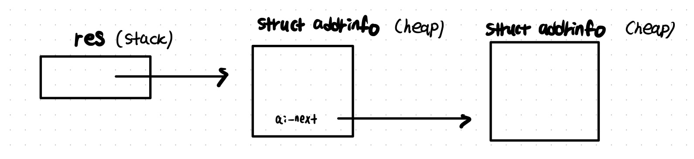
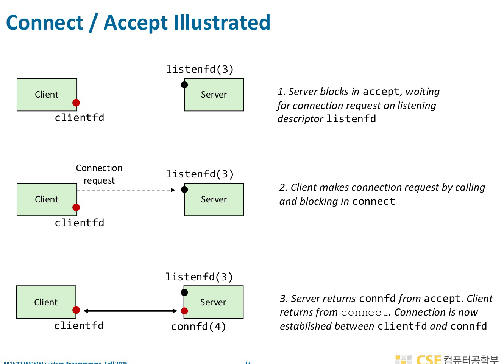

In this post, 22 ~ 23 System Programming lecture is introuduced. 


// 11.11, 11.13 (녹음 강의)


# Socket API

**getaddrinfo**

```c
int getaddrinfo(const char *node, const char *service, 
                const struct addrinfo *hints, struct addrinfo **res);
  
struct addrinfo hints, *res;

memset(&hints, 0, sizeof(hints)); // memset은 구조체 내부 필드를 0으로 초기화하는 함수
hints.ai_family = AF_INET;  // IPv4 only
hints.ai_socktype = SOCK_STREAM; // TCP

getaddrinfo("google.com", "80", &hints, &res);
```

- socket open에 사용되는`addrinfo` 구조체 리스트를 반환한다. 이 구조체에는 도메인 이름에 대한 IP 주소가 저장된다. 리스트인 이유는 하나의 도메인 이름이 여러개의 IP 주소로 변환될 수 있기 때문이다. 
- 함수
  - `node` : 도메인 이름 또는 IP 문자열 
  - `service` : 포트 번호 또는 서비스 이름
  - `hints` : 검색 조건을 담는 구조체
  - `res` : 리턴값은 연결 리스트 형태의 addrinfo 구조체이고 그 주소를 `res`가 가리킴.
  - return : 연결 리스트 형태의 addrinfo 구조체
- 내부 동작
  - /etc/hosts 확인. 도메인이 hosts 파일에 있으면 DNS 안함.
  - DNS 캐시 확인. 이미 DNS 조회한 적 있는 경우 캐시 사용.
  -  필요하면 DNS Query 보냄. UDP(또는 TCP)로 DNS 서버에 요청 전송.
  - DNS에서 받은 IP를 `struct addrinfo`로 포장함. 실제 내부적으로는 `struct sockaddr_in` 또는 `sockaddr_in6` 가 만들어짐.
  - 
- 끝나면 `freeaddrinfo` 를 호출하여 유저 heap에 생성된 모든 `addrinfo` 를 free 해야 함.

**socket**

```c
int socket(int domain, int type, int protocal);

int sockfd = socket(AF_INET, SOCK_STREAM, 0);
```

- 커널에게 소켓을 만들어달라고 요청하는 시스템 콜 래퍼 함수. 소켓 = “네트워크용 파일 디스크립터(fd)” 이다. 커널이 내부적으로 소켓 객체를 만들고 그 소켓을 가리키는 정수(파일 디스크립터)를 반환한다.
- 함수
  - `domain` : 어떤 방식의 주소(IP, Unix domain 등)를 사용할 것인지
    - `AF_INET` : IPv4 주소 체계
    - `AF_INET6`: IPv6 주소 체계
    - `AF_UNIX / AF_LOCAL` : 같은 시스템 내부 프로세스 간 통신 (Unix domain socket)
    - `AF_PACKET` : 이더넷 레벨
    - IPv4, IPv6 는 L3 단계에서 커널 코드가 IP 헤더를 붙이는 과정을 수행하는데, 어떤 방식의 주소 체계를 사용하느냐에 따라 이 패킷 포맷이 달라진다. `AF_UNIX` 를 쓰면 L4 단계에서 TCP/UDP 아님을 확인하고 Unix domain socket 자체 프로토콜을 사용한다. 
  - `type` : 어떤 전송 방식을 쓸지 (TCP냐 UDP냐에 따라 패킷 구조가 다름)
    - `SOCK_STREAM` : TCP
    - `SOCK_DGRAM` : UDP
  - `protocal` : 0으로 주면 커널에게 “타입에 맞는 기본 프로토콜(TCP/UDP)을 자동 선택하라”는 의미.

**bind**

```c
int bind(int sockfd, const struct sockaddr *addr,
        socklen_t addrlen);
```

- 내가 사용할 로컬 IP + 로컬 포트 번호를 지정하는 함수. 쉽게 말하면 "이 소켓은 앞으로 이 주소(=IP:PORT)로 들어오는 데이터를 받을게" 라고 운영체제에 등록하는 단계. 즉, **서버는 무조건 bind()가 필요**하지만 클라이언트는 대부분 필요 없음(커널이 자동으로 포트 선택).
- listen()을 호출한 소켓(listening socket)은 클라이언트와 데이터 송수신을 할 수 없다. 그 소켓은 오직 **연결 대기(waiting)** 역할만 한다.
- 함수
  - `sockfd` : socket()으로 생성한 소켓 FD 
  - `addr` : 어떤 IP/PORT에 묶을지 지정
  - `addrlen` : addr의 크기

**listen**

```c
int listen(int sockfd, int backlog);
```

- 1. TCP 소켓을 “수동 대기 상태(passive open)”로 전환 (커널이 이 소켓을 "서버 소켓"으로 인식하게 하기 위함)
  2. 커널에 **connection queue** 만듦
  3. 커널이 SYN 패킷을 처리할 수 있게 함
     - listen() 호출 전에는 이 포트에 SYN 오면? → 연결 요청 무시 (RST)
     - listen() 후에는 이 포트의 SYN 처리해줘 → SYN/ACK 보내고 큐에 넣어둠
       ACK 오면 → accept queue로
- 함수
  - `sockfd` : socket() + bind()로 만든 TCP 소켓
  - `backlog` : accept() 되기 전에 커널이 임시로 보관할 수 있는 연결 요청의 최대 수 (커널이 대기열(Queue)에 넣어둘 수 있는 연결 요청 수)


📝 **SYN, 3-way handshake**

TCP는 연결 지향 프로토콜이므로 통신하기 전에 반드시 서로 연결을 “설정(setup)”해야 한다. 

이 과정이 **3-way handshake**이고 SYN은 여기서 사용된다. 

SYN은 TCP 연결을 만들 때 사용되는 “연결 시작 패킷(flag)”이다. TCP 헤더의 "Flags" 필드 중 하나이다.

1.  클라이언트 → 서버 (SYN)

   - “나 너랑 연결하고 싶어”

   - “내 시퀀스 번호는 X로 시작할게”

2. 서버 → 클라이언트 (SYN + ACK)

   - “좋아, 연결하자”
   - “나도 내 시퀀스 번호 Y로 시작할게”
   - “너가 보내준 번호 X 받았어(ACK)”

3. 클라이언트 → 서버 (ACK)

   - “너의 시퀀스 번호 Y 받았어”
   - 연결 완료

**3-way handshake**를 진행하는 동안 커널 내부에 두 개의 Queue가 필요하다.

1. SYN Queue (Incomplete connection queue)
   - 아직 handshake 끝나지 않은 “반쯤 열린 연결(SYN RECV 상태)” 저장

2. Accept Queue (Completed connection queue)
   - handshake 완료된 연결이 들어가는 큐. 여기서 accept()가 꺼내간다.

**accept**

```c
int accept(int sockfd, structure sockaddr *addr,
           socklen_t *addrlen);
```

- listen() 중인 소켓으로 들어온 클라이언트 연결 요청을 받아서, 통신 전용(connected) 소켓을 새로 만들어 반환하는 함수.

  1. 3-way handshake가 **끝난 연결을 받아서** 커널의 accept queue에 저장된 연결을 꺼낸다. Queue에 pending connection이 없다면, connection이 들어올 때까지 기다린다. (blocking) 만약 listening socket을 non-blocking으로 설정하면, accept은 connection이 queue에 없을 시 기다리지 않고 즉시 -1을 리턴한다. 이렇게 accept을 non-blocking으로 한다면 언제 다시 accept을 시도해야할지 어떻게 알까? **epoll** 이라는 event system call을 사용한다. epoll은 어떤 event가 발생할 때까지 blocking 상태가 된다. 여기서는 listening socket이 readable 해지는 event를 모니터링 하도록 epoll을 call한다. 

  2. 새로운 소켓(conn_fd)을 생성한다. 리턴되는 fd는 listen_fd와 완전히 다른 소켓이다.

  3. 클라이언트의 IP/Port 정보를 addr에 채워준다.

- 함수

  - `sockfd` : listen() 중인 소켓
  - `addr` : 연결해온 클라이언트의 주소(IP, port)를 저장할 버퍼
  - `addrlen` : 그 버퍼의 크기 (입력 & 출력)
  - return : 클라이언트와 연결된 새로운 소켓 FD 

**connect**

```c
int connect(int sockfd, const struct sockaddr *addr,
            socklen_t *addrlen);
```

- 클라이언트가 서버에게 TCP 연결을 요청하는 함수이며, TCP 3-way handshake를 시작하는 시스템 콜. `SYN` 패킷을 보내고, `SYN`+`ACK`를 blocking 상태로 기다린다. 마찬가지로 socket을 non-blocking으로 설정하면, write event를 set하여 해당 socket이 writable 해지면, connect이 established 되었음을 알게 된다. 
- 함수
  - `sockfd` : socket() 으로 만든 소켓 (클라이언트 쪽 소켓)
  - `addr` : 연결할 대상(서버)의 주소 (IP + 포트)
  - `addrlen` : addr 구조체 크기

- 내부 동작
  - 소켓을 `SYN_SENT` 상태로 전이
  - SYN 패킷 생성
  - 라우팅 테이블 확인해 next hop 결정
  - ARP로 MAC 주소 획득
  - NIC에 DMA로 전송 지시

**send / recv**

```c
ssize_t send(int sockfd, const void *buf, size_t len
            int flags);
ssize_t recv(int sockfd, void *buf, size_t len,
            int flags);
```

- `send` : 커널에 “이 데이터를 TCP 소켓으로 보내라”고 요청하는 함수. 유저 버퍼의 데이터를 커널 send buffer로 복사하고 이후 커널 내부 TCP 스택이 복잡한 처리 과정을 거치고 최종적으로 NIC 드라이버가 패킷을 실제로 전송. send buffer가 가득 차면(상대가 데이터를 안 받아줌) block 될 수 있음. non-blocking 이라면, send buffer가 꽉 차 있으면 바로 -1 반환. 만약 send buffer에 100만큼 보내고 싶은데 70만큼의 공간만 있다면, 70만큼만 복사되고 70을 즉시 리턴함. send가 수행되었다고 전송이 된것이 아님. 그저 커널 버퍼로 복사 된 것일 뿐. 이후 전송은 TCP 커널 코드가 알아서 수행.
- `recv` : 커널의 TCP receive buffer에 도착한 데이터를 사용자 버퍼로 가져오는 함수. 커널 TCP receive buffer 확인하여 받은 데이터가 있다면 `copy_to_user()`로 사용자 buf로 복사. 데이터가 없다면, 데이터가 도착할 때까지 wait queue에서 sleep. 이후, 데이터가 도착하면 NIC가 CPU에게 interrupt를 발생시키고, 커널의 인터럽트 핸들러로 진입하는데, 이 과정에서 실행되는 커널 네트워크 스택이 `wake_up()` 함수를 통해 wait queue를 깨운다.
- 함수
  - `flags` : recv에서 0일 경우, recv는 read와 동일.
  - return : send는 보낸 데이터 수, recv는 받은 데이터 수.
  





// 11.25 강의 ~ 22분까지.

chap 17 ppt 23 ~ 40
