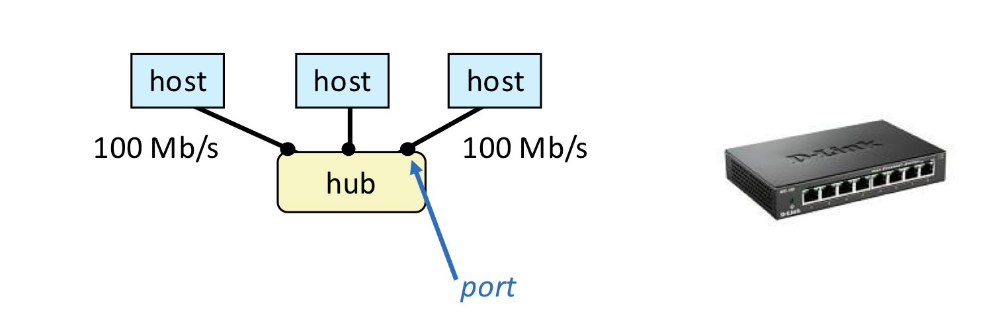
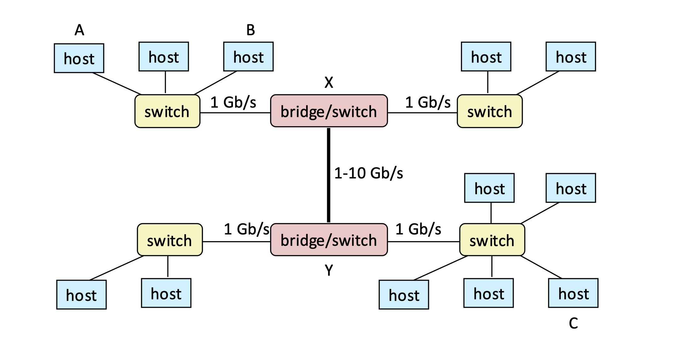
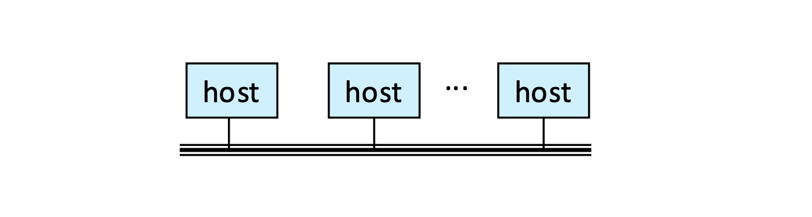
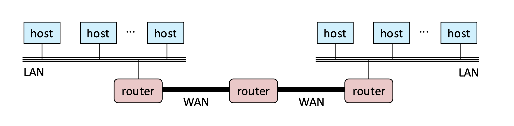
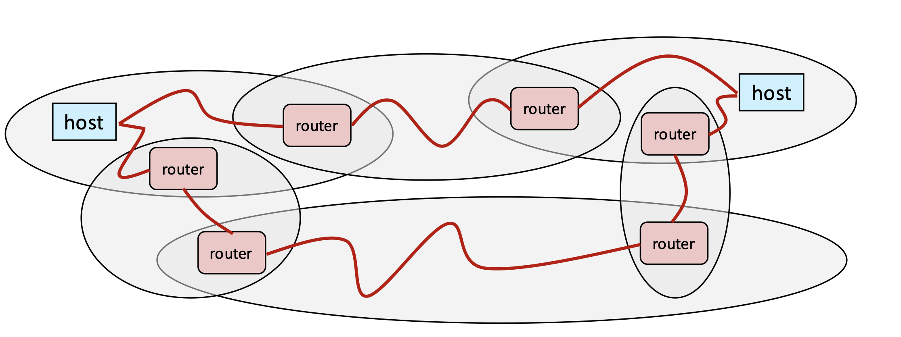
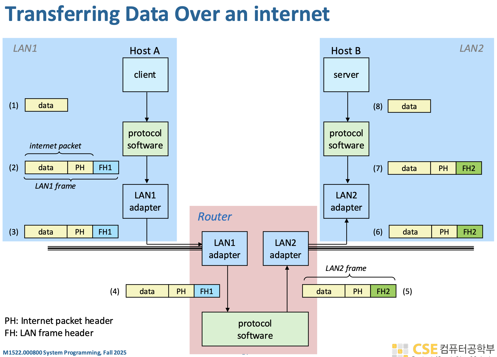
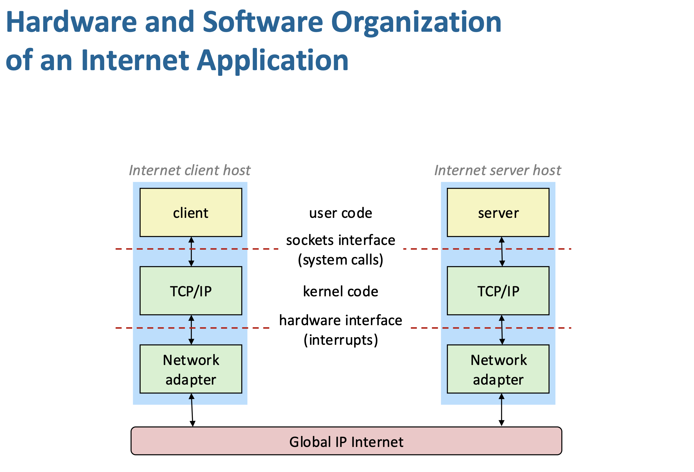
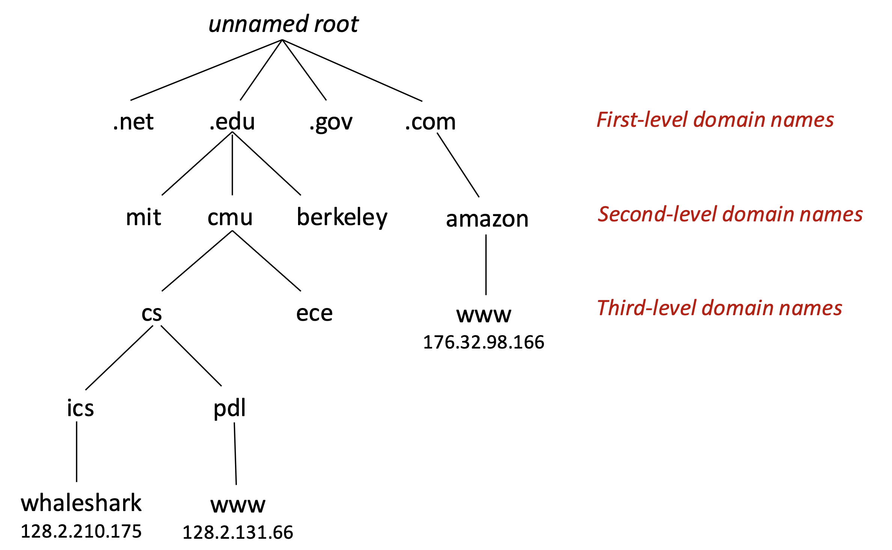
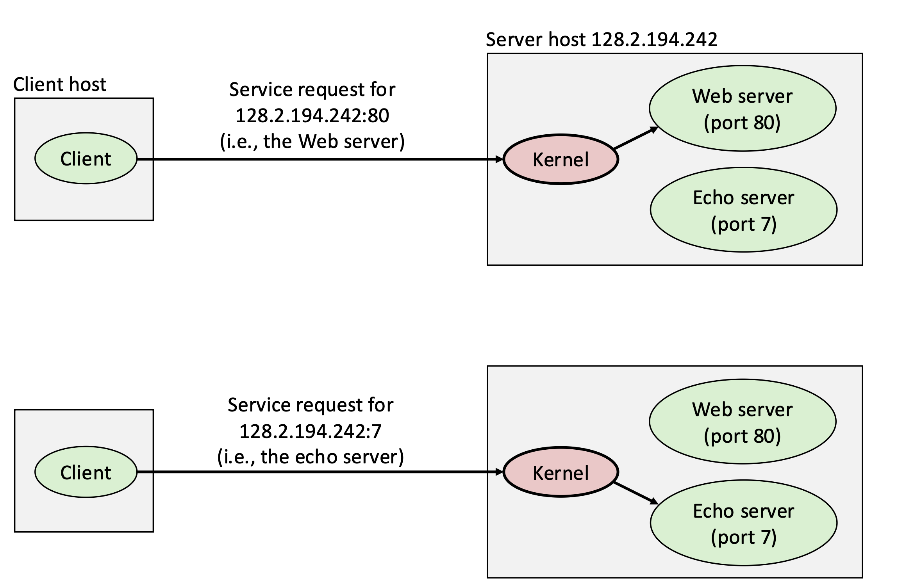

In this post, 22 System Programming lecture is introuduced. 


# Computer Networks

컴퓨터 네트워크에 대한 아주 기본적인 개념만 설명한다. 자세한 내용은 내년에 네트워크 강의를 듣기로 한다.

network 란, 박스(컴퓨터, 서버, 스위치 등) + 선(케이블) → 이들이 **지리적 거리 기준으로 계층적으로 구성된 시스템** 이다.

intetnet은 internetwork의 약자로, 네트워크들의 네트워크이다.

Internet은 가장 유밍한 우리가 사용하는 internet이다. internet이지만 Internet이 아닌 예시는 인트라넷, military network 등이 있다.

- **Ethernet segment** : 여러 host(컴퓨터) 들이 UTP 케이블로 연결된 네트워크의 가장 기본 단위이다.

  - 
  - 각 컴퓨터가 hub에 연결되어 있는데 이 때 hub의 연결점을 **port**라 한다.
  - 모든 컴퓨터는 네트워크 카드를 가지고, 모든 네트워크 카드에는 **MAC address** 라는 48-bit 고유주소가 있다.
  - 컴퓨터는 데이터를 bit들의 묶음인 **frame** 단위로 보낸다. host A → host B로 보내고 싶으면 frame 안에 “목적지 MAC 주소” 넣어서 전송한다.
  - hub는 들어온 신호를 모든 포트로 그대로 복사해서 뿌린다. 이를 **broadcast**라 한다. 
  - 그 결과 ethernet setment에서는 모든 컴퓨터가 모든 데이터를 다 보게 된다. 그러나 목적지가 MAC 주소가 자신이 아니었다면 그냥 버린다.

- **Bridged Ethernet Segment** : 가운데 있는 **bridge/switch (X, Y)**에 여러 LAN을 연결되어, 여러 이더넷 세그먼트를 하나의 네트워크처럼 연결하는 구조이다.

  - 

  - Bridge/swith는 frame이 들어오는 포트를 기반으로, 어떤 MAC 주소가 어느 포트 뒤에 있는지 table에 저장한다.(X는 Y 뒤에 연결되어 있는 host들의 정보도 저장한다.)
  - 예 : (A, 왼쪽 스위치, 브리지 X의 포트1), (C, 오른쪽 아래 스위치, 브리지 Y의 포트3) 
  - A → C로 보낼 때, 브리지가 C가 어느 포트인지 알고 있다면, 해당 포트로만 전달한다.
  - 처음보는 MAC 주소일 때는 모든 포트로 뿌린다.
  - 같은 세그먼트 내부일 때 : 브리지로 전달을 하지 않는다.
  - 이런식으로, 건물 / 캠퍼스 범위의 네트워크 전체 연결이 가능하다. 

- **LAN** : 한 지역(집, 학교, 회사 등)에서 여러 호스트들이 연결된 **전체 네트워크**를 의미한다. 위에서 본 것처럼 Ethernet을 이용한 네트워크, WiFi를 이용한 네트워크 기술 등등 여러 기술이 존재한다. 

  - 간단히, 호스트, 허브, 브릿지, LAN선을 다음과 같이 호스트가 하나의 wire에 연결된 그림으로 나타낸다.



- **internets** : 이제 여러 LAN 네트워크들을 연결하여 더 큰 네트워크를 만들고 싶다. 그런데, ethernet, WiFi 등 여러 LAN 기술들이 incompatiable 하기 때문에 이를 해결해야 한다. 
  - 
  - **라우터(router)**는 서로 다른 네트워크를 **연결 + 변환 + 전달**하는 장치이다.
  - 
  - 인터넷은 정해진 구조(트리, 링 등)가 없고 그냥 여러 네트워크가 막 연결된 형태이다. 이를 **ad hoc interconnection**이라 한다.
  - 데이터는 한 번에 가지 않고 여러 네트워크를 hop(점프) 하면서 이동한다. 라우터가 다음 목적지 방향을 결정해서 넘긴다. 구체적으로 패킷이 라우터에 도착하면 목적지 **IP**를 보고 어디로 보내야 하는지 결정해서 다음 라우터로 넘긴다. 이 때, 라우터는 **라우팅 테이블**을 조회하여 결정을 내린다. 
  - MAC 주소는 같은 LAN 안에서 장치를 식별해 바로 옆으로 데이터를 전달할 때 쓰이는 물리 주소이고, IP 주소는 네트워크 간을 넘나들며 목적지까지의 경로를 결정하기 위한 논리 주소다. MAC은 구조가 없어 전체 인터넷에서 경로 계산이 불가능하지만, IP는 계층적 구조를 가져 라우터가 효율적으로 길을 찾을 수 있다. 그래서 실제 통신에서는 라우터는 IP로 방향을 정하고, 각 구간에서는 MAC으로 전달한다.

**internet protocol**

서로 다른 LAN/WAN은 기술(규칙)이 다르다. 프레임 형식, 속도, 주소 체계 등이 제각각이다. 그냥 비트만 보내면 서로 이해를 하지 못한다. 따라서, 다른 규칙들 위에 공통된 규칙을 얹는다. 이를 internet protocal 이라 한다. internet protocal의 역할은 크게 두 가지이다. 

- Naming scheme (주소 체계 제공) : 모든 장치에 **IP 주소 같은 통일된 주소**를 부여한다. 각 호스트/라우터는 고유하게 식별된다. 

- Delivery mechanism (전달 방식 제공) : 데이터를 packet(IP 패킷) 단위로 보낸다. 패킷 구조는 **Header**(출발지, 목적지, 크기 등 전달 정보)와 **Payload** (실제 데이터 비트) 를 포함한다. 

다음 그림은 한 LAN에서 다른 LAN으로 데이터를 보낼 때 실제로 무슨 일이 일어나는지를 단계별로 보여준다.



1. 클라이언트에서 데이터 생성

- Host A에서 그냥 **data** 생성

2. 프로토콜이 인터넷 패킷 만듦

- data 앞에 **PH (IP 헤더)** 붙임. 이것이 **인터넷 패킷**

- 그리고 LAN으로 보내기 위해 앞에 **FH1 (LAN1 프레임 헤더)** 추가

3. LAN1을 통해 전송

- 그냥 **LAN1 프레임** 형태로 이동

4. 라우터 도착 → 프레임 벗김

- 라우터는 FH1 제거 (LAN1용이니까 버림) **IP 헤더(PH)** 보고 다음 경로 결정

5. LAN2로 보내기 위해 새 프레임 생성

- LAN2에 맞게 **FH2 새로 붙임**(LAN마다 프레임 형식이 다르기 때문)

6. LAN2 통해 이동

- 이제 LAN2 규칙으로 전송

7. 서버 도착 → 프레임 제거

- FH2 제거

8. 최종적으로 data 전달

- 프로토콜이 PH 제거
- 서버 애플리케이션에 **data 전달**


## Global IP Internet

internet과 Internet은 다르지만  internet protocol = Internet protocol = IP 이다. 

- **Global IP Internet** : 우리가 쓰는 internet의 대표적인 형태 = Internet
  -  **TCP/IP** 프로토콜 집합 위에서 돌아간다

- **IP** : 주소 지정 + 패킷 전달 

  - **기본적인 주소 체계 제공** → IP 주소

  - **비신뢰성(unreliable)** → 그냥 보내기만 함.
  - Host-to-host

- **UDP** : 단순한 프로세스 간 전달

  - IP 위에서 동작
  - 여전히 **unreliable**

- **TCP** : process-to-process + 신뢰성 보장

  - reliable (신뢰성 있음)
  - 재전송, 순서 보장, 중복 제거
  - connection 기반 : 연결을 먼저 맺고 통신

📝 **IP가 보낸다, TCP가 보낸다의 의미**

다음과 같은 프로그램이 실행된다고 하자.

```c
send(sock, data, len, 0);
```

1. CPU가 syscall 실행하여 user mode → kernel mode 전환이 이루어진다.
2. TCP/UDP 프로토콜을 구현한 OS 코드에서 여러 작업.
3. IP 프로토콜을 구현한 OS 코드에서 **목적지 IP 확인**, **라우팅 테이블 조회**, 어디로 보낼지 결정.
4. Link 계층 OS 코드에서 패킷 완성
5. OS 코드가 NIC 드라이버 호출하여 패킷을 NIC의 **DMA 버퍼**에 넣음
6. NIC는 프레임을 읽고 전송 준비(유선 전송인 경우에는 케이블을 따라 전류/전기장 전달, 무선 전송인 경우에는 0/1을 전자기파 변조하여 공기 중으로 전송)

실제 네트워크 데이터는 `CPU → (커널 네트워크 스택) → NIC(랜카드) → 전기/전자기 신호`  흐름이다.

따라서, IP로만 보낸다라는 표현은 IP가 데이터를 보내는 무슨 물리적 주체라는 뜻이 아니라, 위에서 step 2를 하지 않는다는 뜻이다. 

📝 **Host-to-Host vs Process-to-process**

- **Host-to-Host** : 컴퓨터 ↔ 컴퓨터 전송. IP는 내 노트북 → 서버까지 데이터를 보낸다. 
- **Process-to-process** : 프로그램 ↔ 프로그램 전송. TCP/UDP는  내 브라우저 → 서버의 웹서버 프로그램으로 데이터를 보냄.

**우리는 TCP “프로토콜 규칙”을 직접 구현해서 쓰는 게 아니라, 커널에 이미 구현된 TCP를 “socket API로 요청해서 사용한다.”** OS 커널이 이미 TCP를 다 구현해놓았기 때문에 socket API를 사용하면 된다. 

지금까지의 논의를 요약하면 아래 그림과 같다.



## Programmer's View of the Internet

프로그래머 관점에서 인터넷을 어떻게 추상화해서 보는지를 생각해보자. 핵심은 복잡한 물리/네트워크 구조를 숨기고, 단순한 모델로 생각한다는 것이다. 

- **Host → IP address 매핑**

  - 인터넷에 연결된 모든 장치(컴퓨터, 서버 등)를 **host**라고 함

  - 각 host는 IP 주소 라는 숫자로 식별됨. 예: `147.46.10.129`

  - 현실에서는 수많은 라우터, 케이블, 스위치가 있지만, 프로그래머 입장에서는 그냥 **“이 컴퓨터 = 이 IP”** 이렇게 보면 됨

- **IP address → Domain name 매핑 (DNS)** 

  - 숫자는 사람이 기억하기 어려움, 그래서 **도메인 이름(domain name)**을 사용. 예: `www.snu.ac.kr`

  - 이 둘은 서로 매핑됨

  - 우리는 `www.snu.ac.kr` 입력하지만, 내부적으로는 DNS가 IP로 변환 → 실제 통신은 IP로 수행

- **Process ↔ Process 통신 (Connection)** 

  - 인터넷의 본질은 컴퓨터끼리 통신이 아니라 프로그램(프로세스)끼리 통신
  - 예. 크롬(내 컴퓨터) ↔ 웹서버 프로그램(구글 서버)

  - 이 통신은 **connection(연결)** 위에서 이루어짐
    

위 각각에 대해 조금 더 자세히 알아보자.

**IP Address**

- **IPv4 vs IPv6** : IPv4는 32비트 주소로 약 43억 개만 지원해 주소 부족 문제가 생겼고, 이를 해결하기 위해 128비트 주소를 사용하는 IPv6가 1996년에 도입되었지만, 기존 인프라와 비용 문제 때문에 2025년 현재도 인터넷 트래픽의 대부분은 여전히 IPv4 기반이며 IPv6는 점진적으로 확산 중인 상태이기 때문에, 실제 네트워크 프로그래밍에서는 두 프로토콜을 모두 지원하는 방식으로 코드를 작성하는 것이 중요하다. 현재는 기존 인프라가 IPv4 기반이 많아서 완전 교체 비용 커 NAT 같은 우회 기술로 버티는 중이다.
- IPv4 주소는 실제로 사람이 보는 문자열이 아니라 32비트 정수로 `struct in_addr` 안의 `s_addr`에 저장되며, 네트워크에서는 모든 정수(IP 주소, 포트 등)를 **big-endian인 network byte order**로 통일하기 때문에 호스트(x86의 little-endian)에서 사용할 때는 변환이 필요하다; 예를 들어 `struct in_addr addr; addr.s_addr = htonl(0xC0A80001);`처럼 `htonl()`로 host → network 변환을 해서 `192.168.0.1`을 올바른 바이트 순서로 저장하고 전송하며, 반대로 수신 시에는 `ntohl()`로 다시 변환한다.

- IPv4 주소는 실제로 32비트 정수로 저장되지만 사람이 읽기 쉽게 하기 위해 이를 1바이트씩 나눠 각각을 10진수로 바꾼 뒤 점(.)으로 구분한 **dotted decimal 형태(예: 128.2.194.242)**로 표현하며, 코드에서는 직접 비트를 나누지 않고 라이브러리 함수를 사용해 변환하는데 예를 들어 `struct in_addr addr; inet_pton(AF_INET, "128.2.194.242", &addr); char buf[INET_ADDRSTRLEN]; inet_ntop(AF_INET, &addr, buf, sizeof(buf));`처럼 문자열 ↔ 이진 형태 변환을 처리한다.

**Domain Names**

- 
- 이 그림은 **도메인 이름(DNS)이 트리 구조로 계층적으로 구성되고, 최종적으로 IP 주소로 매핑되는 과정**을 보여준다. 최상단에는 이름이 없는 **루트(root)**가 있고, 그 아래에 `.com`, `.edu`, `.gov` 같은 **최상위 도메인(1단계)**이 있으며, 그 아래 `amazon`, `cmu`, `mit` 같은 **2단계 도메인**, 그리고 `www`, `cs`, `ece` 같은 **3단계(서브도메인)**이*이어지면서 `www.amazon.com → 176.32.98.166`처럼 최종적으로 특정 IP 주소로 연결된다. 즉, 도메인 이름은 사람이 기억하기 쉬운 이름을 계층적으로 관리하기 위한 구조이고, 실제 네트워크에서는 DNS가 이를 **IP 주소로 변환**하여 통신이 이루어진다.
- DNS는 인터넷에서 **도메인 이름을 IP 주소로 변환해주는 전 세계에 분산된 데이터베이스 시스템**이며, 프로그래머 입장에서는 각 도메인과 IP의 매핑 정보를 담은 여러 host entry들의 집합으로 볼 수 있고, 하나의 도메인이 여러 IP를 가질 수도 있고 그 반대도 가능하다.

**Internet Connections**

클라이언트와 서버는 TCP 연결을 통해 **바이트 스트림을 주고받는데**, 이 연결은 두 프로세스를 직접 연결하는 **point-to-point**, 동시에 양방향 통신이 가능한 **full-duplex**, 그리고 순서대로 정확히 전달되는 **reliable**한 특성을 가진다. 이때 연결의 양 끝점을 **소켓(socket)**이라 하며 소켓은 **IP주소:포트번호**로 식별된다. 

여기서 **포트(port)**는 프로세스를 구분하는 16비트 값으로, 클라이언트가 연결할 때 자동으로 할당되는 **ephemeral port**와, 웹 서버의 80번처럼 특정 서비스에 정해진 **well-known port**가 있다. 포트 정보는 PCB(Process Control Block)가 아니라 TCP 쪽 구조체에 저장된다. 

호스트가 전달 받은 패킷에는 (src IP, src port, dst IP, dst port) 정보가 있고 커널은 이걸로 **소켓 테이블**을 조회하여 이미 연결된 TCP 가 있다면 해당 소켓 버퍼(recv buffer)로 데이터를 전달한다. 소켓은 특정 프로세스의 파일 디스크립터로, 프로세스가 `recv()` 호출해서 버퍼의 값을 읽는다.

클라이언트에서 서버로 보내는 상황을 생각해보자. 클라이언트 포트 `51213`은 커널이 자동으로 할당한 **ephemeral port**, 서버 포트 `80`은 웹 서비스용 **well-known port**다. 이 구조 덕분에 같은 서버(80번 포트)에 동시에 여러 클라이언트가 접속해도 각각의 연결이 서로 구분되어 독립적으로 통신할 수 있다.




