In this post, 23 System Programming lecture is introuduced. 


# Socket

소켓 인터페이스는 네트워크 프로그램을 만들 때 사용하는 **시스템 콜 집합(socket, connect, send, recv 등)**으로, 기존 Unix의 파일 I/O 방식(read/write)과 함께 동작해 네트워크 통신을 파일처럼 다루게 해준다. 

소켓은 그냥 **fd (파일 디스크립터)**이다. 그래서 아래와 같이 사용한다. 

```c
write(sockfd, buf, n);  // 네트워크로 보냄
read(sockfd, buf, n);   // 네트워크에서 받음
```

각 프로세스는 자기 소켓 fd만 알고 있다.(`client(fd)  ←→  server(fd)` ) 커널이 내부에서 연결을 관리한다. 

## Socket Address Structures

다양한 프로토콜(IPv4, IPv6 등)이 서로 다른 주소 구조를 가지는데도 `connect`, `bind`, `accept` 같은 시스템 콜은 **하나의 타입으로 주소를 받기 위해** 공통 형태인 `struct sockaddr`를 사용한다는 점이다. 이 구조체는 `sa_family`(주소가 IPv4인지 IPv6인지 같은 프로토콜 종류)와 실제 주소 데이터를 담는 `sa_data`로 구성되어 있지만, 실제로는 `sockaddr_in`(IPv4), `sockaddr_in6`(IPv6) 같은 **구체 구조체를 만든 뒤 이를 `struct sockaddr`로 캐스팅해서 전달**한다. 즉, `struct sockaddr`는 실제 주소를 담기 위한 구조라기보다, **여러 주소 타입을 하나의 인터페이스로 처리하기 위한 “껍데기(공통 타입)” 역할**을 한다.

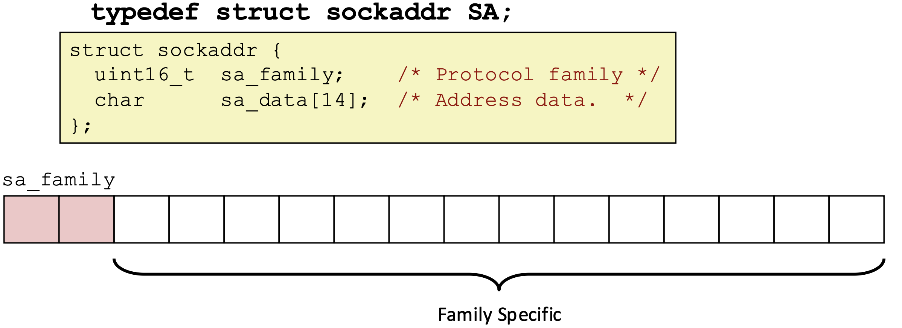

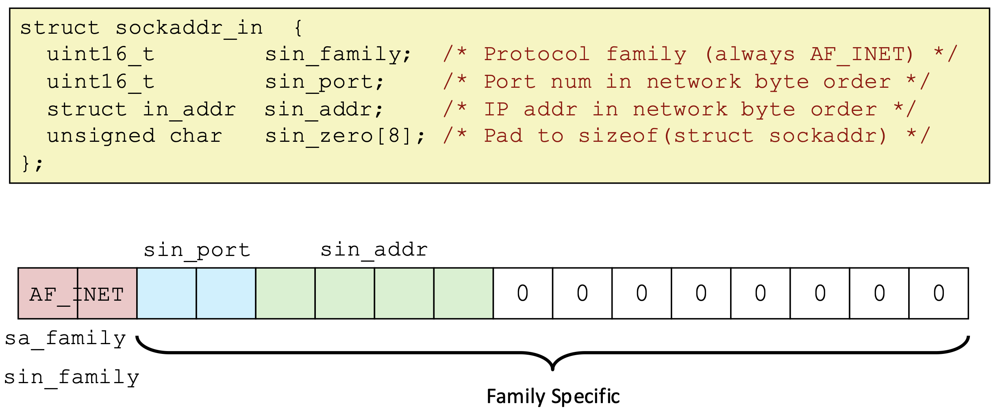

이 그림은 **IPv4용 소켓 주소 구조체 `struct sockaddr_in`의 실제 메모리 구성**을 보여준다. 이 구조체는 `struct sockaddr`의 구체 버전으로, 먼저 `sin_family`에 **프로토콜 종류(AF_INET)**를 넣고, `sin_port`에는 **포트 번호(반드시 network byte order)**, `sin_addr`에는 **IP 주소(역시 network byte order)**를 저장한다. 나머지 `sin_zero`는 실제 의미 없는 **패딩(padding)**으로,*전체 크기를 `struct sockaddr`와 맞추기 위해 존재한다. 즉, 이 구조체는 **“IP주소 + 포트번호 + 프로토콜 타입”을 하나로 묶어 커널에 전달하기 위한 형태**이고, 실제 시스템 콜에서는 이를 `struct sockaddr*`로 캐스팅해서 사용한다.

# Socket API

이 그림은 **소켓 기반 TCP 클라이언트–서버 전체 흐름**을 한 번에 보여준다. 이제부터, 각 단계에서 일어나는 일과, api에 대해 알아보자.

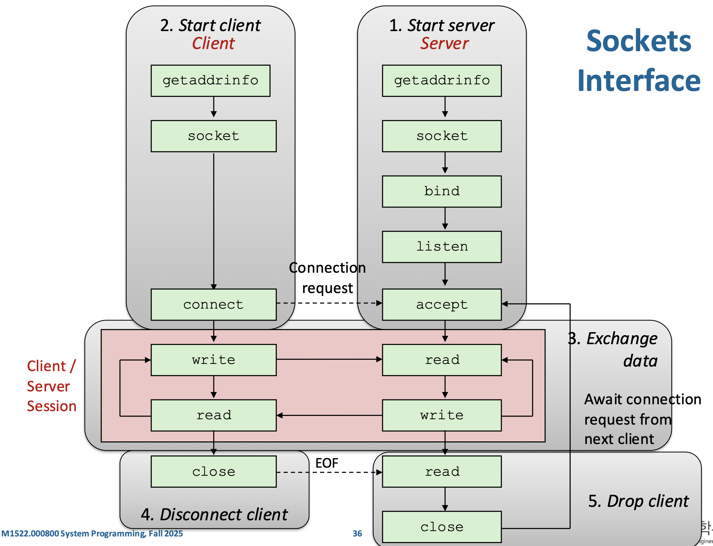

## Step 1. getaddrinfo

클라이언트는 `getaddrinfo` 함수를 호출하여, 서버의 주소를 형식에 맞게 얻고, 서버는 자기 자신이 사용할 주소(포트 포함)를 형식에 맞게 얻는다. 

`getaddrinfo`는 `"www.google.com"`, `"80"` 같은 **문자열 형태의 호스트 이름, IP, 포트, 서비스 이름을 실제 소켓 주소 구조체(`sockaddr_in`, `sockaddr_in6`)로 변환해주는 현대적인 함수**로, 예전의 `gethostbyname`, `getservbyname`을 대체한다. 장점은 **스레드 안전(reentrant)**하고, IPv4와 IPv6를 모두 지원해서 프로토콜 독립적인 코드 작성이 가능하다는 점이며, 단점은 인터페이스가 조금 복잡하지만 대부분의 경우 몇 가지 패턴만 알면 충분히 사용할 수 있다.

`getaddrinfo(host, service, hints, result)`는 `"www.google.com"`, `"80"` 같은 문자열 입력을 받아, 가능한 주소 후보들을 담은 **`addrinfo` 구조체들의 연결 리스트**를 `result`로 반환하며, 각 노드는 실제 `sockaddr`(IP+port)와 소켓 생성에 필요한 정보들을 포함한다. 즉, 하나의 입력에 대해 IPv4/IPv6 등 여러 가능한 주소를 한 번에 제공해주기 때문에 프로그램은 이를 순회하며 적절한 주소로 `socket`, `connect`, `bind` 등을 시도하면 된다. 사용 후에는 `freeaddrinfo`로 메모리를 해제하고, 오류 발생 시 `gai_strerror`로 에러 메시지를 확인한다.

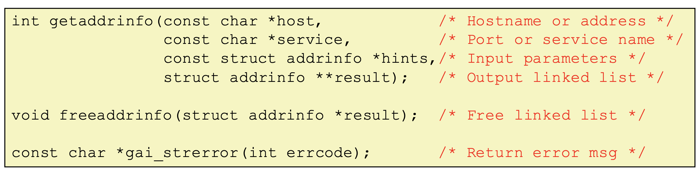

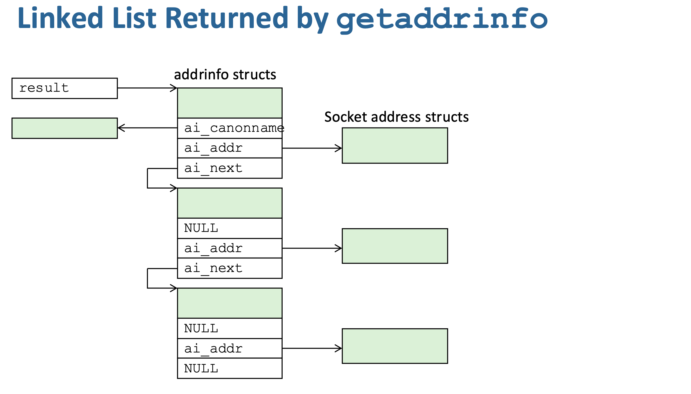

이 그림은 **`getaddrinfo`가 하나가 아니라 여러 개의 주소 후보를 “연결 리스트”로 반환한다는 것**을 보여준다. `result`는 `addrinfo` 구조체들의 리스트의 시작을 가리키고, 각 노드는 `ai_addr`를 통해 실제 소켓 주소(`sockaddr`)를 담고 있으며 `ai_next`로 다음 후보를 연결한다. 이 구조의 핵심은 **여러 가능한 주소(IPv4/IPv6, 여러 IP 등)를 순서대로 시도할 수 있게 한다는 것**으로, 클라이언트는 리스트를 순회하며 `socket` → `connect`를 시도하다가 성공하면 멈추고, 서버는 `socket` → `bind`가 성공할 때까지 순회한다. 즉, `getaddrinfo`는 단일 결과가 아니라 **“가능한 모든 연결 옵션을 나열해주는 리스트”**를 제공한다.

```c
int getaddrinfo(const char *node, const char *service, 
                const struct addrinfo *hints, struct addrinfo **res);
  
struct addrinfo hints, *res;

memset(&hints, 0, sizeof(hints)); // memset은 구조체 내부 필드를 0으로 초기화하는 함수
hints.ai_family = AF_INET;  // IPv4 only
hints.ai_socktype = SOCK_STREAM; // TCP

getaddrinfo("google.com", "80", &hints, &res);
```

- socket open에 사용되는`addrinfo` 구조체 리스트를 반환한다. 이 구조체에는 도메인 이름에 대한 IP 주소가 저장된다. 리스트인 이유는 하나의 도메인 이름이 여러개의 IP 주소로 변환될 수 있기 때문이다. 
- 함수
  - `node` : 도메인 이름 또는 IP 문자열 
  - `service` : 포트 번호 또는 서비스 이름
  - `hints` : 검색 조건을 담는 구조체
  - `res` : 리턴값은 연결 리스트 형태의 addrinfo 구조체이고 그 주소를 `res`가 가리킴.
  - return : 연결 리스트 형태의 addrinfo 구조체
- 내부 동작
  - /etc/hosts 확인. 도메인이 hosts 파일에 있으면 DNS 안함.
  - DNS 캐시 확인. 이미 DNS 조회한 적 있는 경우 캐시 사용.
  -  필요하면 DNS Query 보냄. UDP(또는 TCP)로 DNS 서버에 요청 전송.
  - DNS에서 받은 IP를 `struct addrinfo`로 포장함. 실제 내부적으로는 `struct sockaddr_in` 또는 `sockaddr_in6` 가 만들어짐.
  - 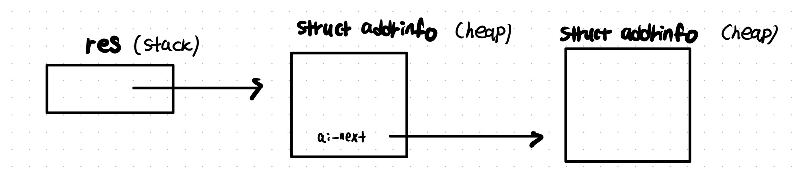
- 끝나면 `freeaddrinfo` 를 호출하여 유저 heap에 생성된 모든 `addrinfo` 를 free 해야 함.

`getaddrinfo`가 `"www.google.com", "80"` 같은 **문자열 → 소켓 주소(IP:port)**로 바꾸는 함수라면, `getnameinfo`는 반대로 **소켓 주소(`sockaddr`) → 호스트 이름과 서비스 이름(문자열)**으로 변환한다. 예를 들어 IP와 포트가 주어졌을 때 이를 `"google.com"`이나 `"http"` 같은 형태로 바꿔준다. 또한 이 함수는 옛날의 `gethostbyaddr`, `getservbyport`를 대체하며, **스레드 안전하고 IPv4/IPv6 모두 지원하는 프로토콜 독립적인 인터페이스**다.

## Step 2. Create Socket

`socket(domain, type, protocol)`은 커널에게 “통신을 위한 끝점(endpoint)을 하나 만들어줘”라고 요청하는 시스템 콜로, 반환값은 이후 `read/write`처럼 사용할 수 있는 **파일 디스크립터(fd)**이며 여기서 `domain`은 IPv4(AF_INET), IPv6(AF_INET6), UNIX(AF_UNIX)처럼 어떤 주소 체계를 쓸지 정하고, `type`은 TCP처럼 연결지향 스트림(SOCK_STREAM)인지 UDP처럼 비연결 데이터그램(SOCK_DGRAM)인지 같은 통신 방식(신뢰성/연결 여부)을 결정하며, `protocol`은 보통 0으로 두면 domain+type에 맞는 기본 프로토콜(TCP/UDP)이 자동 선택되므로 결국 이 호출 한 번으로 “어떤 네트워크에서 어떤 방식으로 통신할 소켓을 만들지”를 커널에 설정하는 과정이다.

**socket**

```c
int socket(int domain, int type, int protocal);

int sockfd = socket(AF_INET, SOCK_STREAM, 0);
```

- 커널에게 소켓을 만들어달라고 요청하는 시스템 콜 래퍼 함수. 소켓 = “네트워크용 파일 디스크립터(fd)” 이다. 커널이 내부적으로 소켓 객체를 만들고 그 소켓을 가리키는 정수(파일 디스크립터)를 반환한다.
- 함수
  - `domain` : 어떤 방식의 주소(IP, Unix domain 등)를 사용할 것인지
    - `AF_INET` : IPv4 주소 체계
    - `AF_INET6`: IPv6 주소 체계
    - `AF_UNIX / AF_LOCAL` : 같은 시스템 내부 프로세스 간 통신 (Unix domain socket)
    - `AF_PACKET` : 이더넷 레벨
    - IPv4, IPv6 는 L3 단계에서 커널 코드가 IP 헤더를 붙이는 과정을 수행하는데, 어떤 방식의 주소 체계를 사용하느냐에 따라 이 패킷 포맷이 달라진다. `AF_UNIX` 를 쓰면 L4 단계에서 TCP/UDP 아님을 확인하고 Unix domain socket 자체 프로토콜을 사용한다. 
  - `type` : 어떤 전송 방식을 쓸지 (TCP냐 UDP냐에 따라 패킷 구조가 다름)
    - `SOCK_STREAM` : TCP
    - `SOCK_DGRAM` : UDP
  - `protocal` : 0으로 주면 커널에게 “타입에 맞는 기본 프로토콜(TCP/UDP)을 자동 선택하라”는 의미.


## Step 3. Socket Bind

`bind(sockfd, addr, addrlen)`은 **서버**가 이미 만든 소켓(fd)에 **“이 IP 주소와 포트 번호를 내가 쓰겠다”라고 커널에 등록하는 단계**로, 즉 특정 네트워크 인터페이스(IP)와 포트를 그 소켓에 연결해 이후 들어오는 요청을 받을 수 있게 만드는 과정이며 보통 서버에서 “나는 80번 포트에서 기다릴게”처럼 사용할 때 필수적으로 쓰이고, 주소 정보는 `sockaddr` 구조체에 담겨 전달되며 주소 체계(IPv4/IPv6 등)에 따라 크기가 달라지기 때문에 길이(`addrlen`)도 함께 넘겨줘야 한다.

**bind**

```c
int bind(int sockfd, const struct sockaddr *addr,
        socklen_t addrlen);
```

- 내가 사용할 로컬 IP + 로컬 포트 번호를 지정하는 함수. 쉽게 말하면 "이 소켓은 앞으로 이 주소(=IP:PORT)로 들어오는 데이터를 받을게" 라고 운영체제에 등록하는 단계. 즉, **서버는 무조건 bind()가 필요**하지만 클라이언트는 대부분 필요 없음(커널이 자동으로 포트 선택).
- listen()을 호출한 소켓(listening socket)은 클라이언트와 데이터 송수신을 할 수 없다. 그 소켓은 오직 **연결 대기(waiting)** 역할만 한다.
- 함수
  - `sockfd` : socket()으로 생성한 소켓 FD 
  - `addr` : 어떤 IP/PORT에 묶을지 지정
  - `addrlen` : addr의 크기

## Step 4. Socket Listen

`listen(sockfd, backlog)`은 **서버**가  `bind`까지 끝난 소켓을 **“이제 연결 요청을 받아들이는 서버용 소켓으로 바꿔라”**라고 커널에 지시하는 단계로, TCP에서만 의미가 있으며 내부적으로 클라이언트들의 연결 요청을 임시로 쌓아두는 큐를 만들고 해당 소켓을 **passive socket(수동 대기 상태)**으로 바꿔 이후 `accept()`로 연결을 꺼내 처리할 수 있게 해주며, `backlog`는 아직 `accept()`되지 않은 대기 연결을 최대 몇 개까지 큐에 쌓아둘 수 있는지를 지정한다.

**listen**

```c
int listen(int sockfd, int backlog);
```

- 1. TCP 소켓을 “수동 대기 상태(passive open)”로 전환 (커널이 이 소켓을 "서버 소켓"으로 인식하게 하기 위함)
  2. 커널에 **connection queue** 만듦
  3. 커널이 SYN 패킷을 처리할 수 있게 함
     - listen() 호출 전에는 이 포트에 클라이언트로부터 SYN 오면? → 연결 요청 무시 (RST)
     - listen() 후에는 이 포트의 SYN 처리해줘 → SYN/ACK 보내고 큐에 넣어둠
       클라이언트로부터 ACK 오면 → accept queue로
- 함수
  - `sockfd` : socket() + bind()로 만든 TCP 소켓
  - `backlog` : accept() 되기 전에 커널이 임시로 보관할 수 있는 연결 요청의 최대 수 (커널이 대기열(Queue)에 넣어둘 수 있는 연결 요청 수)


📝 **SYN, 3-way handshake**

TCP는 연결 지향 프로토콜이므로 통신하기 전에 반드시 서로 연결을 “설정(setup)”해야 한다. 

이 과정이 **3-way handshake**이고 SYN은 여기서 사용된다. 

SYN은 TCP 연결을 만들 때 사용되는 “연결 시작 패킷(flag)”이다. TCP 헤더의 "Flags" 필드 중 하나이다.

1.  클라이언트 → 서버 (SYN)

   - “나 너랑 연결하고 싶어”

   - “내 시퀀스 번호는 X로 시작할게”

2. 서버 → 클라이언트 (SYN + ACK)

   - “좋아, 연결하자”
   - “나도 내 시퀀스 번호 Y로 시작할게”
   - “너가 보내준 번호 X 받았어(ACK)”

3. 클라이언트 → 서버 (ACK)

   - “너의 시퀀스 번호 Y 받았어”
   - 연결 완료

**3-way handshake**를 진행하는 동안 커널 내부에 두 개의 Queue가 필요하다.

1. SYN Queue (Incomplete connection queue)
   - 아직 handshake 끝나지 않은 “반쯤 열린 연결(SYN RECV 상태)” 저장

2. Accept Queue (Completed connection queue)
   - handshake 완료된 연결이 들어가는 큐. 여기서 accept()가 꺼내간다.

SYN queue나 accept queue에 저장되는 건 “소켓”이 아니라 **연결 상태(요청/세션 정보)**이다. passive socket(리스닝 소켓)은 하나만 존재하면서 커널이 관리하는 두 큐를 바라보는 역할만 하고, 클라이언트가 SYN을 보내면 먼저 SYN queue(half-open, 아직 3-way handshake 완료 전)에 연결 요청 정보가 쌓이고, handshake가 완료되면 그 연결이 accept queue(fully established)로 이동하며, 그때까지도 실제 “연결용 소켓” 객체는 사용자에게 보이지 않다가 `accept()`가 호출될 때 커널이 그 연결 정보를 꺼내서 새로운 connected socket(fd)을 만들어 반환하는 구조다.

## Step 5. Socket Accept

`accept(sockfd, addr, addrlen)`은 `listen` 상태인 서버 소켓에서 **클라이언트의 연결 요청이 올 때까지 기다렸다가 그 연결을 하나 받아들이고, 그 클라이언트와 통신할 전용 새로운 소켓(fd)을 만들어 반환하는 함수**로, 기존 `sockfd`는 계속 새로운 요청을 받기 위한 “대기용 소켓”으로 남아 있고 반환된 값은 실제 데이터 송수신에 사용하는 “연결 소켓”이며, 필요하면 클라이언트의 IP/포트 정보가 `addr`에 채워지고 기본적으로는 요청이 올 때까지 blocking되지만 non-blocking으로 설정할 수도 있다.

**accept**

```c
int accept(int sockfd, structure sockaddr *addr,
           socklen_t *addrlen);
```

- listen() 중인 소켓으로 들어온 클라이언트 연결 요청을 받아서, 통신 전용(connected) 소켓을 새로 만들어 반환하는 함수.

  1. 3-way handshake가 **끝난 연결을 받아서** 커널의 accept queue에 저장된 연결을 꺼낸다. Queue에 pending connection이 없다면, connection이 들어올 때까지 기다린다. (blocking) 만약 listening socket을 non-blocking으로 설정하면, accept은 connection이 queue에 없을 시 기다리지 않고 즉시 -1을 리턴한다. 이렇게 accept을 non-blocking으로 한다면 언제 다시 accept을 시도해야할지 어떻게 알까? **epoll** 이라는 event system call을 사용한다. epoll은 어떤 event가 발생할 때까지 blocking 상태가 된다. 여기서는 listening socket이 readable 해지는 event를 모니터링 하도록 epoll을 call한다. 

  2. 새로운 소켓(conn_fd)을 생성한다. 리턴되는 fd는 listen_fd와 완전히 다른 소켓이다.

  3. 클라이언트의 IP/Port 정보를 addr에 채워준다.

- 함수

  - `sockfd` : listen() 중인 소켓
  - `addr` : 연결해온 클라이언트의 주소(IP, port)를 저장할 버퍼
  - `addrlen` : 그 버퍼의 크기 (입력 & 출력)
  - return : 클라이언트와 연결된 새로운 소켓 FD 

## Step 4-5. Socket Connect

`connect(sockfd, addr, addrlen)`은 클라이언트 소켓에서 **지정한 서버(IP+포트)로 TCP 연결을 시작하는 함수로, 내부적으로 3-way handshake(SYN→SYN/ACK→ACK)를 수행해 연결을 확립하며 기본적으로는 연결이 완료될 때까지 blocking되고 성공하면 0을 반환하고 실패하면 -1을 반환하지만, non-blocking 모드에서는 즉시 -1을 반환하면서 `errno=EINPROGRESS`로 “연결 진행 중” 상태를 알려주며 이후 `epoll`/`select`로 연결 완료를 확인할 수 있다.

**connect**

```c
int connect(int sockfd, const struct sockaddr *addr,
            socklen_t *addrlen);
```

- 클라이언트가 서버에게 TCP 연결을 요청하는 함수이며, TCP 3-way handshake를 시작하는 시스템 콜. `SYN` 패킷을 보내고, `SYN`+`ACK`를 blocking 상태로 기다린다. 마찬가지로 socket을 non-blocking으로 설정하면, write event를 set하여 해당 socket이 writable 해지면, connect이 established 되었음을 알게 된다. 
- 함수
  - `sockfd` : socket() 으로 만든 소켓 (클라이언트 쪽 소켓)
  - `addr` : 연결할 대상(서버)의 주소 (IP + 포트)
  - `addrlen` : addr 구조체 크기

- 내부 동작
  - 소켓을 `SYN_SENT` 상태로 전이
  - SYN 패킷 생성
  - 라우팅 테이블 확인해 next hop 결정
  - ARP로 MAC 주소 획득
  - NIC에 DMA로 전송 지시

## Step 6. Send / Receive

`send(sockfd, buf, len, flags)`와 `recv(sockfd, buf, len, flags)`는 연결된 소켓에서 실제 데이터를 주고받는 함수로, `send`는 사용자 메모리의 데이터를 커널의 소켓 송신 버퍼로 복사해 네트워크로 보내며 버퍼가 가득 차면 blocking될 수 있고 반환값은 실제로 보낸 바이트 수이며, `recv`는 커널의 수신 버퍼에 도착한 데이터를 사용자 버퍼로 복사해주고 데이터가 없으면 blocking되며 반환값은 읽은 바이트 수(0이면 상대가 연결 종료)를 의미하고, `flags`가 0이면 각각 `write/read`와 거의 동일하게 동작한다.

**send / recv**

```c
ssize_t send(int sockfd, const void *buf, size_t len
            int flags);
ssize_t recv(int sockfd, void *buf, size_t len,
            int flags);
```

- `send` : 커널에 “이 데이터를 TCP 소켓으로 보내라”고 요청하는 함수. 유저 버퍼의 데이터를 커널 send buffer로 복사하고 이후 커널 내부 TCP 스택이 복잡한 처리 과정을 거치고 최종적으로 NIC 드라이버가 패킷을 실제로 전송. send buffer가 가득 차면(상대가 데이터를 안 받아줌) block 될 수 있음. non-blocking 이라면, send buffer가 꽉 차 있으면 바로 -1 반환. 만약 send buffer에 100만큼 보내고 싶은데 70만큼의 공간만 있다면, 70만큼만 복사되고 70을 즉시 리턴함. send가 수행되었다고 전송이 된것이 아님. 그저 커널 버퍼로 복사 된 것일 뿐. 이후 전송은 TCP 커널 코드가 알아서 수행.(서버 쪽의 receive buffer가 가득 차있으면 더 이상 데이터를 받지 않겠다는 신호를 클라이언트에게 보낸다. 이런 일들은 TCP 커널 코드가 알아서 하는 것이다.)
- `recv` : 커널의 TCP receive buffer에 도착한 데이터를 사용자 버퍼로 가져오는 함수. 커널 TCP receive buffer 확인하여 받은 데이터가 있다면 `copy_to_user()`로 사용자 buf로 복사. 데이터가 없다면, 데이터가 도착할 때까지 wait queue에서 sleep. 이후, 데이터가 도착하면 NIC가 CPU에게 interrupt를 발생시키고, 커널의 인터럽트 핸들러로 진입하는데, 이 과정에서 실행되는 커널 네트워크 스택이 `wake_up()` 함수를 통해 wait queue를 깨운다.
- 함수
  - `flags` : recv에서 0일 경우, recv는 read와 동일.
  - return : send는 보낸 데이터 수, recv는 받은 데이터 수.
  


📝 **Listening vs Connection Socket**

리스닝 디스크립터(listening socket)는 **클라이언트의 연결 요청만 받기 위한 하나의 “대기용 소켓”으로 서버 시작 시 한 번 만들어져 계속 유지되는 반면**, `accept()`가 호출될 때마다 생성되는 커넥션 디스크립터(connection socket)는 **특정 클라이언트와 실제로 데이터를 주고받기 위한 전용 소켓**으로 요청을 처리하는 동안에만 존재하며, 이 둘을 분리함으로써 서버는 하나의 리스닝 소켓으로 계속 새로운 연결을 받아들이면서 동시에 여러 클라이언트와 각각 독립적인 연결 소켓을 통해 병렬로 통신할 수 있다.

❗️동일한 서버 프로그램과 동일한 클라이언트 프로그램에서 여러 개의 연결이 동시에 수행되기 위해서는 각 connection은 (src IP, src port, dst IP, dst port) 로 유일하게 구분되기 때문에, 복수의 연결은 같은 서버 port, IP를 사용하지만 다른 클라이언트 Port를 사용하게 된다.

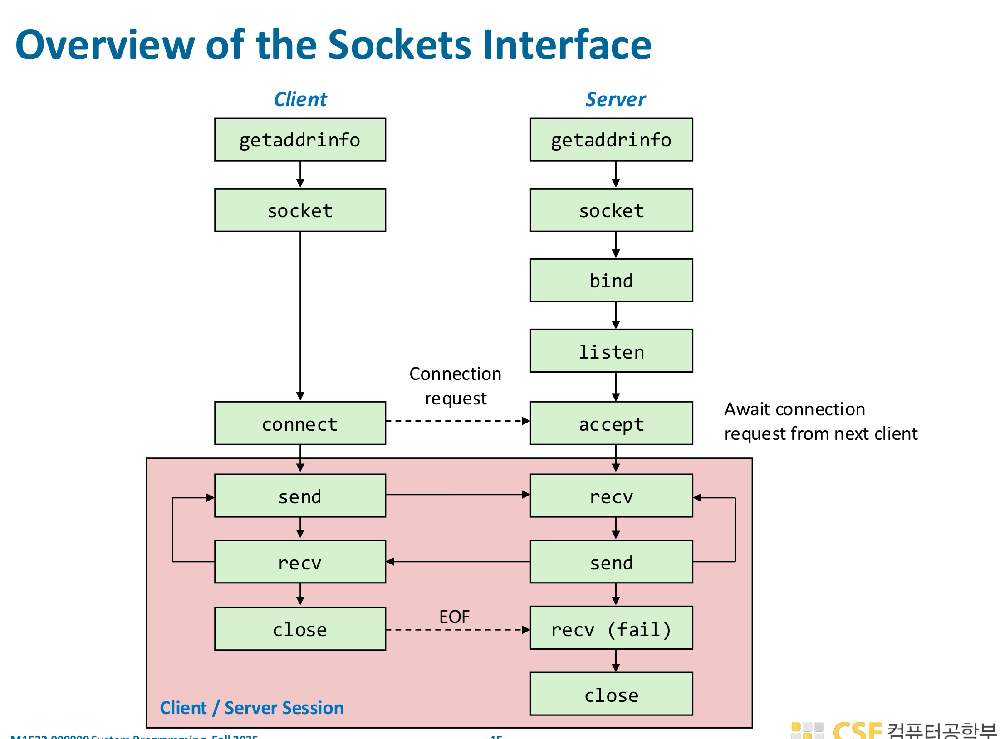


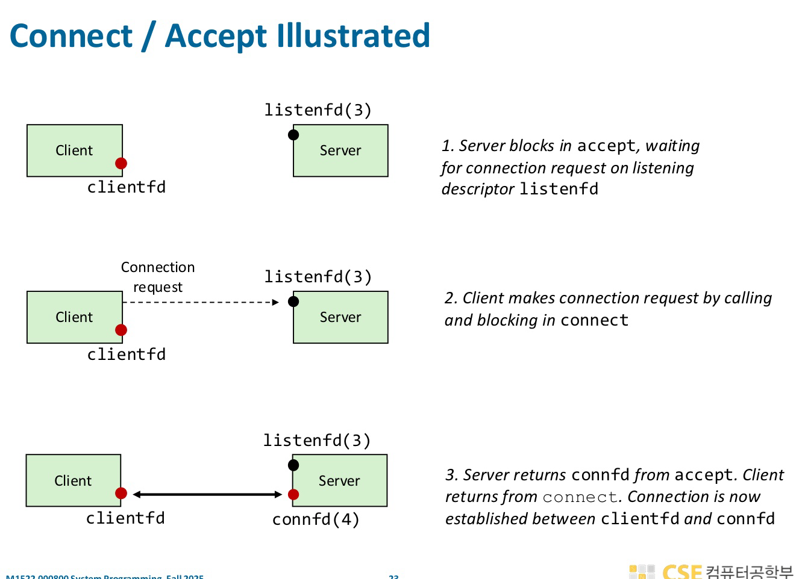

## Step 7. Socket Close 

클라이언트든 서버든 어느 한쪽이 `close()`를 호출하면 그 방향의 연결 종료가 시작된다. 하지만 “즉시 완전히 끊긴다”라고 단순하게 보면 안 되고, TCP는 보통 half-close와 종료 핸드셰이크(FIN/ACK)를 거치므로 좀 더 섬세하게 이해해야 한다. 예를 들어 클라이언트가 `close()`하면 “나는 더 이상 보낼 데이터가 없다”는 뜻의 FIN이 나가고, 서버는 그 뒤 `read/recv`에서 0(EOF) 을 받으면서 상대가 송신을 끝냈음을 알게 된다. 그렇다고 서버도 즉시 아무것도 못 하는 것은 아니고, 서버는 남은 응답 데이터를 계속 보낼 수 있다. (**하지만  클라이언트는 받는 쪽(read)은 아직 열려 있으므로 클라이언트는 여전히 그 데이터를 받는다**) 서버가 자기 쪽도 다 보내고 `close()`해야 비로소 양방향 종료가 끝난다. 즉, 한쪽 `close()`는 종종 “완전 즉시 단절”이 아니라 한 방향 송신 종료의 시작으로 보는 게 맞다.

여기서 델리케이트한 문제들이 꽤 많다. 가장 중요한 건 `close()`를 호출했다고 해서 상대가 이미 모든 데이터를 애플리케이션까지 읽었다는 보장은 없다는 점이다. 커널 송신 버퍼에 남은 데이터는 전송을 시도하지만, 프로그램이 성급하게 종료되거나 `SO_LINGER`를 이상하게 쓰면 기대와 다른 동작이 날 수 있다. 또 상대가 이미 연결을 닫았는데 계속 `write/send`하면 **`SIGPIPE` 또는 `EPIPE`** 가 날 수 있고, 반대로 상대가 FIN을 보냈는데도 이를 무시하고 계속 읽기/쓰기를 설계 없이 처리하면 이상한 블로킹이나 오류 처리를 만나게 된다. 그리고 **RST(reset)** 상황도 조심해야 한다. 정상 종료는 FIN 기반이지만, 소켓을 비정상적으로 닫거나 아직 읽히지 않은 데이터를 남긴 채 특정 방식으로 종료하면 상대는 “정상 EOF”가 아니라 connection reset으로 볼 수 있다.

## Code

지금까지의 논의를 코드로 알아보자.

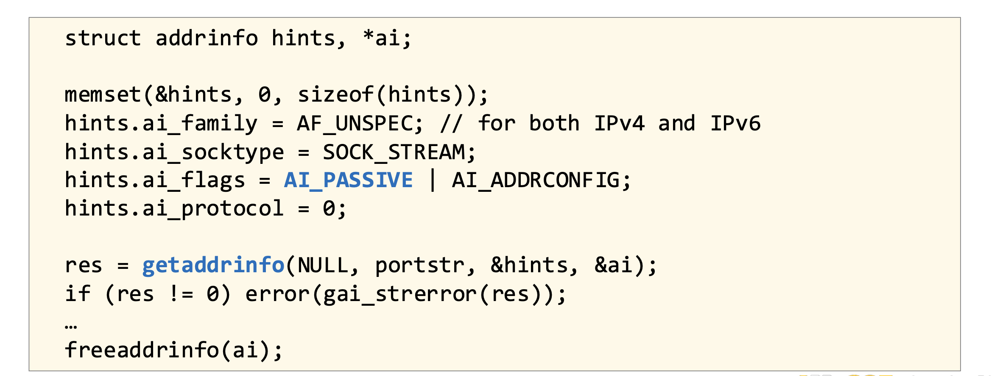

- (**Step 1. Server**) 이 코드는 서버가 `bind`에 사용할 주소 정보를 얻기 위해 `getaddrinfo`를 설정하는 과정으로, `hints.ai_flags`에 **AI_PASSIVE**를 주면 “이 주소는 내가 접속할 대상이 아니라, **내가 바인드해서 클라이언트 요청을 받을 주소**”라는 의미가 되고 그래서 `getaddrinfo(NULL, port, ...)`처럼 호스트를 NULL로 주면 특정 IP가 아니라 **모든 네트워크 인터페이스(0.0.0.0 또는 ::)**에 바인딩 가능한 주소를 반환해 주며, 결과적으로 이 설정은 서버가 특정 IP가 아니라 해당 포트로 들어오는 모든 요청을 받아들이도록 준비하는 것이다.

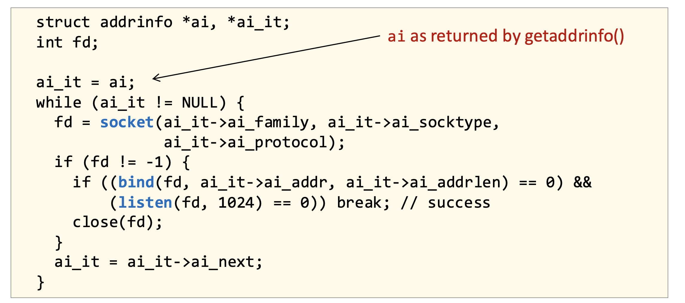

- (**Step 2~4. Server**)이 코드는 `getaddrinfo`가 반환한 여러 가능한 주소 후보(`ai` 리스트)를 순회하면서 각각에 대해 `socket → bind → listen`을 시도해 **실제로 동작하는 하나의 리스닝 소켓을 찾는 과정**으로, 각 후보에 대해 소켓을 만든 뒤 `bind`와 `listen`이 모두 성공하면 그 소켓을 사용하고 실패하면 닫고 다음 후보로 넘어가며, 이렇게 하는 이유는 IPv4/IPv6나 다양한 네트워크 설정 환경에서 어떤 주소가 실제로 바인딩 가능한지 보장할 수 없기 때문에 “될 때까지 시도”하는 방식으로 서버 초기화를 안정적으로 수행하기 위해서다.

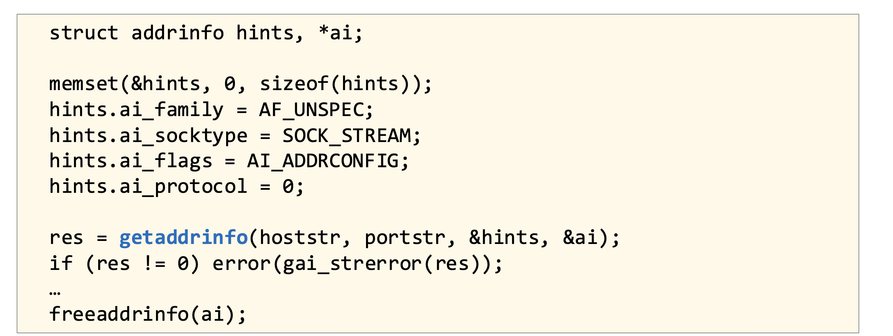

- (**Step 1. Client**)이 코드는 클라이언트가 서버에 연결하기 위해 `getaddrinfo`로 **원격 서버의 IP와 포트 정보를 얻는 과정**으로, 서버와 달리 `AI_PASSIVE`를 사용하지 않고 반드시 `hoststr`에 연결할 서버의 주소(도메인/IP)를 넘겨줘야 하며 이렇게 얻은 `addrinfo` 리스트를 기반으로 이후 `socket`과 `connect`를 수행하게 되고, `AI_ADDRCONFIG`는 현재 시스템에서 사용 가능한 네트워크 설정(IPv4/IPv6)에 맞는 주소만 반환하도록 도와주며 에러가 나면 `gai_strerror`로 사람이 읽을 수 있는 메시지를 출력한다.

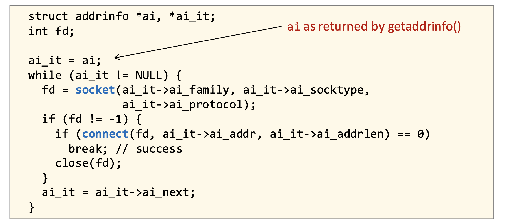

- (**Step 4~5. Client**)이 코드는 클라이언트가 `getaddrinfo`로 얻은 여러 서버 주소 후보들을 순회하면서 각각에 대해 `socket`을 만들고 `connect`를 시도해 **실제로 연결에 성공하는 하나의 소켓을 찾는 과정**으로, 어떤 주소(IPv4/IPv6 등)가 네트워크 상황에서 실제로 연결 가능한지 확실하지 않기 때문에 성공할 때까지 반복하며 실패한 소켓은 닫고 다음 후보를 시도하고, 결국 `connect`가 성공한 순간 그 소켓이 서버와의 실제 통신에 사용되는 연결 소켓이 된다.

📝 **Telnet**

`telnet <host> <port>`는 특정 서버의 IP와 포트로 TCP 연결을 직접 맺어 **문자(ASCII)를\*그대로 보내고 응답을 확인할 수 있는 간단한 테스트 도구**로, 실제 애플리케이션 없이도 서버가 제대로 연결을 받고 데이터를 주고받는지 확인할 수 있기 때문에 echo 서버, 웹 서버(HTTP 요청 직접 입력), 메일 서버 등에서 디버깅용으로 유용하게 쓰이며 내부적으로는 그냥 `connect` 후 키보드 입력을 `send`, 서버 응답을 `recv`해서 화면에 출력하는 구조다.


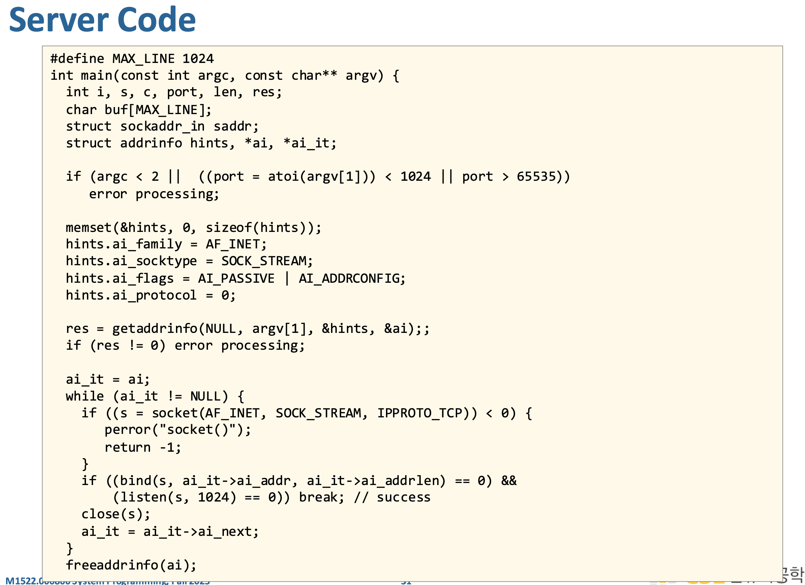

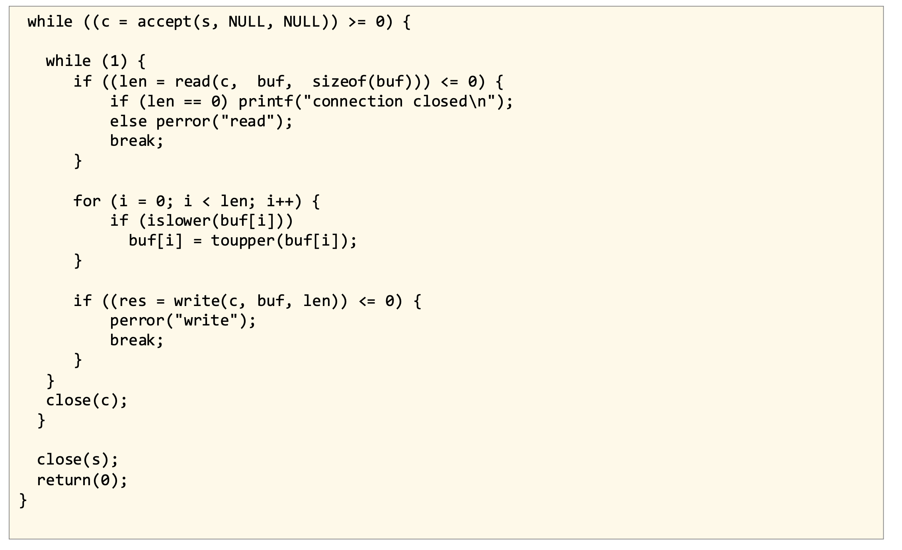

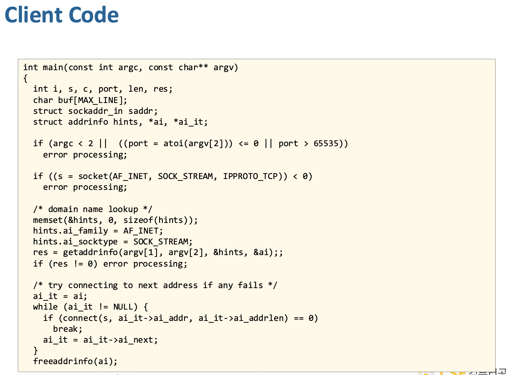

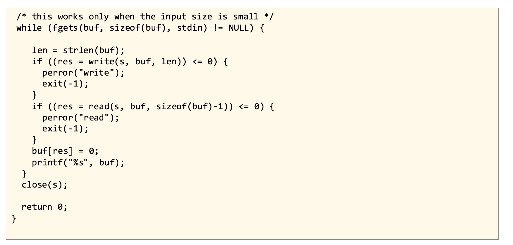

이 코드들은 **아주 단순한 TCP echo/uppercase 서버와 그에 대응하는 클라이언트 예제**를 보여주는데, 클라이언트 코드는 `getaddrinfo`로 서버 주소를 찾고 `connect`로 연결한 뒤 표준입력에서 한 줄씩 읽어 `write`로 서버에 보내고 서버 응답을 `read`로 받아 출력하며, 서버 코드는 `getaddrinfo(NULL, port, ...)`와 `AI_PASSIVE`로 바인드 가능한 주소를 얻고 `socket→bind→listen`으로 리스닝 소켓을 만든 다음 `accept`로 클라이언트 연결을 하나 받으면 그 연결 소켓 `c`에 대해 `read`로 데이터를 받고 소문자를 대문자로 바꾼 뒤 `write`로 다시 보내는 일을 반복하다 연결이 끝나면 `c`를 닫고 다시 다음 클라이언트를 기다리는 구조다.

다만 이 서버는 **한 번에 한 클라이언트만 처리**할 수 있다는 큰 한계가 있는데, 특정 클라이언트와 내부 `while(1)` 루프에서 통신하는 동안에는 다른 클라이언트의 연결을 처리하지 못하므로 동시성이 없고, 또 `read/write`가 항상 요청한 길이만큼 한 번에 처리된다고 가정(*!*)하는 것도 위험해서 실제로는 부분 읽기/쓰기를 고려해야 하며, 이런 문제를 해결하려면 `fork`나 스레드로 연결마다 분기하거나, 더 일반적으로는 소켓을 non-blocking으로 바꾸고 `select/poll/epoll`로 “지금 처리 가능한 FD만” 골라서 이벤트 기반으로 여러 연결을 동시에 다루는 방식으로 바꿔야 한다.

가정 (*!*) 은 **클라이언트와 서버 둘 다에 숨어 있는데**, 예를 들어 클라이언트 쪽 `write(s, buf, n)`는 사실 반환값을 확인해서 `n`바이트가 전부 써졌는지 검사하고 남은 부분을 다시 보내야 하는데 그런 루프가 없으므로 **“한 번 write하면 n바이트가 다 보내진다”**고 가정한 것이고, 서버 쪽도 `while ((n = read(c, buf, sizeof(buf))) > 0) { ... write(c, buf, n); }` 같은 형태에서 `read`는 받은 만큼만 처리하니 괜찮지만 바로 뒤의 `write(c, buf, n)` 역시 반환값을 체크하지 않고 넘어가므로 **“read로 받은 n바이트를 write가 한 번에 전부 다시 보낸다”**고 가정한 셈이다; 즉 문제 지점은 특히 **`write`/`send`의 반환값을 검사하지 않는 부분**이고, 실제 robust한 코드는 `sent += write(...)` 식으로 전부 쓸 때까지 반복해야 한다.
