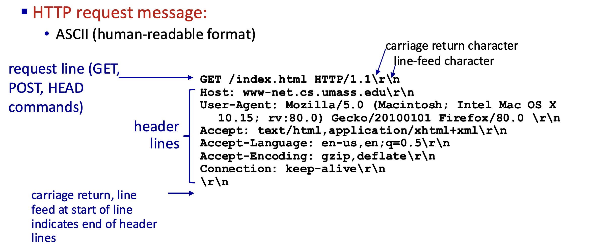
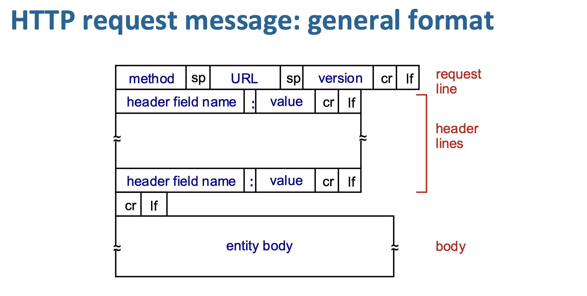
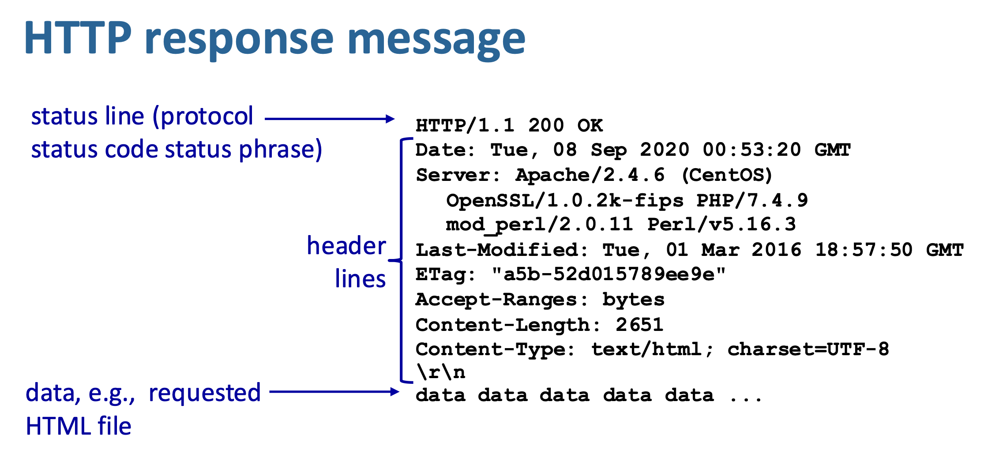
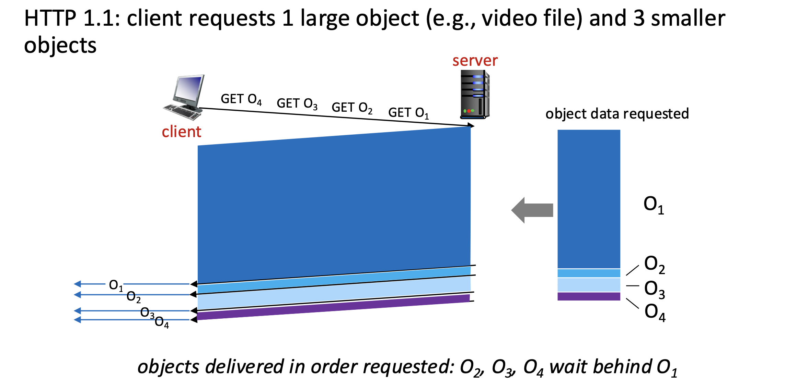
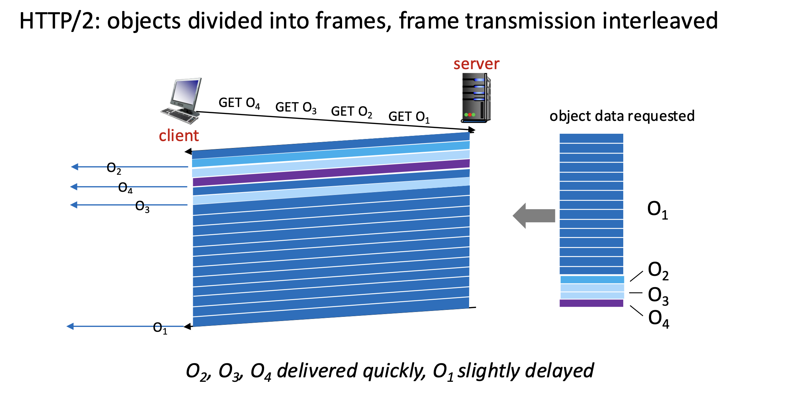

In this post, 24 ~ 25 System Programming lecture is introuduced. 

# HTTP

- 웹의 역사는 1945년 Vannevar Bush가 정보들을 링크로 연결해 탐색하는 “memex” 개념을 제시하면서 시작되었고, 1989년 Tim Berners-Lee가 CERN에서 이를 기반으로 실제 분산 하이퍼텍스트 시스템(웹)을 제안하며 구체화되었다. 이후 1990년대 초에는 최초의 웹 브라우저와 서버가 등장하고, 1993년 Mosaic 브라우저가 보급되면서 웹이 대중화되기 시작했으며, 서버 수와 트래픽이 급격히 증가하면서 오늘날의 인터넷 기반 웹 환경으로 발전하게 되었다.
- **인터넷은 IP, TCP 같은 프로토콜로 컴퓨터들 사이에서 데이터를 전달하는 기본 구조**를 제공하고, 웹은 그 위에서 **HTTP라는 규칙을 이용해 문서(HTML, 이미지 등)를 주고받는 응용 계층 서비스**다. 즉, 브라우저(클라이언트)가 서버에 HTTP 요청을 보내면, 그 데이터는 실제로는 TCP 연결을 통해 IP 패킷 형태로 네트워크를 따라 전달되고, 서버가 다시 HTTP 응답을 보내는 구조다. 정리하면, **인터넷은 “데이터를 어떻게 보내는가”를 정의하고, 웹은 “무슨 데이터를 어떤 형식으로 주고받는가”를 정의한다**고 보면 된다.

- 웹 페이지는 하나의 파일이 아니라 여러 **객체(object)**들로 구성되며, 각 객체(HTML, 이미지, 오디오 등)는 서로 다른 서버에 있을 수도 있고 각각 **URL**로 접근된다. 이때 웹 페이지는 기본이 되는 **base HTML 파일**이 있고, 그 안에 여러 객체에 대한 참조가 포함되어 있으며, URL은 `scheme(프로토콜)` + `host name(서버 주소)` + `path name(자원 위치)`로 구성되어 어떤 서버의 어떤 자원을 가져올지 명확히 지정한다.

- HTTP는 웹에서 사용하는 **애플리케이션 계층 프로토콜**로, 클라이언트-서버 모델에서 동작하며 브라우저 같은 클라이언트가 HTTP 요청(request)을 보내면 서버가 해당 웹 객체를 HTTP 응답(response)으로 보내주고, 클라이언트는 이를 받아 화면에 표시하는 방식으로 웹 통신이 이루어진다.

- TCP/IP는 인터넷 전체에서 데이터가 어떻게 **전송될지(전달, 경로, 신뢰성 등)**를 담당하는 하위 계층 프로토콜 묶음(IP은 주소 기반 전달, TCP는 신뢰성 있는 전송이고, HTTP는 그 위에서 동작하는 **애플리케이션 계층 프로토콜**로서 실제로 어떤 데이터를 요청하고 응답할지(웹 페이지, 이미지 등)를 정의하므로, 즉 TCP/IP가 “어떻게 보내는지”라면 HTTP는 “무엇을 보내는지”를 담당한다.

- HTTP는 **TCP 위에서 동작**해서 클라이언트가 서버의 80번 포트로 TCP 연결을 먼저 만들고 그 위에서 요청/응답 메시지를 주고받은 뒤 연결을 종료하며, 동시에 HTTP는 **stateless(무상태)**라서 서버가 이전 요청 정보를 기억하지 않기 때문에 각 요청이 독립적으로 처리된다.

❗️HTTP가 TCP 위에서 동작한다는 말의 의미는 다음과 같다. HTTP 메시지가 TCP의 데이터(payload)로 실려서 전송된다. 즉 애플리케이션(HTTP)이 만든 요청/응답 문자열이 소켓을 통해 커널로 내려가면 TCP가 이를 **세그먼트로 쪼개고 TCP 헤더를 붙이고**, 그 아래에서 IP가 **IP 패킷으로 감싸 전송**하므로, 구조는 “HTTP 데이터 → TCP 세그먼트 → IP 패킷”처럼 계층적으로 캡슐화되는 것이다.

- **Non-persistent HTTP**는 요청마다 TCP 연결을 새로 열고 하나의 객체만 전송한 뒤 바로 닫기 때문에 여러 객체를 받으려면 연결을 여러 번 만들어야 하고, **persistent HTTP**는 하나의 TCP 연결을 유지한 채 여러 객체를 연속으로 주고받아 연결 생성/종료 오버헤드를 줄인다. Non-persistent HTTP에서는 먼저 TCP 연결을 맺고 HTML 파일 하나를 요청·응답받은 뒤 연결을 끊고, 이후 HTML을 해석해 포함된 각 이미지마다 **다시 새로운 TCP 연결을 반복해서 생성→요청→응답→종료** 과정을 거치므로, 객체 수만큼 연결이 여러 번 발생해 비효율적이다. Non-persistent HTTP에서 객체 하나의 응답 시간은 **TCP 연결을 여는 데 1 RTT + 요청/응답이 오가는 데 1 RTT + 실제 파일 전송 시간**이 걸리므로, 객체마다 최소 2 RTT가 추가되고 파일 수가 많을수록 지연이 크게 증가한다.
- HTTP 요청 메시지는 사람이 읽을 수 있는 ASCII 텍스트 형식으로 구성되며, 맨 앞에는 **요청라인(request line)**이*와서 `GET /index.html HTTP/1.1`처럼 어떤 메서드(GET, POST 등)로 어떤 자원을 요청할지와 프로토콜 버전을 명시하고, 그 뒤에는 **헤더 라인들(header lines)**이 이어져서 `Host`, `User-Agent`, `Accept` 같은 추가 정보(어느 서버인지, 어떤 브라우저인지, 어떤 형식을 원하는지 등)를 전달하며, 각 줄은 `\r\n`으로 끝나고 마지막에 **빈 줄(\r\n)**이 오면 헤더의 끝을 의미해 이후에 (필요한 경우) body가 따라오는 구조이다.

- HTTP 요청에는 여러 메서드가 있는데, **GET**은 데이터를 URL 뒤에 붙여 서버에 요청하고(주로 조회), **POST**는 사용자 입력을 메시지 body에 담아 서버로 보내며(폼 제출 등), **HEAD**는 실제 내용 없이 헤더만 받아 확인할 때 사용하고, **PUT**은 지정한 URL에 파일을 업로드하거나 기존 자원을 완전히 대체하는 데 사용된다.
- HTTP 응답 메시지는 서버가 클라이언트 요청에 대해 보내는 것으로, 맨 앞에 **status line(프로토콜 버전 + 상태코드 + 상태문구, 예: HTTP/1.1 200 OK)**가 오고, 그 뒤에 **header lines**가 이어져서 날짜, 서버 정보, 콘텐츠 타입/길이 같은 메타데이터를 전달하며, `\r\n`으로 구분된 빈 줄 이후에는 실제 **body(data)**가 와서 HTML 파일이나 이미지 같은 요청한 콘텐츠가 포함되는 구조이다.

- HTTP 응답 상태코드는 응답 메시지의 첫 줄에 포함되어 요청 결과를 나타내며, 예를 들어 **200 OK**는 정상 처리, **301 Moved Permanently**는 자원이 다른 위치로 이동, **400 Bad Request**는 잘못된 요청, **404 Not Found**는 자원을 찾을 수 없음, **505 HTTP Version Not Supported**는 지원하지 않는 HTTP 버전을 의미한다.

- 정적 콘텐츠는 서버가 단순히 파일을 읽어(Content-Length, Content-Type 등 헤더 구성) 그대로 클라이언트에 보내는 방식인 반면, 동적 콘텐츠는 요청 URL(예: `/cgi-bin`)을 보고 서버가 별도의 프로그램을 **fork/exec로 실행**해 결과를 생성하고 그 출력을 받아 클라이언트에 전달하며, 이러한 방식은 비용이 커서 실제로는 FastCGI나 서버 내부 모듈(mod_xxx)처럼 더 효율적인 방법이 주로 사용된다.
- **웹 캐시**는 클라이언트와 원 서버 사이에서 중간 서버처럼 동작하며, 브라우저의 요청을 먼저 받아 캐시에 해당 객체가 있으면 바로 응답하고 없으면 원 서버에서 가져와 저장한 뒤 전달함으로써, 클라이언트 입장에서는 더 빠른 응답을 얻고 네트워크 트래픽도 줄일 수 있으며, 서버는 `Cache-Control` 헤더 등을 통해 해당 데이터의 캐싱 가능 여부와 기간을 제어한다.
- **Conditional GET**은 브라우저(클라이언트)가 캐시에 저장된 객체의 최신 여부를 확인하기 위해 `If-Modified-Since` 헤더로 기준 시간을 보내고, 서버는 그 이후 변경이 없으면 **304 Not Modified**로 실제 데이터를 보내지 않고, 변경이 있으면 **200 OK와 함께 새 데이터를 전송**함으로써 불필요한 데이터 전송과 지연을 줄이는 방식이다.
- **HTTP/2**는 여러 객체를 빠르게 받기 위해, 기존 HTTP/1.1처럼 요청 순서대로 처리하면서 큰 파일 때문에 작은 파일이 기다리는 **HOL blocking 문제**를 줄이고자, 하나의 TCP 연결에서 데이터를 프레임 단위로 나눠 섞어 보내고**, 클라이언트가 지정한 우선순위에 따라 전송 순서를 조정**하며, 필요하면 요청하지 않은 리소스도 미리 보내는(push) 등으로 지연을 크게 줄인 프로토콜이다.

- 위 그림에서 HTTP/1.1에서는 큰 객체(O₁)를 먼저 전송하면 뒤에 있는 작은 객체(O₂, O₃, O₄)가 끝날 때까지 기다리는 **HOL blocking**이 발생하지만, HTTP/2에서는 각 객체를 작은 **프레임으로 쪼개서 섞어(interleave) 전송**하기 때문에 작은 객체들도 중간중간 빠르게 전달되어 전체 지연이 줄어든다.
- HTTP/2는 하나의 TCP 연결 위에서 동작하기 때문에 패킷 하나만 손실돼도 TCP 특성상 전체 전송이 멈추는 문제가 여전히 존재하고(그래서 병렬 연결을 쓰기도 함), 기본 TCP 자체에는 보안이 없지만 실제로는 HTTPS를 사용하며, 이를 개선하기 위해 HTTP/3는 TCP 대신 **UDP 기반(QUIC)**을 사용해 객체별로 독립적인 전송과 오류/혼잡 제어를 가능하게 하여 지연과 정체 문제를 더 줄인다.
