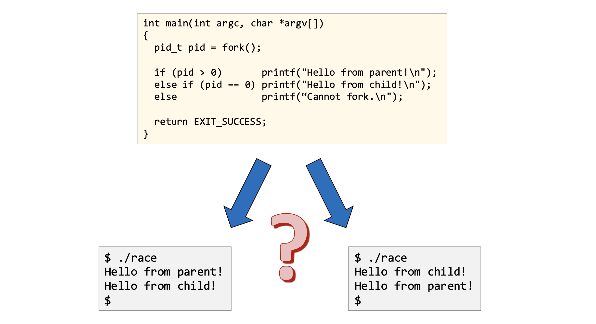
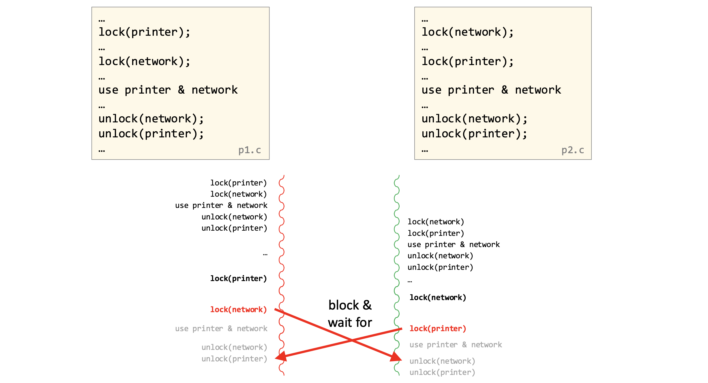
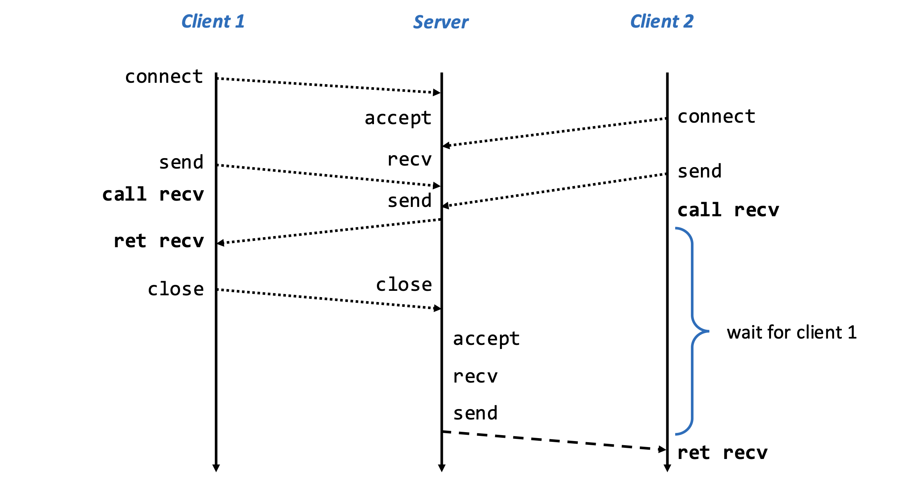
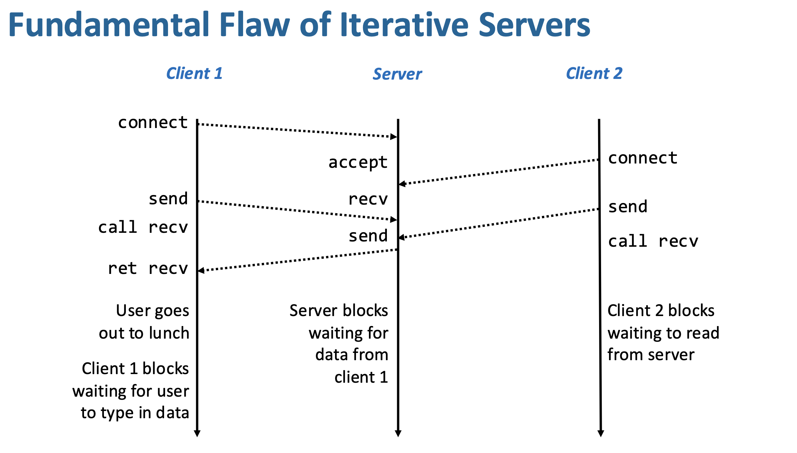
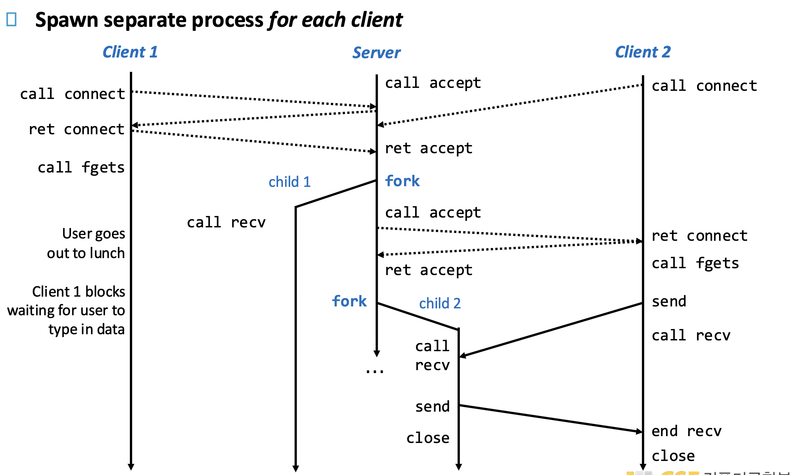
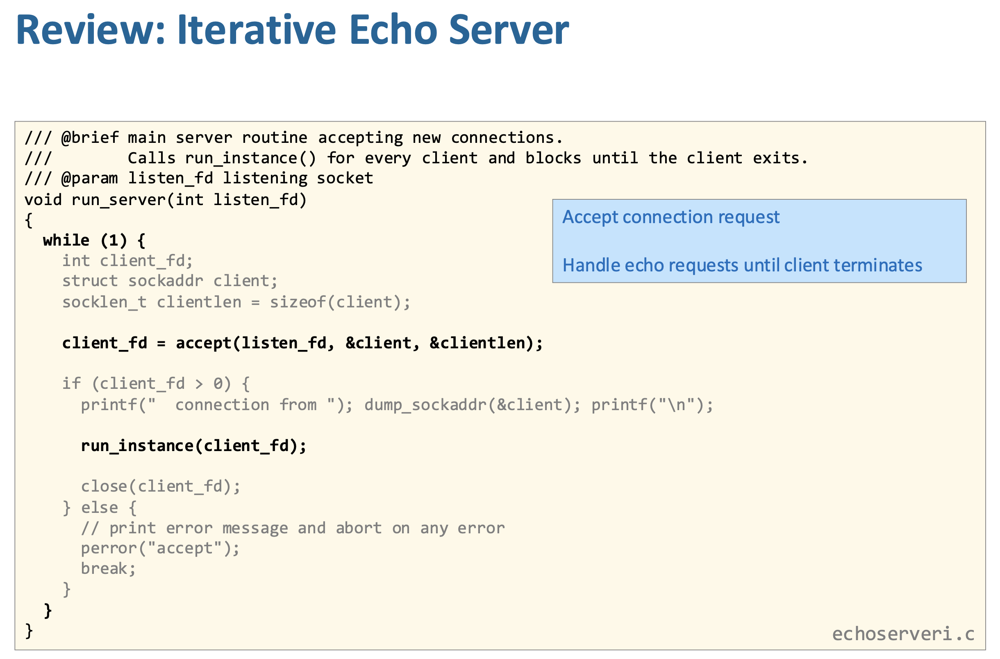
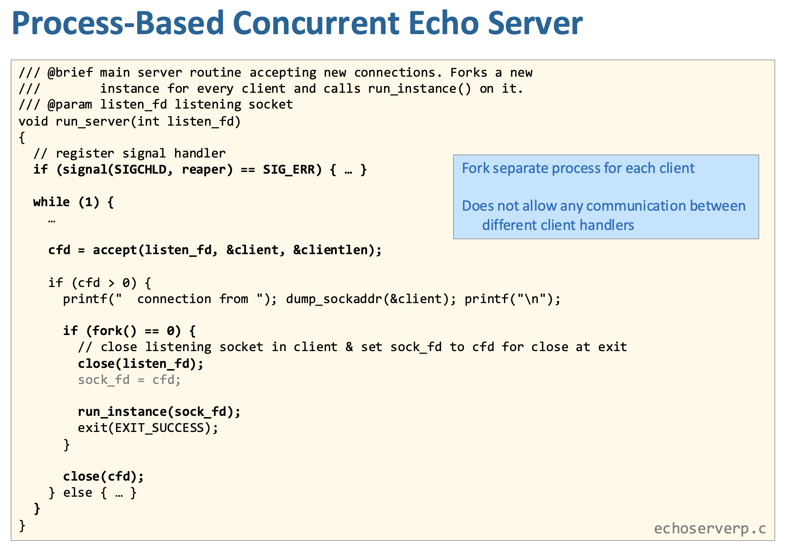

In this post, 26 System Programming lecture is introuduced. 

# Concurrent Programming

**Concurrent programming**은 한 프로그램 안에서 여러 개의 실행 흐름(threads, tasks) 을 만들어서 동시에 여러 일을 처리하는 방식이다. 이는 단일 흐름으로 순차적으로 처리하는 것과 달리, 여러 작업이 시간적으로 겹치게 실행되도록 구성하는 것을 의미하며, 운영체제 수준에서 여러 프로세스가 동시에 돌아가는 것과는 구분된다. 주로 계산을 여러 데이터에 나눠 수행하는 데이터 병렬성이나, 서로 다른 작업을 나눠 처리하는 태스크 병렬성에서 유용하며, 웹 서버처럼 여러 클라이언트 요청을 동시에 처리해야 하는 상황에서 핵심적으로 사용된다.

**Data Parallelism**은 **같은 연산을 여러 데이터에 나눠서 동시에 처리하는 방식**으로, 예를 들어 벡터 덧셈 (C[i]=A[i]+B[i])처럼 각 인덱스 계산이 서로 독립적일 때 배열을 여러 구간으로 나눠 각 스레드가 다른 부분을 동시에 계산하게 만드는 것이다. 이렇게 하면 전체 작업을 순차적으로 한 번에 처리하는 대신, **작업을 여러 조각으로 쪼개 병렬 실행**할 수 있어 속도가 빨라지며, 구간을 연속적으로 나누거나(블록 분할) 일정 간격으로 나누는(스트라이드 분할) 등 다양한 방*으로 workload를 분배할 수 있다.

**Task parallelism**은 **같은 일을 나누는 게 아니라, 서로 다른 작업들을 나눠서 동시에 처리하는 방식**이다. 예를 들어 웹서버에서는 각 클라이언트 요청(1, 2, 3, …)이 서로 독립적인 “다른 작업”이므로, 하나의 스레드가 순서대로 처리하면 기다림이 생기지만, 여러 스레드(또는 프로세스)를 사용하면 각각의 요청을 동시에 처리할 수 있어 전체 처리 속도가 빨라진다. 즉, 데이터 병렬성이 “같은 연산을 여러 데이터에 적용”하는 것이라면, task parallelism은 “서로 다른 일들을 동시에 실행”하는 것이라고 보면 된다.

## Why It is hard

동시성 프로그래밍은 여러 실행 흐름이 동시에 동작하면서 결과가 실행 순서에 따라 달라지는 **race condition**, 서로 자원을 기다리다 아무도 진행 못 하는 **deadlock**, 그리고 특정 작업이 계속 밀려 실행되지 못하는 **starvation/공정성 문제** 같은 복잡한 상황을 만들어내기 때문에 어렵다. 즉, 단순히 코드를 맞게 짜는 것뿐 아니라 스케줄링과 자원 공유까지 고려해야 해서 예측이 어려운 문제가 생긴다.

**Race Condition**

- 이 코드는 `fork()`로 **부모 프로세스와 자식 프로세스가 동시에 실행**되는데, 둘 다 각각 `printf`를 실행한다. 그런데 **누가 먼저 실행될지는 운영체제 스케줄러가 결정**하기 때문에 순서가 정해져 있지 않다. 그래서 어떤 실행에서는 parent → child 순서로 출력되고 다른 실행에서는 child → parent 순서로 출력된다.

**DeadLock**

- 두 프로세스가 **자원을 잡는 순서가 다르기 때문에 서로 영원히 기다리는 상황**이 바로 deadlock이다. 왼쪽 프로세스는 `printer → network` 순서로 lock을 잡고, 오른쪽은 `network → printer` 순서로 잡는다. 만약 동시에 실행되면,

  - 왼쪽은 printer를 잡고 network를 기다림
  - 오른쪽은 network를 잡고 printer를 기다림

  이렇게 되면 **서로가 서로가 가진 자원을 기다리면서 아무도 진행 못함 → 무한 대기 상태**가 된다.

## NP with CP

**Iterative Server**는 서버가 한 번에 하나의 클라이언트만 처리한다.

- Client 1 연결
  - 서버: `accept → recv → send → close`
  - → Client 1 작업 끝날 때까지 서버는 여기에 묶여 있음
- Client 2는 이미 요청 보냈지만
  - `call recv` 상태에서 **대기**
  - (서버가 아직 Client 1 처리 중이라 응답 못함)
- Client 1 끝난 후에야
  - 서버가 Client 2 `accept → recv → send`

❓Client 1과의 연결은 close되기 전에 어떻게 Client2가 성공적으로 connect, send 가능한가?

이전에 배웠듯이 서버 소켓이`listen()` 이후에는 커널이 **연결 요청들을 큐(backlog)**에 쌓아둔다. 즉, 서버 프로그램이 아직 `accept()` 안 해도 클라이언트는 connect 성공할 수 있다. `Send`의 경우도,  `accept()` 되기 전에도 보낸 데이터는 서버 커널의 **receive buffer**(소켓 큐)에 쌓여 있다.

위 그림은 왜 iterative server가 문제인지를 보여주는 예시이다. 자금 서버는 Cient 1만 보고 있다. 그런데 Client 1 사용자가“점심 먹으러 가서” 입력을 하지 않는다. 

- Client 1은 **입력 기다리며 block**

- 서버는 `recv()`에서 **Client 1 데이터 기다리며 block**. 아무 일도 하지 못한다. 
- Client 2는 connect, send, recv 호출 했지만 서버가 봐주지 않고 있어 → **Client 2도 block**
- 

동시에 여러 클라이언트를 처리하기 위해 서버는 여러 “논리적 실행 흐름(concurrent flows)”을 만들어야 하며, 이를 구현하는 대표적인 방법이 세 가지다: (1) **프로세스 기반**은 각 요청을 별도의 프로세스로 처리하여 메모리 공간이 완전히 분리되기 때문에 안전하지만 생성 비용이 크고 자원 소모가 많다, (2) **스레드 기반**은 하나의 프로세스 안에서 여러 스레드가 동일한 주소 공간을 공유하며 동작해 생성 비용이 낮고 효율적이지만 동기화 문제(레이스, 데드락 등)가 발생할 수 있다, (3) I/O 멀티플렉싱(select 등)은 하나의 스레드에서 여러 소켓 상태를 관찰하며 프로그래머가 직접 흐름을 번갈아 처리하는 방식으로 자원 효율은 높지만 구현이 복잡하다; 결국 이 세 방법은 “누가 흐름을 나눠서 처리하느냐(커널 vs 프로그래머)”와 “메모리를 공유하느냐”라는 차이로 구분된다.

**프로세스 기반**

이 그림은 **프로세스 기반 concurrent server**의 동작을 보여주는데, 핵심은 서버가 클라이언트마다 `fork()`로 **별도의 프로세스(child)**를 만들어 동시에 처리한다는 것이다. 서버는 `accept()`로 연결을 받으면 바로 `fork()`를 호출해 자식 프로세스에게 그 클라이언트 처리를 맡기고, **부모 프로세스는 다시 `accept()`로 돌아가 다음 클라이언트를 받는다**. 그래서 Client 1이 입력을 안 하고 멈춰 있어도(예: 점심 먹으러 감) 그건 child 1만 멈출 뿐이고, 서버(부모)는 계속 돌아가서 Client 2를 받아 child 2를 만들어 처리할 수 있다. 즉, **각 클라이언트 처리가 서로 독립적으로 진행되므로 한 클라이언트의 지연이 \*른 클라이언트에 영향을 주지 않는다**는 것이 iterative server와의 결정적인 차이이다.

**스레드 기반**은 다음 게시글에서.

- `fork()` 이후 부모와 자식 모두 `listen_fd`와 `client_fd`를 각각 가지고 있게 된다. 이때 자원 누수와 연결 문제를 막기 위해 **부모는 client_fd를 닫고, 자식은 listen_fd를 닫아야** 한다. 즉, 부모는 계속 새로운 연결을 받는 역할만 하고, 자식은 특정 클라이언트와의 통신만 담당하도록 역할을 명확히 나누는 구조다. 
- 이 슬라이드는 **fork 기반 멀티 프로세스 서버에서 반드시 지켜야 할 구현 규칙**을 정리한 것이다. 먼저, 부모 서버는 종료된 자식 프로세스를 `waitpid()`로 회수(reap)하지 않으면 좀비 프로세스가 쌓여 자원을 고갈시키므로 반드시 처리해야 한다. 또한 `fork()` 이후 부모와 자식이 동일한 `client_fd`를 공유하게 되어 참조 카운트가 2가 되는데, 이 상태에서는 한쪽만 `close()`해도 연결이 완전히 닫히지 않으므로 **부모는 자신의 client_fd를 반드시 닫아야**연결이 정상적으로 종료될 수 있다(모든 참조가 0이 되어야 TCP 연결이 진짜로 닫힘). 반대로 자식 프로세스는 클라이언트 통신만 담당하므로 새로운 연결을 받을 필요가 없기 때문에 **listen_fd를 닫아야** 불필요한 리소스 유지와 혼란을 방지할 수 있다. 즉, 이 구조의 핵심은 FD 참조 관리와 프로세스 역할 분리를 정확히 하는 것이다.
