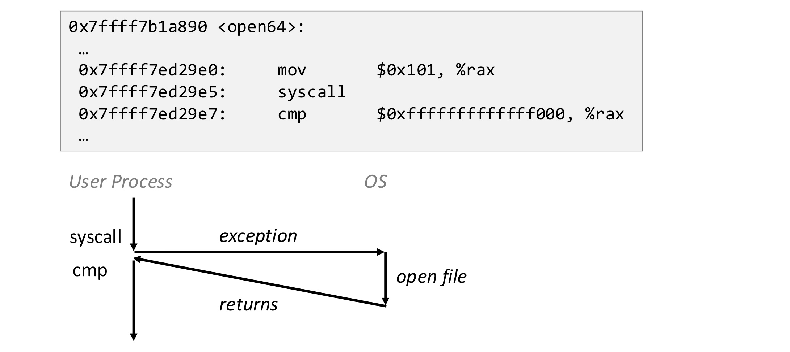
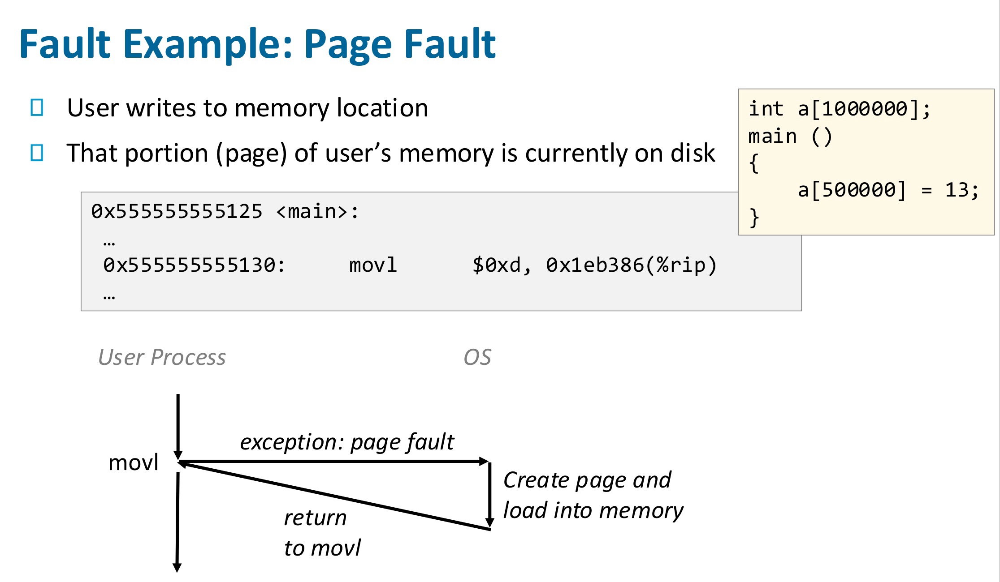
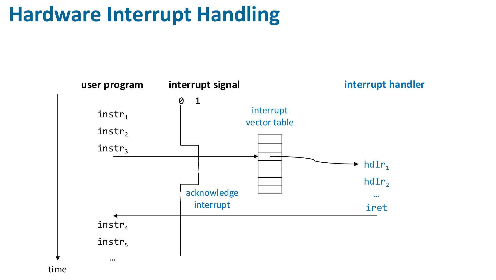
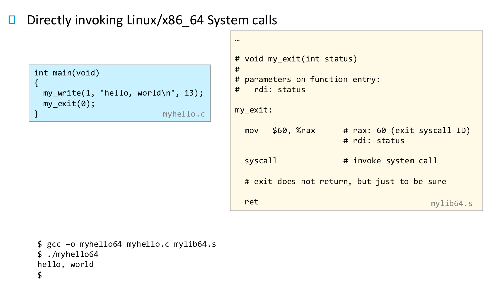

In this post, 18 ~ 20 System Programming lecture is introuduced. 


// 11.4 , 동영상 2개 (녹음 강의)


# Exceptional Control Flow

Exceptional Control Flow는 프로그램이 원래 실행하던 순서를 갑자기 바꾸는 모든 상황을 말한다.

## Low level mechanism : Exception 

Exception에는 **Synchronous Exception**과 **Asynchronous Exception (Interrput)** 이 존재한다.

**Synchronous Exception(Exception)**

- CPU가 직접 감지하고 CPU 내부에서 발생. (ex. page fault : MMU가 문제를 감지)
- Synchronous : 현재 실행 중인 명령어 위치에서 즉시 발생

**Asynchronous Exception (Interrupt)**

- CPU 외부 장치(HDD, 키보드, 타이머 등)가 CPU에게 보내는 비동기 신호. (ex. Disk I/O 완료 인터럽트)
- Asynchronous : 프로그램이 어떤 명령어를 실행하든 상관없이 “언제든” 발생 가능

## Synchronous Exceptions

Synchronous Exception에는 **Traps**, **Faults**, **Aborts**가 존재한다.

**Traps / System Calls**

- Intentional

- Examples : system calls(밑에 system call에 대한 설명과 함께 보면 이해가 쉬울 것), breakpoint traps, special instructions

  

- 복귀 주소 : next instruction

**Faults**

- Unintentional but possibly recoverable

- Examples : page faults, protection faults, floating point exceptions (divide by 0, under/overflow)

  

  - page fault가 발생하는 경우 흐름은 다음과 같다. 먼저, CPU의 MMU가 가상주소를 바탕으로 물리주소를 얻는 과정에서 오류가 생기면 CPU는 내부적으로 page fault exception을 발생시킨다. 그리고 IVT의 Page Fault 엔트리(벡터 14)로 이동한다. 여기까지가 설계된 하드웨어의 동작이고, 이후 OS handler 코드가 loads page into memory, PTE 수정, 명령어 재수행을 수행한다.

  

  - Invalid Memory Refercene가 발생하는 경우 흐름은 다음과 같다. 위에서와 마찬가지로 page fault가 발생하여 OS handler 코드가 실행되던 중 invalid address load into memory 조건을 detect하게 되고 (handler 코드가) SIGSEGV signal을 process에 전달한다. (signal에 대해서는 더 아래에서 다룸). 그러면 process의 default action은 "Segmentation fault"와 함께 terminate되는 것이다.

- Either re-exectures faulting("current") instruction or aborts

**Aborts**

- Unintentional and unrecoverable, typically hardware errors
- Examples : parity error, machine check
- Aborts current program

## Asynchronous Exception (Interrupt)

Interrupt는 CPU 외부에서 어떤 이벤트가 발생했을 때, CPU의 interrupt pin으로 신호가 전달된다. CPU는 pin을 확인하고, 적절한 handler로 jump 하도록 하드웨어적으로 구현되어 있으며, 복귀 후 next instruction을 수행한다. 이벤트의 예시는 다음이 있다. 

- I/O interrupts (keyboard 입력, moving mouse, network에서 packet 도착, disk에서 data 도착)
- Timer interrupt
- Soft rest interrupt (hitting Ctrl-Alt-Delete on a PC)



Interrupt mask register (IMR) 이라는 커널 전용 레지스터에는 1비트 당 한 종류의 인터럽트를 표현하여 1이면 해당 인터럽트를 CPU가 무시하고, 0이면 취급하게 한다. 

## System Calls

x_86_64 Linux에서 시스템 콜은 **syscall / sysret** 라는 명령어로 구현된다.  

**syscall** 은 trap을 발생시키는 instruction이다. `ld`, `sw`이 하드웨어적으로 어떤 동작을 수행하도록 ISA에 정의되어 있듯이, syscall은 하드웨어에서 trap을 발생시켜, 커널 모드로 전환하도록 하는 명령어이다. 

- 하드웨어는 syscall 명령어가 fetch되면 커널 모드로 들어가고(Privilege level 전환, 스택을 커널 스택으로 변경 등 이 강의 범위 밖의 하드웨어 동작을 수행함), 커널의 syscall entry 주소로 실행을 넘긴다(즉, pc 값을 OS의 `entry_SYSCALL_64()` 함수 위치로 변경함).
- 소프트웨어(OS)인 `entry_SYSCALL_64()`  함수는 rax register에 저장된 system call 번호를 보고, (예를 들어, 0x101이면 open 시스템 콜 임을 알고) syscall table에서 해당 인덱스를 찾아 적절한 핸들러로 분기한다. 이 때, rax registser에 101 값을 넣는 것은 open()과 같은 시스템 콜 함수 코드에 구현되어 있다. (이 밖에도 지정된 register에 파라미터를 전달한다.)

❗️이 방식에서는 Interrupt Vector Table이 이용되지 않는다. 

다음과 같은 C 코드가 있다. 

```c
#include <stdlib.h>
#include <unistd.h>

int main(void)
{
    write(1, "hello, world\n", 13);
    exit(0);
}
```

우리는 glibc의 시스템 콜 (래퍼)함수 write, exit을 직접 구현하여 아래와 같이 코드를 작성하고자 한다.

```c
int main(void)
{
    my_write(1, "hello, world\n", 13);
    my_exit(0);
}
```

my_write과, my_exit을 assembly를 이용하여 어셈블리 파일로 구현하면 다음과 같다.




이후 아래와 같이 빌드한다.

```bash
gcc -c my_write.s # 어셈블러가 my_write.o 오브젝트 파일 만듦
gcc -o myhello64 myhello.c my_write.o # 링커가 myhello 라는 실행파일 만듦

./myhello64
hello, world
```


IA32 Linux에서 시스템 콜은 **int 0x80** 이라는 명령어로 구현된다. 

**int**는 소프트웨어가 스스로 interrupt를 일으키게 하는 명령어이다. 이를 software-interrupt 라고 하며 software-interrupt는 (단어에 interrupt가 있지만) Synchronous Exception - Trap에 속한다. CPU가 프로그램 수행중 `int 0x80` 이라는 명령어를 만나면, 마치 외부에서 0x80번 인터럽트가 발생한 것처럼 행동한다. 즉, IVT[80]에 적힌 주소 (code for exception handler 80)로 jump 하여 명령을 수행한다. 이 전체 과정이 하드웨어(CPU)의 동작이다.

❗️Asynchronous Exception 인 하드웨어 interrupt가 발생했을 때(키보드 입력, disk I/O 완료 등), CPU 외부에서 인터럽트 라인을 통해 강제로 CPU에게 신호를 보내고 CPU는 IVT의 해당 벡터로 점프하도록 하드웨어 적으로 구현되어 있다. int 명령어를 수행할 때도 같은 CPU 동작이 일어나므로 이를 software가 유발한 interrupt라는 뜻에서 software-interrupt라고 한다.


## High level mechanism : Signal

