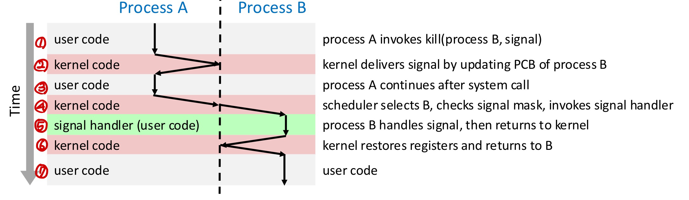
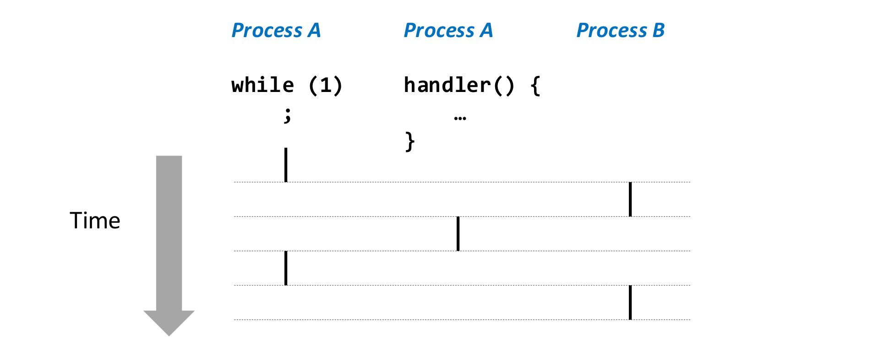

In this post, 18 ~ 20 System Programming lecture is introuduced. 


# Exceptional Control Flow

Exceptional Control Flow는 프로그램이 원래 실행하던 순서를 갑자기 바꾸는 모든 상황을 말한다.

## Low level mechanism : Exception 

Exception에는 **Synchronous Exception**과 **Asynchronous Exception (Interrput)** 이 존재한다.

**Synchronous Exception(Exception)**

- CPU가 직접 감지하고 CPU 내부에서 발생. (ex. page fault : MMU가 문제를 감지)
- Synchronous : 현재 실행 중인 명령어 위치에서 즉시 발생

**Asynchronous Exception (Interrupt)**

- CPU 외부 장치(HDD, 키보드, 타이머 등)가 CPU에게 보내는 비동기 신호. (ex. Disk I/O 완료 인터럽트)
- Asynchronous : 프로그램이 어떤 명령어를 실행하든 상관없이 “언제든” 발생 가능

## Synchronous Exceptions

Synchronous Exception에는 **Traps**, **Faults**, **Aborts**가 존재한다.

**Traps / System Calls**

- Intentional

- Examples : system calls(밑에 system call에 대한 설명과 함께 보면 이해가 쉬울 것), breakpoint traps, special instructions

  

- 복귀 주소 : next instruction

**Faults**

- Unintentional but possibly recoverable

- Examples : page faults, protection faults, floating point exceptions (divide by 0, under/overflow)

  

  - page fault가 발생하는 경우 흐름은 다음과 같다. 먼저, CPU의 MMU가 가상주소를 바탕으로 물리주소를 얻는 과정에서 오류가 생기면 CPU는 내부적으로 page fault exception을 발생시킨다. 그리고 IVT의 Page Fault 엔트리(벡터 14)로 이동한다. 여기까지가 설계된 하드웨어의 동작이고, 이후 OS handler 코드가 loads page into memory, PTE 수정, 명령어 재수행을 수행한다.

  

  - Invalid Memory Refercene가 발생하는 경우 흐름은 다음과 같다. 위에서와 마찬가지로 page fault가 발생하여 OS handler 코드가 실행되던 중 invalid address load into memory 조건을 detect하게 되고 (handler 코드가) SIGSEGV signal을 process에 전달한다. (signal에 대해서는 더 아래에서 다룸). 그러면 process의 default action은 "Segmentation fault"와 함께 terminate되는 것이다.

- Either re-exectures faulting("current") instruction or aborts

**Aborts**

- Unintentional and unrecoverable, typically hardware errors
- Examples : parity error, machine check
- Aborts current program

## Asynchronous Exception (Interrupt)

Interrupt는 CPU 외부에서 어떤 이벤트가 발생했을 때, CPU의 interrupt pin으로 신호가 전달된다. CPU는 pin을 확인하고, 적절한 handler로 jump 하도록 하드웨어적으로 구현되어 있으며, 복귀 후 next instruction을 수행한다. 이벤트의 예시는 다음이 있다. 

- I/O interrupts (keyboard 입력, moving mouse, network에서 packet 도착, disk에서 data 도착)
- Timer interrupt
- Soft rest interrupt (hitting Ctrl-Alt-Delete on a PC)


Interrupt mask register (IMR) 이라는 커널 전용 레지스터에는 1비트 당 한 종류의 인터럽트를 표현하여 1이면 해당 인터럽트를 CPU가 무시하고, 0이면 취급하게 한다. 

## System Calls

x_86_64 Linux에서 시스템 콜은 **syscall / sysret** 라는 명령어로 구현된다.  

**syscall** 은 trap을 발생시키는 instruction이다. `ld`, `sw`이 하드웨어적으로 어떤 동작을 수행하도록 ISA에 정의되어 있듯이, syscall은 하드웨어에서 trap을 발생시켜, 커널 모드로 전환하도록 하는 명령어이다. 

- 하드웨어는 syscall 명령어가 fetch되면 커널 모드로 들어가고(Privilege level 전환, 스택을 커널 스택으로 변경 등 이 강의 범위 밖의 하드웨어 동작을 수행함), 커널의 syscall entry 주소로 실행을 넘긴다(즉, pc 값을 OS의 `entry_SYSCALL_64()` 함수 위치로 변경함).
- 소프트웨어(OS)인 `entry_SYSCALL_64()`  함수는 rax register에 저장된 system call 번호를 보고, (예를 들어, 0x101이면 open 시스템 콜 임을 알고) syscall table에서 해당 인덱스를 찾아 적절한 핸들러(ex. `sys_write()`)로 분기한다. 이 때, rax registser에 101 값을 넣는 것은 open()과 같은 시스템 콜 함수 코드에 구현되어 있다. (이 밖에도 지정된 register에 파라미터를 전달한다.) 이 핸들러 코드에서 특정 DMA 레지스터에 write을 수행하면, 이를 감지하던 DMA 하드웨어가 실제 write을 수행하는 식으로 동작한다.

❗️이 방식에서는 Interrupt Vector Table이 이용되지 않는다. 

다음과 같은 C 코드가 있다. 

```c
#include <stdlib.h>
#include <unistd.h>

int main(void)
{
    write(1, "hello, world\n", 13);
    exit(0);
}
```

우리는 glibc의 시스템 콜 (래퍼)함수 write, exit을 직접 구현하여 아래와 같이 코드를 작성하고자 한다.

```c
int main(void)
{
    my_write(1, "hello, world\n", 13);
    my_exit(0);
}
```

my_write과, my_exit을 assembly를 이용하여 어셈블리 파일로 구현하면 다음과 같다.


이후 아래와 같이 빌드한다.

```bash
gcc -c my_write.s # 어셈블러가 my_write.o 오브젝트 파일 만듦
gcc -o myhello64 myhello.c my_write.o # 링커가 myhello 라는 실행파일 만듦

./myhello64
hello, world
```


IA32 Linux에서 시스템 콜은 **int 0x80** 이라는 명령어로 구현된다. 

**int**는 소프트웨어가 스스로 interrupt를 일으키게 하는 명령어이다. 이를 software-interrupt 라고 하며 software-interrupt는 (단어에 interrupt가 있지만) Synchronous Exception - Trap에 속한다. CPU가 프로그램 수행중 `int 0x80` 이라는 명령어를 만나면, 마치 외부에서 0x80번 인터럽트가 발생한 것처럼 행동한다. 즉, IVT[80]에 적힌 주소 (code for exception handler 80)로 jump 하여 명령을 수행한다. 이 전체 과정이 하드웨어(CPU)의 동작이다.

❗️Asynchronous Exception 인 하드웨어 interrupt가 발생했을 때(키보드 입력, disk I/O 완료 등), CPU 외부에서 인터럽트 라인을 통해 강제로 CPU에게 신호를 보내고 CPU는 IVT의 해당 벡터로 점프하도록 하드웨어 적으로 구현되어 있다. int 명령어를 수행할 때도 같은 CPU 동작이 일어나므로 이를 software가 유발한 interrupt라는 뜻에서 software-interrupt라고 한다.


## High level mechanism : Signal

ECF 중 Low level mechanism 으로 일어나는 exception(ex. Fault), interrupt를 생각해보면 ecf를 유발하는 신호 자체가 HW(page fault의 경우 MMU, keyboard interrupt의 경우 CPU pin)에서 발생하고, 이 신호에 따라 자동으로 IVT를 수행하도록 역시 HW(cpu)가 설계되어 있다. 

반면, Signal은 소프트웨어(os 커널 코드)에 의해 특정 프로세스로 전달되고, 그 처리도 sw적으로 일어난다. 

### Signal Generation

Signal이 발생하는 경우는 다음 3가지가 있다. 

- **HW** 로 부터오는 비동기 **interrupt** 가 signal로 변환되는 경우.
  - Ex : 사용자가 키보드 Ctrl+C 입력하는 경우. 타이머 interrupt 등.
    1. HW 디바이스가 인터럽트 라인(INTx/APIC)을 통해 CPU에 interrupt 신호를 보냄
    2. CPU는 현재 실행 중이던 user mode 코드를 **즉시 중단** (즉시 중단은 control flow의 관점이다. 파이프라인 안에서는 중단지점 이전까지의 명령어는 모두 commit 될 수 있다.)
    3. CPU는 IVT를 참고하여 해당 interrupt entry로 jump → 커널 interrupt handler 실행 (여기까지가 HW로 구현되어 있고, 위에서 본 내용이다.)
    4. 커널 interrupt handler가 특정 프로세스에게 signal을 “pending” 상태로 등록
       (ex. current->pending_sigset에 SIGINT 비트 세팅)

- **SW**가 signal을 발생시키는 경우
  - Ex : 또 다른 프로세스가 kill(pid, SIGKILL) 사용, 스스로 raise(SIGUSR1) 호출, abort() → SIGABRT, segfault → 커널이 SIGSEGV 발생
    1. 사용자가 kill() 또는 raise() 시스템콜 실행
    2. 시스템콜 트랩이 발생 (`int 0x80`, `syscall` 등) → IVT의 system call entry
    3. 커널의 sys_kill() 또는 sys_tgkill()으로 진입
    4. 커널이 target 프로세스의 pending signal에 추가
- CPU **exception** 이 signal로 변환되는 경우.
  - Ex : 0으로 나누기 → SIGFPE, segmentation fault → SIGSEGV, illegal instruction → SIGILL
    1. CPU가 **동기적 예외(synchronous exception)** 발생
    2. IVT에서 exception handler로 jump
    3. 커널 handler에서 원인 분석 후 프로세스에게 해당 signal 등록

공통점은 커널 코드가 특정 process로 signal을 등록한다는 것이다. 이 과정을 자세히 알아보자. 대부분의 시스템에서 signal의 type은 1-31의 정수로 표시된다. 즉, `int` 형 변수 하나를 이용하면 각 bit가 하나의 signal type을 대표하게 된다. 각 process의 **PCB**에는 다음 변수가 저장되어 있다. 

```c
int pending = 0;
int blocked = 0;
```

커널이 signal을 등록한다는 것은 target process의 PCB에서 해당 signal 자리의 pending bit을 1로 설정하는 것이다. 

blocked은 signal을 받는 process가 "특정 signal은 unblock 될 때까지 block으로 설정"하게 하는 변수이다. 

### Signal reception

아래는 Signal generation-delivery-reception 흐름을 나타낸 과정이다. 위에서 2번까지의 과정을 다룬 것이다. 



이후, 3번 과정(process A의 유저 코드 실행)을 거쳐 Process B로 컨텍스트 스위칭을 하는 과정(4)에서 유저 코드를 수행(7)하기 이전에 Process B의 PCB의 pending과 blocked 변수를 이용하여 set of pending but not blocked signals를 아래와 같이 구한다.

```c
pnb = pending & ~blocked
```

그리고 이 pnb가 0이 됟 때까지 처리해야 할 signal(pnb에서 bit가 1인 signal)들의 handler를 수행한다(5). 이 handler을 process B의 유저 코드에 등록되어 있다. 이 동작의 수도 코드를 나타내면 아래와 같다.

```c
while (pnb != 0){
  Choose least nonzero bit k in pnb
    Force process p to receive signal k (receipt of the signal triggers some action by p)
  Clear bit k in pnb
}

Return to p
```

즉, signal handler는 별도의 process가 아니라, main program과 concurrent하게 수행되는 별도의 logical flow임을 알 수 있다. (아래 그림에서 A, B는 위에서 A, B와 무관) 



❗️There can be at most one pending signal of any particular type, in other words, signals are not queued.

❗️Signal reception is asynchronous to delivery.

각 signal에 대한 handler가 process B의 유저 코드에 등록되어 있다고 했는데, 정확히는 기본적으로 커널이 설정해둔 default action이 있고, 필요시 유저가 새롭게 handler를 등록할 수 있다. 다음의 선택이 가능하다.

- **catching** 은 유저가 custom signal handler를 만드는 것이다. 
- **blocking** 은 unblocked 될 때까지 해당 signal을 무시하는 것이다.
- **ignoring**은 해당 signal을 무시하는 것이다.
- **default action**은 커널이 미리 정해둔 action으로 terminate(process 종료), ignore, stop/continue 가 있다. 
- ❗️`SIGKILL` , `SIGSTOP`은 caught, blocked, ignored 될 수 없다.

### Nested Signal Handlers

커널은 user stack 위에 handler들을 연속해서 실행할 수 있는 구조(신호 프레임)를 이미 만들어 놓는다. 그래서 handler1이 실행 되고 나서, 다시 커널로 복귀할 필요 없이 handler2가 수행되는 식이다. process A에서 B로 singal을 보내 B에서 유저 모드(default action인 경우 커널)에서 handler가 동작하던 중(이 코드가 process B의 일부),  interrupt나 exception으로 인해 커널로 재진입할 수 있다. 커널로 재진입하면 다시 signal delivery를 수행한다 (커널 진입 지점이면 언제든 pending signal을 검사함). 이 때, 새로운 handler3가 신호 프레임 위에 존재하여 먼저 수행되고, 이후 handler1이 재개된다. (이전에 수행되던 위치는 유저 스택에 저장되어 재개가능). 그래서 user-handler 안에서 다시 handler가 nested되어 실행된다.

```bash
[ 커널 진입 ]
    ↓
pending signals: SIGINT, SIGTERM
delivery loop 수행
    ↓
handler1 → handler2 순서로 실행될 프레임 구성
    ↓
[ user-mode 복귀 ]
handler1 실행
    ↓ (user-mode)
타이머 interrupt 발생
    ↓
[ 커널 재진입 ]
pending: SIGALRM
handler3 준비
    ↓
[ user-mode 복귀 ]
handler3 실행 (nested)
    ↓
sigreturn → handler1 재개
    ↓
handler1 종료 → sigreturn → handler2
    ↓
handler2 종료 → sigreturn → 원래 코드로 복귀
```

**Question on Nested Signal Delivery**

I would like to ask a question to confirm whether my understanding of signal delivery and kernel re-entry is correct. As I understand it, when a process returns to user mode after signal delivery, the kernel has already constructed signal frames on the user stack so that multiple signal handlers can be executed sequentially. A signal handler itself is just user-mode code, so while a handler is running, the process can be interrupted by a hardware interrupt (such as a timer interrupt) or an exception, which causes the CPU to re-enter kernel mode. Upon this kernel re-entry, the kernel again checks for pending signals. If a new signal (e.g., SIGALRM) is pending, the kernel constructs a new signal frame on top of the existing ones and arranges for the new handler to run first when returning to user mode. This results in nested execution of signal handlers, and when each handler finishes, sigreturn restores the previous context so that execution resumes at the interrupted handler or the original user code. Is this description accurate for how signal delivery and nested handlers are implemented in Linux, or am I missing any important detail or nuance in this process? Thank you very much for your time.

## Singal API

C standarad library의 `kill` 시스템 콜 래퍼 함수를 이용하면 특정 프로세스에 특정 singal을 보낼 수 있다. 

```c
#include <signal.h>

int kill(pid_t pid, int sig);
```

- `pid` 
  - $>0$ : PID가 pid인 프로세스에 signal 보냄.
  - $=0$ : PID가 pid인 프로세스의 process group에 있는 모든 process에 signal 보냄.
  - $=-1$ : permission이 있는 모든 프로세스에 signal 보냄
  - $< -1$ : process group이 -pid인 (pid가 음수이므로 -pid는 양수) 모든 process에 signal 보냄.
- `sig`
  - $>0$ : 보낼 signal 번호.
  - $=0$ : test delivery.

```c
int main(int arc, char *argv[]){
  pid_t pid[N];
  int i, child_status;
  
  for (i=0; i<N; i++){
    if ((pid[i] = fork()) == 0){ // child : sleep for cetrain amount of time
      sleep(i/2);
      return 100+i;
    } else{ // parent : report
      printf("Created process %d\n", pid[i]);
    }
  }
  
  for (i=0; i<N; i+=2){ // parent : send SIGINT to half of children
    printf("Killing process %d\n", pid[i]);
    kill(pid[i], SIGINT);
  }
  
  for (i=0; i<N; i++){ // parent : wait for children to terminate
    pid_t wpid = wait(&child_status);
    if (WIFEXITED(child_status)){
      printf("Child %d termniated with exit status %d\n", wpid, WEXITSTATUS(child_status));
    } else{
      printf("Child %d terminated abnormally\n", wpid);
    }
  }
}
```

❗️`wait()`는 종료된 자식 프로세스의 PID중 가장 최근에 좀비가 된 것을 반환하여 child_status에 저장한다. 프로세스마다 종료되는 시점이 다르기 때문에, 출력 순서가 pid 순서대로가 아니게 된다. 또한, wait는 종료된 자식 프로세스가 없다면 생길 때까지 기다린다. 따라서, for문이 수행 될 때까지 자식 process가 끝나지 않아 출력되지 않은 채로 프로세스가 종료될 일은 없다. 


C standarad library의 `sigaction` 시스템 콜 래퍼 함수를 이용하면 특정 signal에 대한 signal handler를 등록할 수 있다. 

```c
int sigaction(int signum, struct sigaction *act, struct sigaction *oldact)
```


- `signum` 
  - 핸들러를 등록할 signal 번호.
  - SIGKILL과 SIGSTOP은 불가하다.
- `sigaction` 
  - 
- `sig`
  - $>0$ : 보낼 signal 번호.
  - $=0$ : test delivery.

❗️**유저 모드에서의 코드를 실행 중 발생한 시그널은 항상 원래의 코드 위치로 복귀한다.** 시스템 콜이 실행 중(ex. 유저 코드에서 write 수행)일 때 시그널이 도착하면, 리눅스는 다음 두 가지 중 하나를 택한다:
