In this post, 27 System Programming lecture is introuduced. 

# Thread

단일 스레드 프로세스에서는 하나의 실행 흐름만 존재하고, 그 스레드가 자기 스택 + 레지스터(PC, SP 등 실행 상태)를 가지며 코드, 데이터, 힙, 커널 자원을 혼자 사용한다. 반면 멀티스레드 프로세스에서는 여러 스레드가 존재하지만, 각 스레드는 자기만의 실행 컨텍스트(레지스터와 스택을 따로 가지면서도 코드(text), 전역 데이터, 힙, 열린 파일 등 커널 자원은 모두 공유한다. 그래서 스레드는 생성 비용이 작고 빠르게 협력할 수 있지만, 동시에 같은 메모리를 공유하기 때문에 race condition 같은 동기화 문제가 발생할 수 있다.

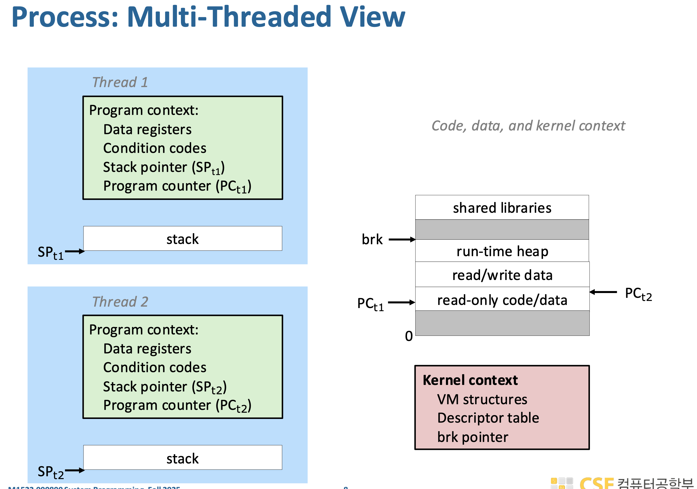

프로세스와 스레드는 관계 구조 자체가 다르다. 프로세스는 fork를 통해 부모-자식 관계가 생기면서 트리 구조를 이루고, 각 프로세스는 독립적인 실행 단위라 서로 직접적으로 제어하지 못하는 반면, 스레드는 하나의 프로세스 내부에서 생성되기 때문에 위계가 아니라 동등한 peer 집합처럼 동작하며 같은 주소 공간과 자원을 공유한다. 그래서 한 스레드가 다른 스레드를 종료시키거나 기다리는 것이 가능하고, 모두가 동일한 메모리(코드, 데이터, 커널 컨텍스트 일부)를 공유하면서 협력적으로 작업한다. 그리고 main thread는 그 프로세스에서 처음 시작된 스레드일 뿐 특별한 권한 구조를 갖는 상위 노드는 아니다.

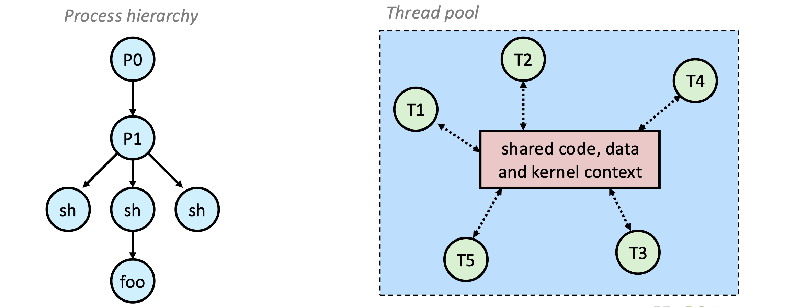

스레드 실행은 CPU 코어 수에 따라 “진짜 병렬”인지 “겉보기 동시성”인지가 갈린다. 단일 코어에서는 한 번에 하나의 스레드만 실제로 실행되고 커널이 짧은 시간 단위로 번갈아 실행시키는 time slicing으로 동시에 실행되는 것처럼 보이지만, 멀티 코어에서는 서로 다른 코어에서 여러 스레드가 물리적으로 동시에 실행되어 진짜 병렬 처리가 가능하다. 따라서 단일 코어에서는 실행 순서와 인터리빙이 성능과 race condition에 영향을 주고, 멀티 코어에서는 동시에 같은 메모리를 접근할 수 있기 때문에 동기화 문제가 더 직접적으로 중요해진다.

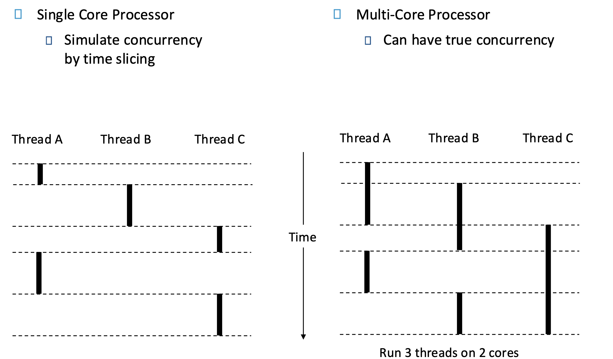

실제로 병렬 프로그래밍을 구현할 때 사용하는 대표적인 라이브러리/프레임워크에는 **Pthreads**, **OpenMP**, **OpenCL** 이 있다. Pthreads는 가장 저수준의 POSIX 표준 스레드 API라서 직접 스레드 생성, 동기화(뮤텍스, 조건변수 등)를 세밀하게 제어할 수 있지만 코드가 복잡해지고, OpenMP는 컴파일러 지시문(`#pragma`) 기반으로 반복문 같은 영역을 자동으로 병렬화해줘서 사용이 훨씬 쉽고 CPU 멀티코어 병렬 처리에 적합하며, OpenCL은 CPU뿐 아니라 GPU 같은 이종 컴퓨팅 장치까지 포함해 병렬 처리를 수행할 수 있게 해주는 더 저수준의 범용 병렬 컴퓨팅 프레임워크라는 차이가 있다.

## Pthreads

이 코드는 Pthreads를 이용해 가장 기본적인 스레드를 하나 생성하고 실행한 뒤 종료까지 기다리는 흐름을 보여준다. `pthread_create(&tid, NULL, thread, NULL)`에서 새로운 스레드를 만들고, 이 스레드는 `thread(void *vargp)`함수부터 실행되며 여기서 실제 작업(여기서는 printf)을 수행한다. 이후 `pthread_join(tid, NULL)`을 호출하면 main 스레드는 생성한 스레드가 끝날 때까지 기다렸다가 종료되며, 즉 join은 “스레드 종료를 기다리는 동기화” 역할을 한다. 정리하면 main → 스레드 생성 → 스레드 함수 실행 → main이 join으로 기다림 → 스레드 종료 후 프로그램 종료라는 구조다.

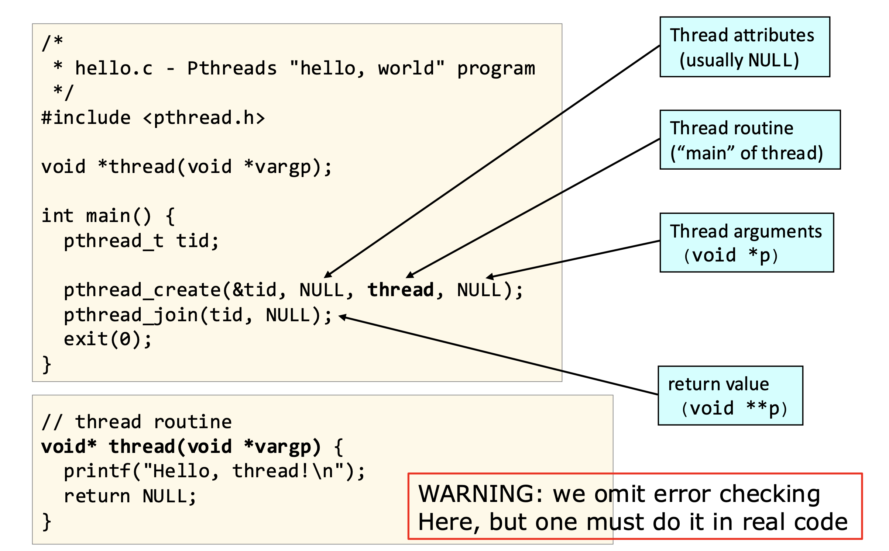

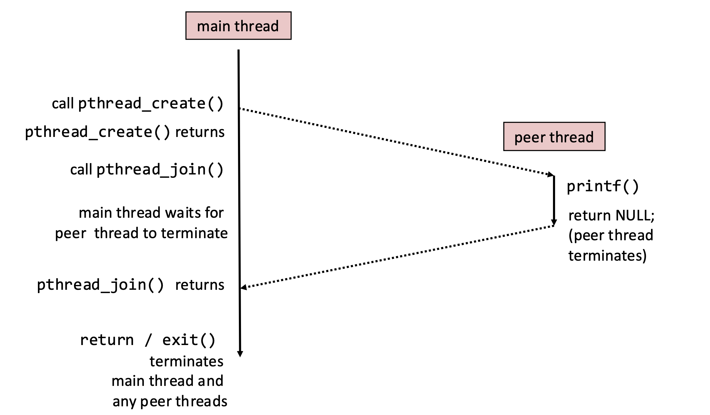

main 스레드와 새로 만든 스레드의 실행 흐름을 시간 순서대로 보여준다. main 스레드가 `pthread_create()`를 호출하면 새로운 peer 스레드가 생성되어 `thread` 함수부터 실행을 시작하고, main은 create가 리턴된 뒤 바로 `pthread_join()`을 호출해 해당 스레드가 끝날 때까지 블록된다. meanwhile peer 스레드는 `printf()`를 수행하고 `return NULL`로 종료되며, 이때 스레드 실행이 끝난다. 그러면 `pthread_join()`이 리턴되어 main이 다시 실행을 이어가고, 마지막에 main이 `return`이나 `exit()`를 호출하면 프로세스 전체가 종료되면서 남아있는 모든 스레드도 함께 종료된다.

이전 글에서는 Iterative Echo Server와 그 대안으로 Process-Based Concurrent Echo Server를 보았다. 이제 Thread-Based Concurrent Echo Server를 보자.

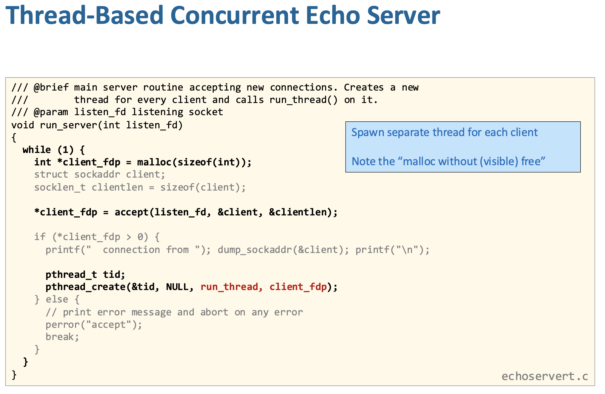

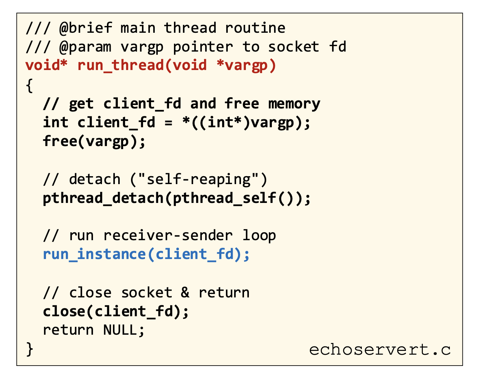이 코드는 서버가 `accept()`로 클라이언트 연결을 받을 때마다 새로운 스레드를 만들어 각 클라이언트를 동시에 처리하는 구조다. 메인 서버 루프에서는 `accept()`로 얻은 `client_fd`를 바로 넘기지 않고, 포인터로 넘기기 위해 `malloc`으로 메모리를 할당한 뒤 그 주소를 `pthread_create()`에 전달한다. 새로 생성된 스레드(`run_thread`)는 시작하자마자 이 포인터를 역참조해 실제 `client_fd` 값을 가져오고, 더 이상 필요 없는 힙 메모리를 `free`한다. 이후 `pthread_detach(pthread_self())`를 호출해 해당 스레드를 join 없이 자동으로 정리되는 detached 상태로 만들고, `run_instance(client_fd)`에서 실제 echo 통신을 수행한 뒤 `close(client_fd)`로 연결을 닫고 종료된다. 핵심은 각 클라이언트를 독립 스레드가 처리하므로 동시성이 확보된다는 점, 그리고 `malloc/free`를 쓰는 이유는 루프 변수 주소를 그대로 넘기면 race condition이 생기기 때문에 각 스레드마다 안전하게 고유한 `client_fd` 저장 공간을 만들어주기 위함이다.

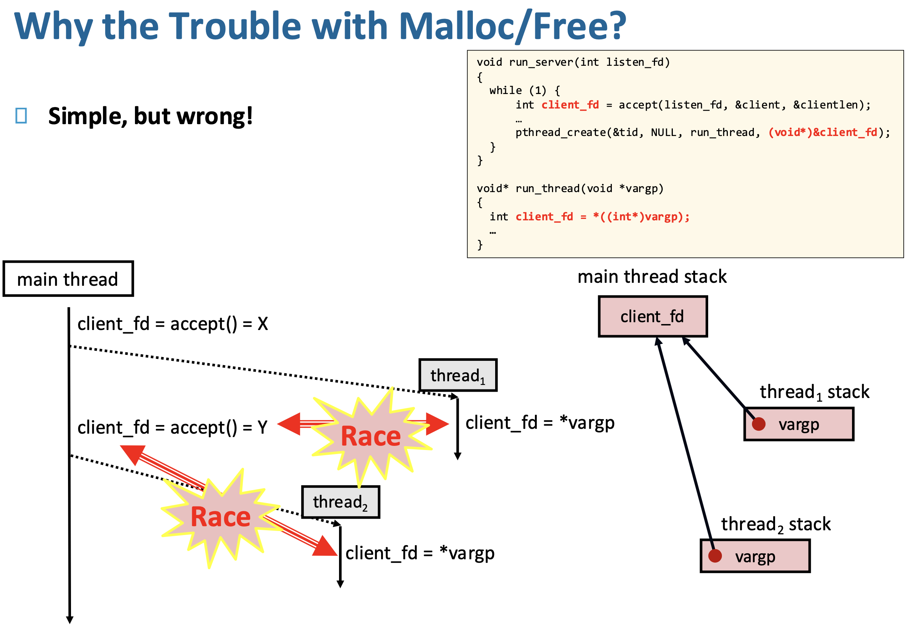

“왜 굳이 malloc/free를 쓰냐”인데, 답은 스레드 생성 시점과 실행 시점이 어긋나면서 같은 메모리를 여러 스레드가 공유하게 되는 race condition 때문이다. 그림의 잘못된 코드처럼 `&client_fd` (메인 스레드 스택 변수의 주소)를 그대로 넘기면, 메인 스레드는 다음 `accept()`를 호출하면서 그 변수 값을 X → Y → Z로 계속 덮어쓴다. 그런데 생성된 스레드들은 언제 실행될지 보장되지 않기 때문에, 어떤 스레드는 X를 받아야 하는데 이미 값이 Y로 바뀐 뒤 읽어버릴 수 있다. 즉 여러 스레드가 “같은 주소”를 보고 있어서 값이 꼬인다. malloc을 쓰면 각 스레드마다 별도의 메모리 공간(힙에 있는 int 하나)을 만들어 그 시점의 값을 복사해서 넘기므로, 이후 메인 스레드가 값을 바꿔도 영향이 없다. 그리고 스레드 시작하자마자 `free`하는 이유는 더 이상 공유할 필요가 없기 때문이다. 요약하면, 문제의 본질은 스택 변수의 주소 공유로 인한 경쟁 상태이고, malloc은 각 스레드에 독립적인 안전한 전달 공간을 만들어주는 역할이다.

부모-자식 프로세스를 fork하는 방식과 달리 모든 스레드가 동일한 주소 공간을 공유한다는 것이 핵심이다. 그래서 코드, 데이터, 힙뿐만 아니라 파일 디스크립터 같은 커널 자원도 스레드 간에 공유되며, 예를 들어 한 스레드가 `accept()`로 얻은 `client_fd`를 다른 스레드가 그대로 사용해 통신할 수 있다. 대신 각 스레드는 자기만의 PC, 레지스터, 스택을 가지므로 실행 흐름은 독립적으로 진행된다. 이 구조 덕분에 프로세스 생성보다 가볍고 빠르게 동시성을 얻을 수 있지만, 공유 메모리 때문에 동기화 문제(레이스 컨디션 등)를 직접 신경 써야 한다는 점이 중요한 특징이다.

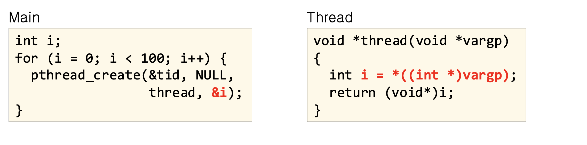

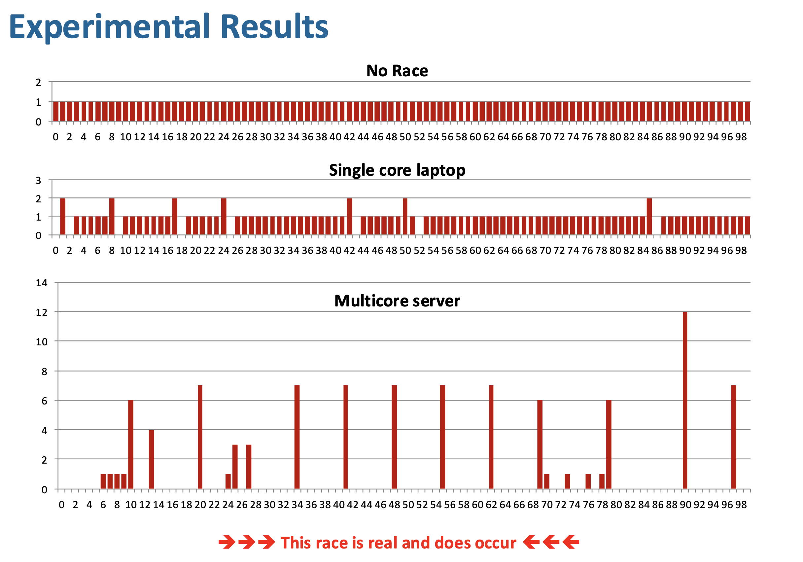

이 실험은 `pthread_create(..., &i)`처럼 루프 변수 `i`의 주소를 그대로 여러 스레드에 넘기면 실제로 race condition이 발생한다는 것을 보여준다. 만약 race가 없다면 100개의 스레드는 각각 서로 다른 시점의 `i` 값을 읽어서 0부터 99까지가 정확히 한 번씩만 나와야 한다. 하지만 실제 결과를 보면 단일 코어에서도 어떤 값은 중복되고 어떤 값은 사라지며, 멀티코어에서는 그 현상이 훨씬 심해져 특정 값이 여러 번 반복되고 많은 값이 아예 읽히지 않는다. 이유는 모든 스레드가 같은 메인 스레드 스택 변수 `i`의 주소를 공유하고 있는데, 메인 스레드는 루프를 돌며 그 값을 계속 바꾸고 있고, 각 스레드는 생성 직후가 아니라 나중에 스케줄될 수도 있어서 자기 차례에 이미 바뀐 값을 읽어버리기 때문이다. 즉, 문제는 “각 스레드가 자기 값을 받는 것”이 아니라 “모두가 같은 주소를 보고 있다”는 데 있고, 이 때문에 `&i`를 넘기는 방식은 실제로 잘못된 코드라는 것이 실험으로 확인된 것이다.

스레드 기반 서버는 가볍고 빠르지만 몇 가지 중요한 함정을 반드시 관리해야 한다. 먼저 스레드는 기본적으로 joinable 상태라서 `pthread_join`으로 회수하지 않으면 자원이 해제되지 않아 메모리 누수가 생기므로, 서버처럼 많은 스레드를 만들 때는 `pthread_detach`로 자동 회수되게 만드는 것이 일반적이다. 또한 모든 스레드가 같은 주소 공간을 공유하기 때문에, 메인 스레드의 스택 변수 주소를 넘기는 것처럼 의도치 않은 공유는 race condition을 유발하므로 매우 조심해야 한다. 마지막으로 여러 스레드가 동시에 실행되므로 사용하는 함수들이 thread-safe하지 않으면 내부 상태가 깨질 수 있어, 동기화나 안전한 API 사용이 필수다. 

## Vector Addition Example

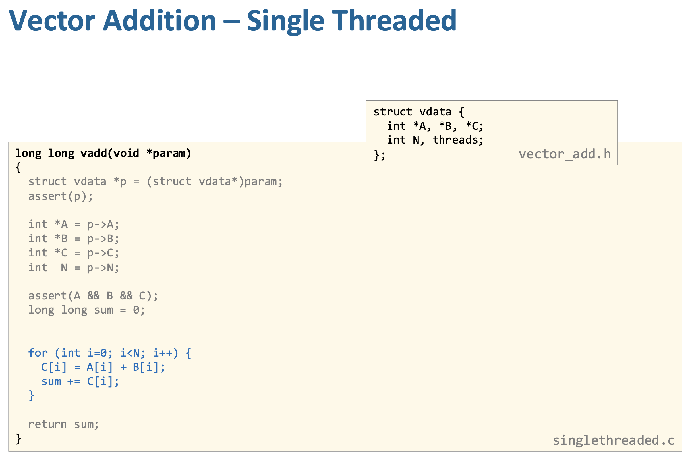

이 코드는 벡터 A와 B를 더해 C를 만드는 작업을 여러 스레드로 나눠 병렬 처리하는 전형적인 패턴이다. 전체 길이 N을 스레드 수 nt로 나눠 각 스레드가 처리할 구간 [from, to)를 계산한 뒤, `tparam` 구조체 배열에 각 스레드의 입력(A, B, C 포인터)과 담당 범위를 저장하고 `pthread_create`로 실행한다. 각 스레드는 자기 구간에 대해서만 `C[i] = A[i] + B[i]`를 수행하고 부분 합을 `p->result`에 기록하므로 서로 같은 인덱스를 건드리지 않아 데이터 경쟁이 없다. 메인 스레드는 이후 `pthread_join`으로 모든 스레드가 끝날 때까지 기다린 뒤, 각 스레드의 부분 합을 모아 최종 결과를 만든다. 

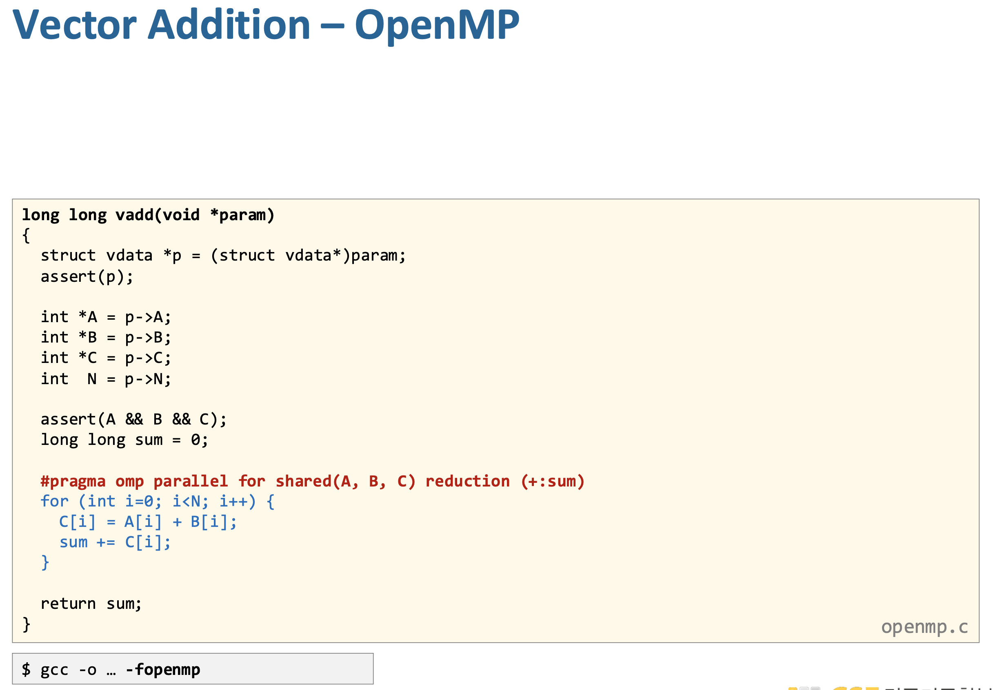

이 코드는 아까 Pthreads로 직접 스레드 나눴던 걸 OpenMP가 자동으로 해주는 버전이다.

`#pragma omp parallel for shared(A, B, C) reduction(+:sum)` 이 의미하는 바는 다음과 같다. (`#pragma`는 C/C++에서 **컴파일러에게 “이 부분 이렇게 처리해줘”라고 지시하는 특별한 문법**이다.)

- `parallel for`  : for 루프를 여러 스레드로 자동 분할해서 실행한다. 개발자가 pthread_create 같은 걸 직접 안 해도 된다.
- `shared(A, B, C)` : A, B, C 배열은 모든 스레드가 공유한다. 각 스레드는 서로 다른 i를 처리하므로 충돌 없음.

- `reduction(+:sum)` : sum은 각 스레드가 따로 가지고 계산하고, 마지막에 자동으로 더해준다.

  - 스레드 1: 자기 구간 sum1 계산

  - 스레드 2: 자기 구간 sum2 계산

  - 마지막에 sum = sum1 + sum2 + ...

