In this post, 27 System Programming lecture is introuduced. 

# Synchronization 

스레드 환경에서 어떤 변수가 공유되는지는 “전역 vs 스택”처럼 단순히 구분할 수 있는 문제가 아니라, **그 변수의 실제 메모리 인스턴스를 여러 스레드가 동시에 참조할 수 있느냐**로 결정된다; 프로세스 내 스레드들은 기본적으로 같은 주소 공간(코드, 전역/힙 메모리)을 공유하지만 각자 별도의 스택을 가지므로 일반적인 지역 변수는 스레드마다 독립적인 인스턴스를 갖는 반면, 전역 변수나 힙에 할당된 객체는 여러 스레드가 같은 주소를 가리킬 수 있어 공유된다; 하지만 이것도 절대적인 규칙이 아니라 예를 들어 스택 변수의 주소를 다른 스레드에 넘기면 그 스택 변수도 공유될 수 있고, 반대로 전역 변수라도 접근이 제한되면 사실상 공유되지 않을 수도 있으므로, 핵심은 “변수 x의 어떤 메모리 인스턴스를 둘 이상의 스레드가 실제로 참조하느냐”이며 이 조건을 만족할 때 그 변수를 **공유 변수 (shared variable )** 라고 한다.

이전 글에서 main 스레드의 스택에 있는 값을 여러 스레드가 참조하여 발생하는 **race condition**에 대해 알아보았다 (아래 그림 참조). 이 문제를 어떻게 해결하는지 두 가지 방법을 알아보자. 

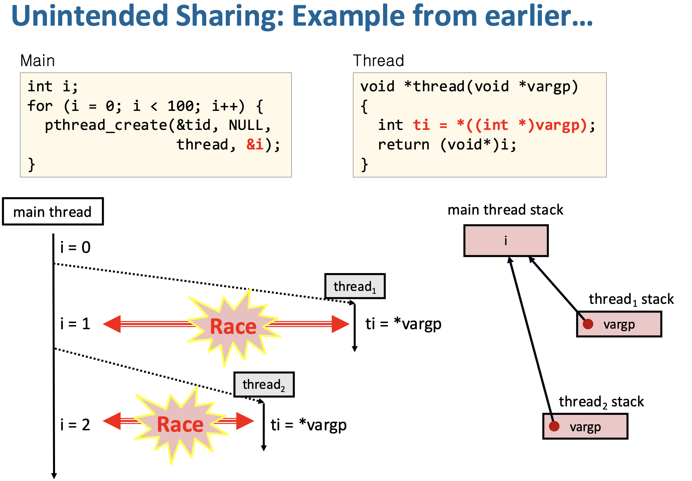

- **The proper way** : 아래 코드는 이전의 문제(루프 변수 하나를 여러 스레드가 같이 참조해서 race 발생)를 해결하는 방식으로, 핵심은 **각 스레드마다 독립적인 메모리 인스턴스를 만들어 넘긴다**는 점인데, `malloc`으로 `long` 하나를 힙에 따로 할당하고 거기에 `i` 값을 복사한 뒤 그 포인터 `iptr`을 스레드에 전달하면 이제 각 스레드는 서로 다른 주소를 참조하게 되어 경쟁이 사라지고, 스레드 함수에서 `*(long*)vargp`로 값을 읽은 뒤 `free`까지 해주면서 수명도 안전하게 관리된다; 반면 `ptr` 같은 전역 포인터는 여전히 모든 스레드가 공유하는 영역(전역/힙)을 가리키므로 읽는 것은 괜찮지만, `static int cnt`처럼 함수 내부 정적 변수도 사실은 전역처럼 공유되기 때문에 `++cnt`는 여전히 race condition 대상이 될 수 있다는 점이 중요하며, 결국 올바른 패턴은 “스레드마다 필요한 입력 데이터는 복사해서 독립적으로 넘기고, 공유 상태는 최소화하거나 반드시 동기화로 보호한다”이다.

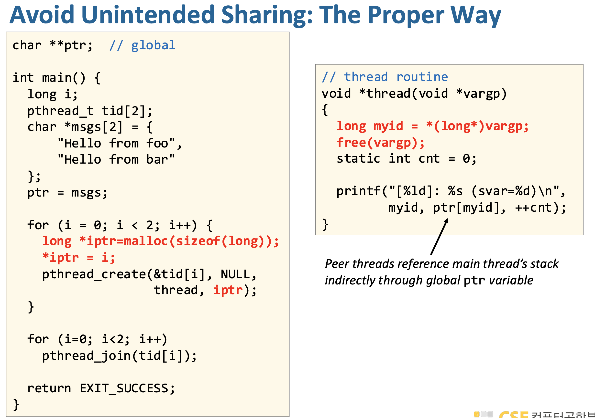

📝 **함수 안의 static variable** 

C에서 함수 안의 `static` 변수는 **그 함수에 “속해 있는 전역 변수”처럼 동작하는 것**으로, 스코프는 함수 내부로 제한되지만 실제 메모리는 스택이 아니라 전역/정적 영역에 한 번만 할당되어 프로그램 시작부터 종료까지 유지되고, 함수가 여러 번 호출되어도 값이 초기화되지 않고 이전 값을 계속 기억하며, 모든 호출과 모든 스레드가 동일한 인스턴스를 공유한다는 특징이 있다; 그래서 호출 횟수 카운트처럼 상태를 유지할 때 유용하지만, 멀티스레드 환경에서는 동시에 접근하면 race condition이 생길 수 있어 별도의 동기화가 필요하다.

전역 변수와 `static` 지역 변수는 둘 다 스택이 아니라 프로세스의 정적/전역 메모리 영역에 단 하나만 존재해서 모든 스레드가 같은 인스턴스를 공유하는 반면, 일반 지역 변수는 각 스레드의 스택에 따로 생성되므로 스레드마다 독립적인 인스턴스를 가진다; 따라서 공유 여부는 “전역이냐 지역이냐”보다 “실제로 메모리에 몇 개의 인스턴스가 존재하느냐”로 판단해야 하고, 전역/정적 변수는 기본적으로 공유되어 동기화가 필요하며, 지역 변수는 기본적으로 독립적이지만 그 주소를 다른 스레드에 넘기면 결국 같은 인스턴스를 참조하게 되어 공유로 바뀔 수 있다는 점이 중요하다.

- **The Hacky Way** : 이 방식은 의도치 않은 공유를 피하려고 하긴 하지만 정석이 아니라 “타입 시스템을 우회하는 꼼수”로, `pthread_create`의 인자 타입이 `void*`이기 때문에 `i` 값을 그냥 `(void*)i`로 캐스팅해서 포인터처럼 넘기고, 스레드 안에서 다시 `(long)vargp`로 되돌려 값을 복원하는 방식인데, 이렇게 하면 주소를 공유하지 않고 값 자체를 레지스터를 통해 전달하므로 이전처럼 하나의 메모리(`i`)를 여러 스레드가 참조하는 문제는 사라진다; 다만 이건 실제 포인터가 아닌 정수를 포인터로 속여 넘기는 것이기 때문에 32/64비트 환경에서 크기 불일치 문제나 정의되지 않은 동작(UB)을 유발할 수 있고, 이식성이나 안정성이 떨어지므로 실무에서는 권장되지 않으며, 안전한 방법은 앞에서처럼 `malloc`으로 각 스레드에 독립적인 메모리를 만들어 넘기는 것이다.

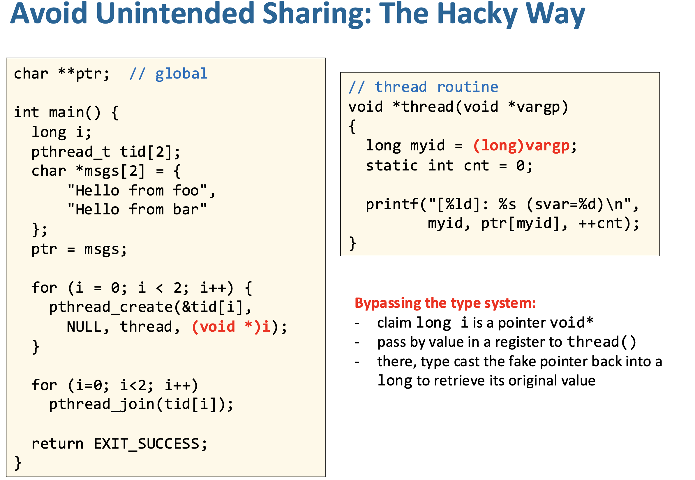

아래 코드를 보자. 

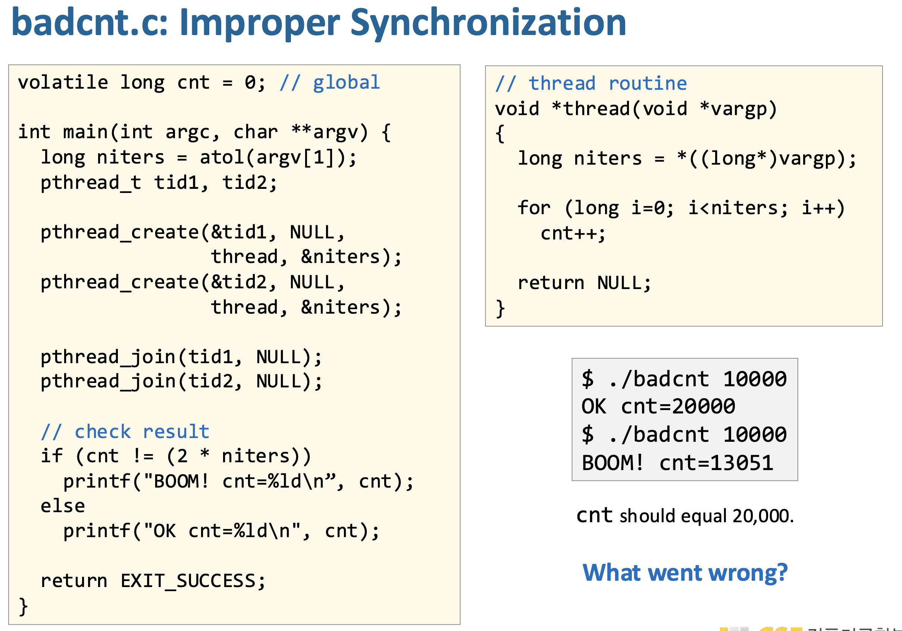

이 코드에서 문제가 생기는 이유는 `cnt++`가 겉보기에는 한 번의 연산 같지만 실제로는 어셈블리 수준에서 **load → increment → store (L-U-S)**의*세 단계로 나뉘어 실행되기 때문에, 두 스레드가 동시에 이 과정을 수행하면 서로의 중간 상태를 덮어쓰는 race condition이 발생하기 때문인데, 예를 들어 두 스레드가 같은 시점에 `cnt` 값을 읽으면 둘 다 같은 값을 가져온 뒤 각각 1을 더하고 다시 저장하면서 결과적으로 한 번의 증가가 “사라지는(lost update)” 상황이 생긴다; 여기서 `volatile`은 컴파일러 최적화를 막아 메모리에서 매번 읽고 쓰게 할 뿐, 이 세 단계 연산을 하나로 묶어주는 atomicity나 스레드 간 동기화를 보장하지 않기 때문에 문제를 해결하지 못하고, 결국 올바른 해결 방법은 한 번에 한 스레드만 `cnt`에 접근하도록 mutex 같은 mutual exclusion을 사용하거나, 하드웨어가 제공하는 atomic 연산(예: fetch-and-add)을 사용하는 것이다.

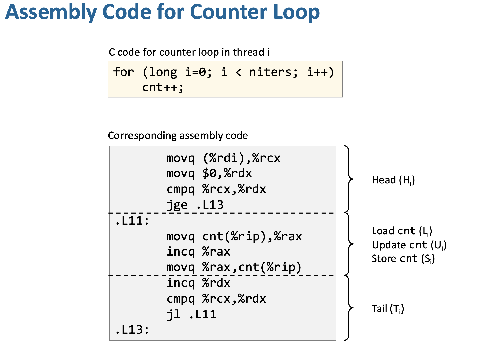

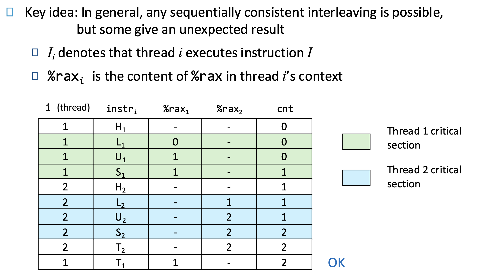

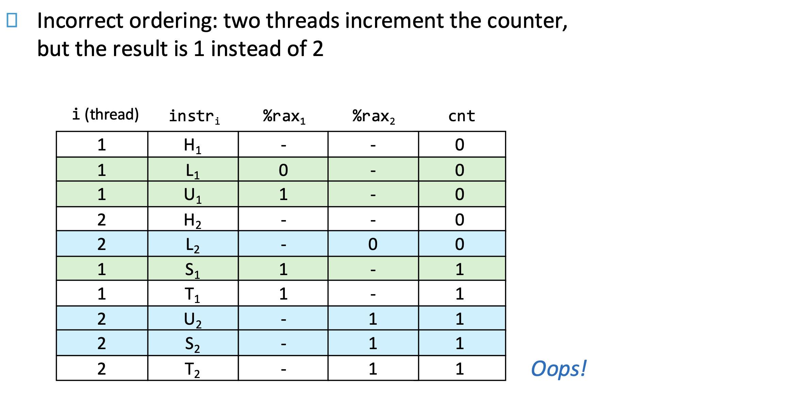

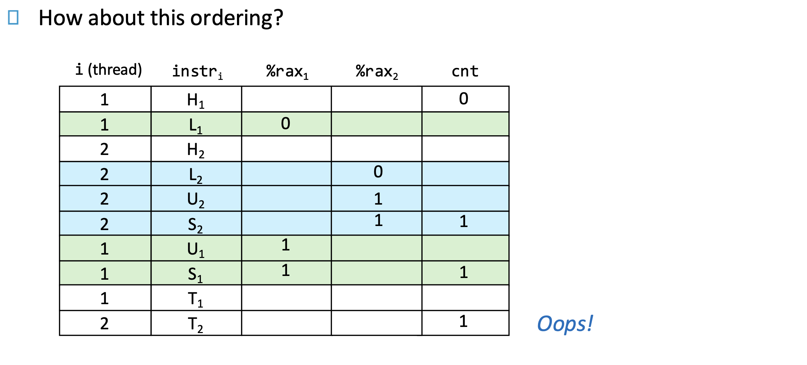

📝 **volatile**

`volatile`이 없으면 컴파일러는 “이 변수는 다른 스레드나 외부에 의해 갑자기 바뀌지 않는다”고 가정하고 더 공격적으로 최적화를 하는데, 대표적으로 `cnt++` 루프를 매번 메모리에서 읽고 쓰는 대신 **레지스터에 한 번 로드해 두고 거기서 계속 증가시키다가 마지막에 한 번만 메모리에 저장**하는 식으로 바꿀 수 있고(또는 루프를 축약하거나 재배치), 이렇게 되면 각 스레드는 서로의 업데이트를 전혀 보지 못한 채 자기 레지스터 값만 기준으로 계산해 최종 결과가 완전히 틀어질 수 있다; 반면 `volatile`을 붙이면 매 반복마다 실제 메모리에서 읽고 다시 써야 하도록 만들어 이런 레지스터 캐싱이나 재정렬을 막지만, 여전히 `load → add → store`가 분리된 비원자 연산인 건 그대로라서 두 스레드가 끼어들며 값을 덮어쓰는 문제 자체는 해결되지 않는다.

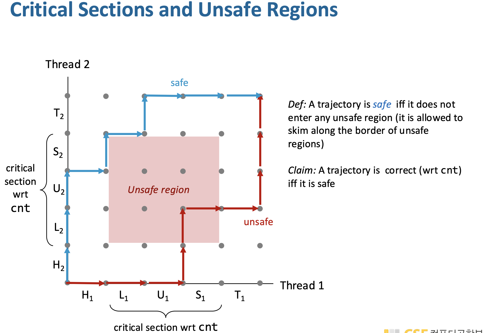

위 그림은 두 스레드의 실행을 2차원 평면(가로: thread 1 진행, 세로: thread 2 진행)으로 나타내서 언제 문제가 생기는지를 보여주는 것으로, 각 스레드에서 `cnt`를 다루는 L→U→S 구간이 critical section인데 두 스레드가 이 구간에 동시에 들어가면(즉 둘 다 아직 store를 끝내지 않은 상태에서 겹치면) 서로의 중간 값을 덮어쓰는 “unsafe region”에 들어가게 되어 결과가 깨지고, 반대로 실행 경로가 이 빨간 영역을 피해 가면(한 스레드가 LUS를 완전히 끝낸 뒤 다른 스레드가 들어가면) 항상 올바른 결과가 나오므로 safe trajectory가 된다; 즉 이 그림의 본질은 “문제는 동시에 critical section에 들어가는 것”이고, mutual exclusion은 이 unsafe 영역 자체를 아예 지나갈 수 없도록 만들어서 모든 실행 경로를 safe하게 강제하는 역할을 한다.

핵심은 unsafe region에 들어가는 실행 순서를 원천적으로 막는 것인데, 이를 위해 각 스레드가 critical section(L→U→S 구간)에 동시에 들어가지 못하도록 **mutual exclusion(상호 배제)**을 강제해야 하고, 즉 한 스레드가 해당 구간에 들어가면 다른 스레드는 반드시 기다리게 만들어 모든 실행이 항상 safe trajectory만 따르도록 만드는 것이다; 이를 구현하는 전통적인 방법이 **Semaphore(또는 mutex)**로, 공유 변수에 접근하기 전에 lock을 획득하고 끝나면 해제하는 방식으로 critical section을 “한 번에 하나의 스레드만” 실행되도록 보장한다.

## Semaphore

세마포어는 여러 스레드가 공유하는 정수 변수 `s`를 이용해 동기화를 하는 도구로, 핵심은 `P`와 `V` 연산이 **원자적으로 실행된다는 점**인데, `P(s)`는 “s가 0이면 기다리고, 아니면 1 감소시키고 들어간다”는 의미라서 자원이 없으면 block되고 있으면 하나를 가져가는 동작이고, `V(s)`는 “자원을 반납하면서 s를 1 증가시킨다”는 의미다; 여기서 중요한 건 이 두 연산 전체(while 검사 + 감소)가 중간에 끊기지 않고 한 번에 실행되도록 커널이나 하드웨어가 보장하기 때문에, 두 스레드가 동시에 `P`를 실행해도 둘 다 s를 감소시키는 일이 절대 발생하지 않아 mutual exclusion이 성립한다는 것이고, 결과적으로 s 값은 항상 0 이상을 유지하면서 동시에 접근 가능한 스레드 수를 제한하는 역할을 하게 된다.

📝 **P & V**

P와 V는 특정 언어나 라이브러리의 실제 함수 이름이라기보다 **세마포어의 동작을 설명하기 위한 추상적인 연산(개념)**인데, 이 연산은 반드시 **원자적으로 실행된다**는 의미까지 포함한 모델이다; 이 개념을 실제로 구현할 때는 운영체제나 라이브러리가 제공하는 API로 대응되는데 예를 들어 POSIX에서는 `sem_wait()`가 P, `sem_post()`가 V에 해당하고, mutex에서는 `pthread_mutex_lock()`/`unlock()`이 같은 역할을 한다.

📝 **semaphore API, pthread mutex API**

- `sem_wait()`/`sem_post()`는 POSIX semaphore API로 `<semaphore.h>`에 정의된 함수이며 내부적으로 커널 지원(예: futex 등)을 받아 카운팅 세마포어를 조작하는 데 쓰이고, 여러 개의 자원 개수를 관리할 수 있고 프로세스 간 공유도 가능하다.
- 반면 `pthread_mutex_lock()`/`pthread_mutex_unlock()`은 POSIX Threads(pthreads) 라이브러리(`<pthread.h>`)에서 제공하는 mutex API로 오직 하나의 스레드만 임계구역에 들어가게 하는 lock을 다루고 보통 같은 프로세스 내 스레드 간 동기화에 사용되며 소유권 개념(락을 건 스레드만 해제 가능)이 있다.
-  **POSIX semaphore API**는 `sem_t` 타입을 사용하며, `sem_init(sem_t *sem, int pshared, unsigned int value)`로 초기화한다(초기 값은 동시에 허용되는 스레드 수). `sem_wait(sem)`는 내부 값이 0이면 블록하고, 1 이상이면 값을 1 감소시키며 진입(P 연산), `sem_post(sem)`는 값을 1 증가시키고 대기 중인 스레드 하나를 깨운다(V 연산). 필요하면 `sem_destroy`로 해제한다. 세마포어는 값이 1이면 mutex처럼 쓸 수 있고(binary semaphore), 2 이상이면 여러 스레드 동시 접근을 허용하는 counting semaphore로도 쓸 수 있다.

- 반면 **pthread mutex API**는 오직 “상호 배제(lock)” 목적에 특화되어 있으며 `pthread_mutex_t` 타입을 사용한다. `pthread_mutex_init(&m, NULL)`로 초기화하고, `pthread_mutex_lock(&m)`은 이미 다른 스레드가 들고 있으면 블록하고, 아니면 락을 획득한다. `pthread_mutex_unlock(&m)`은 락을 해제하고 대기 중인 스레드 하나를 깨운다. 마지막에 `pthread_mutex_destroy`로 정리한다. mutex는 반드시 “락을 획득한 스레드만 해제할 수 있다”는 소유권 개념이 있지만, 세마포어는 그런 제약이 없다.

용어를 정의하면 다음과 같다. 

- **semaphore** : 여러 스레드가 공유하는 정수 카운터 기반 동기화 변수로, P(wait)와 V(post)라는 원자적 연산을 통해 자원의 사용 가능 개수를 관리하고 스레드의 접근을 제어하는 메커니즘
- **binary semaphore** : 값이 0 또는 1만 가질 수 있는 semaphore로, 자원이 “사용 가능(1)” 또는 “사용 중(0)” 상태만 표현하는 형태
- **mutex** : 상호 배제를 위해 사용하는 lock으로, 한 번에 하나의 스레드만 critical section에 들어가도록 보장하는 동기화 도구이며 개념적으로는 binary semaphore의 특수한 경우이지만 소유권(누가 lock을 잡았는지) 개념이 있고 보통 같은 스레드만 unlock할 수 있다는 점에서 더 엄격하게 정의된다.

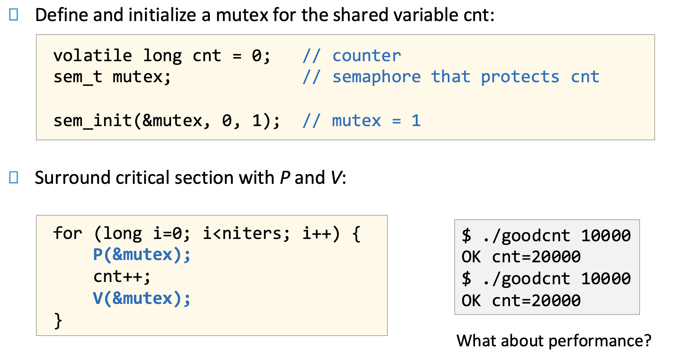

이 코드는 `cnt++`를 보호하기 위해 세마포어(여기서는 초기값 1인 binary semaphore)를 mutex처럼 사용해서, 반복문 안에서 `P(&mutex)`로 lock을 잡고 `cnt++`를 수행한 뒤 `V(&mutex)`로 lock을 풀어줌으로써 항상 한 스레드만 critical section에 들어가도록 만들어 race condition을 완전히 제거한 올바른 구현이다. 

이제 두 가지 예제를 통해, semaphore가 순히 mutual exclusion(락) 용도로만 쓰는 게 아니라 **스레드 간 조건 발생을 알리는 신호(동기화)와 자원 개수 관리에 활용할 수 있음**을 알아보자. 

## Producer-Consumer Problem

producer-consumer 문제는 하나 이상의 producer가 데이터를 만들어 shared buffer에 넣고, 하나 이상의 consumer가 그 데이터를 꺼내 쓰는 구조에서 발생하는 동기화 문제로, 핵심은 “버퍼가 꽉 차면 producer는 기다리고, 비어 있으면 consumer는 기다려야 한다”는 조건을 정확히 지키는 것인데, 이를 위해 보통 두 개의 counting semaphore(빈 공간 수, 아이템 수)와 하나의 mutex를 사용해 구현하며, producer는 빈 슬롯이 있을 때만 데이터를 넣고 넣은 뒤 아이템 개수를 증가시켜 consumer를 깨우고, consumer는 아이템이 있을 때만 꺼내고 꺼낸 뒤 빈 슬롯 개수를 증가시켜 producer를 깨우는 식으로 서로를 신호하며 협력한다; 이런 패턴은 영상 프레임 생성-렌더링, 이벤트 처리 큐 등 실제 시스템에서 매우 널리 쓰이며, 세마포어를 이용해 자원 상태와 실행 순서를 동시에 제어하는 대표적인 예다.

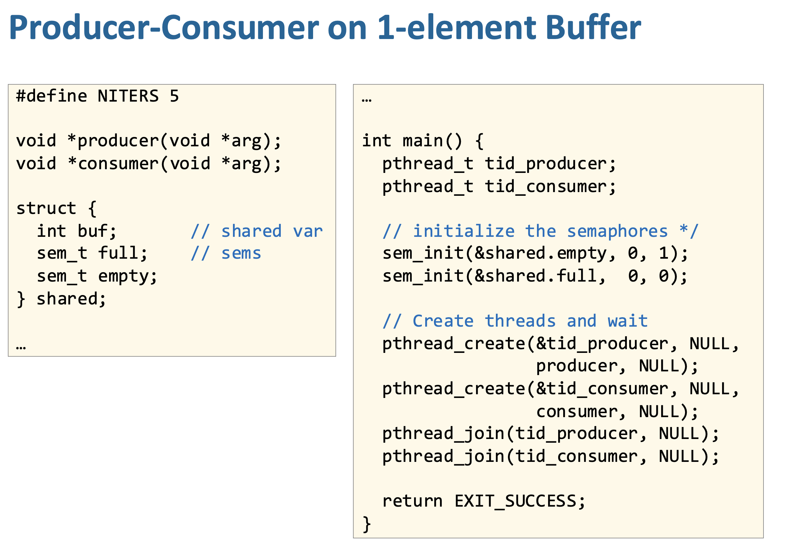

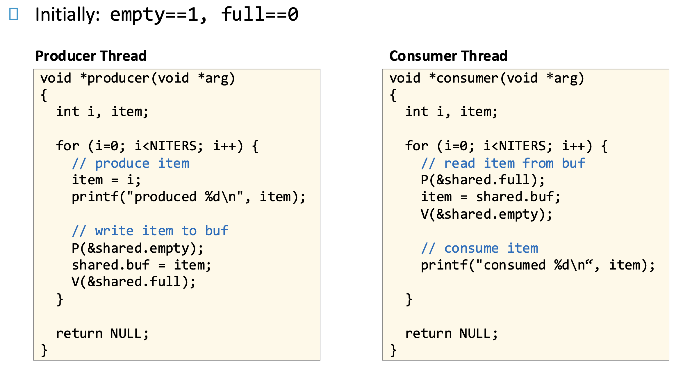

이 코드는 크기가 1인 버퍼에서 producer와 consumer를 세마포어로 정확히 동기화하는 전형적인 예로, `empty`와 `full` 두 개의 counting semaphore를 사용해 버퍼 상태를 관리하는데 초기값이 `empty=1`, `full=0`이므로 처음에는 producer만 실행 가능하고 consumer는 대기하게 된다; producer는 데이터를 만들고 `P(empty)`로 빈 슬롯이 있는지 확인한 뒤 버퍼에 쓰고 `V(full)`로 “데이터 있음”을 알리며, consumer는 `P(full)`로 데이터가 들어올 때까지 기다렸다가 읽고 `V(empty)`로 “다시 비었음”을 알리는 구조라서 두 스레드가 정확히 번갈아 실행되며 race condition 없이 동작한다; 중요한 포인트는 이 코드에서는 mutual exclusion을 따로 명시하지 않아도 버퍼 크기가 1이라서 empty/full 세마포어 자체가 동시에 접근을 막는 역할까지 겸하게 된다는 점이다.

반면 크기가 n인 버퍼를 사용하는 경우에, 이 버퍼를 race condition 없이 사용할 수 있도록 버퍼 자료구조 `sbuf`와 관련 함수들을 만들어보자.

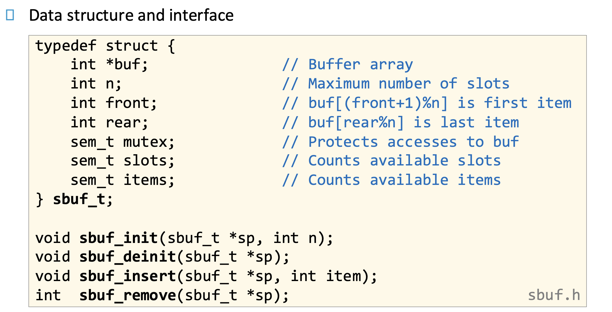

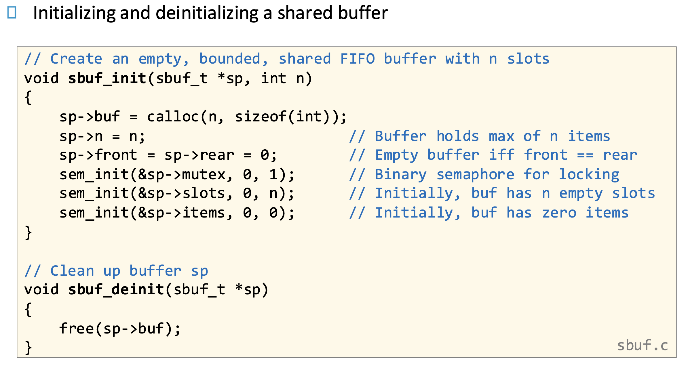

n개짜리 producer-consumer 버퍼에서는 1개짜리 버퍼와 달리 여러 producer/consumer가 동시에 접근할 수 있으므로, 버퍼 배열 자체와 `front/rear` 인덱스를 보호하는 `mutex` 하나와, 빈 칸 개수를 세는 `slots`, 들어 있는 아이템 개수를 세는 `items` 두 개의 counting semaphore가 필요하다. 초기화할 때 `buf`를 크기 `n`으로 만들고 `front=rear=0`, `mutex=1`, `slots=n`, `items=0`으로 두면 처음에는 빈 슬롯이 n개이고 아이템은 0개라는 뜻이 된다.

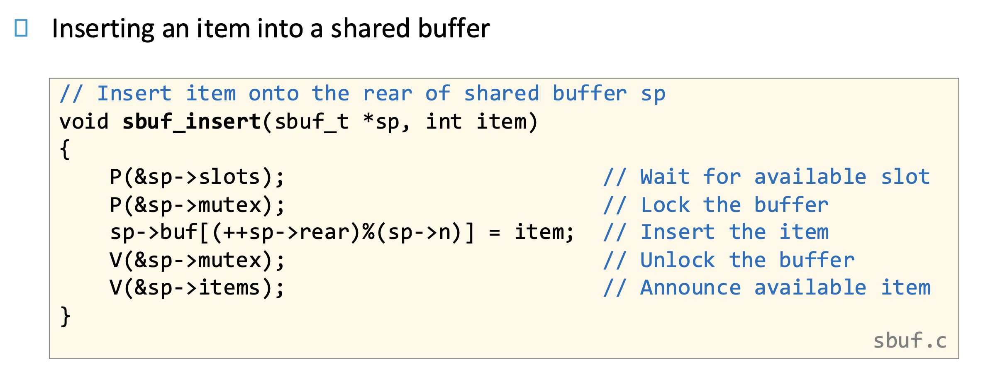

producer의 `sbuf_insert`는 먼저 `P(slots)`로 빈 칸이 생길 때까지 기다리고, 그다음 `P(mutex)`로 버퍼를 잠근 뒤 `rear`를 증가시키며 원형 배열 위치에 item을 넣고, `V(mutex)`로 버퍼 잠금을 푼 뒤 `V(items)`로 “아이템 하나 생김”을 알린다.

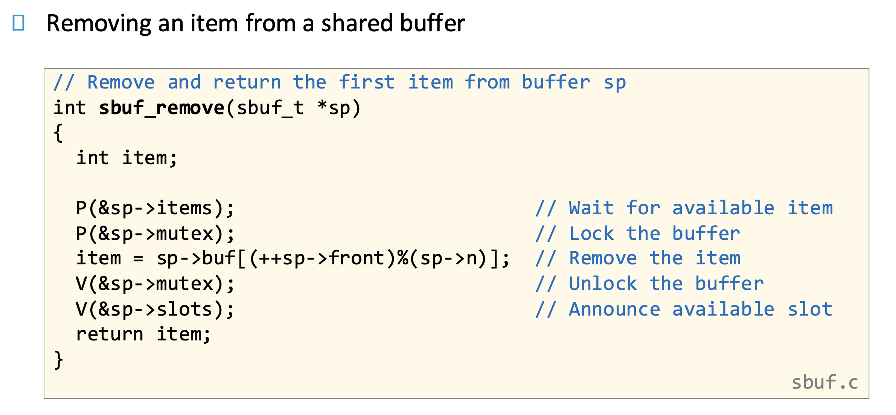

consumer의 `sbuf_remove`는 반대로 `P(items)`로 아이템이 생길 때까지 기다리고, `P(mutex)`로 버퍼를 잠근 뒤 `front`를 증가시키며 가장 오래된 item을 꺼내고, `V(mutex)`로 잠금을 푼 뒤 `V(slots)`로 “빈 칸 하나 생김”을 알린다; 즉 `slots/items`는 생산자와 소비자의 실행 조건을 조절하고, `mutex`는 실제 버퍼 자료구조를 수정하는 순간의 race condition을 막는다.

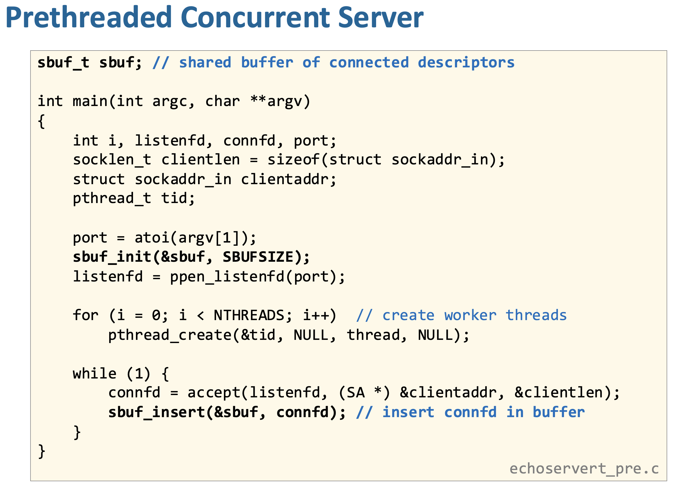

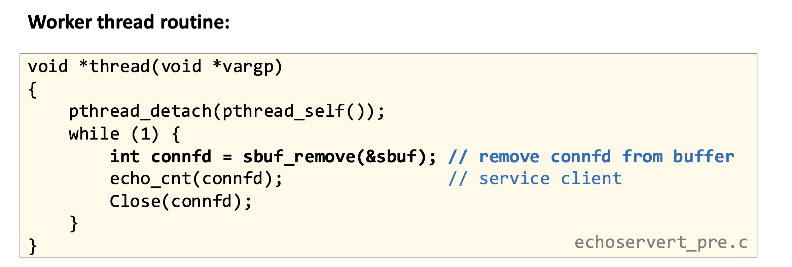

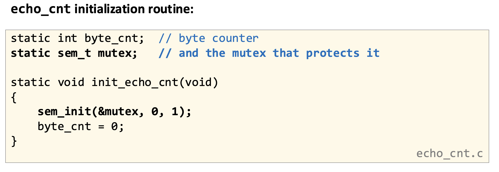

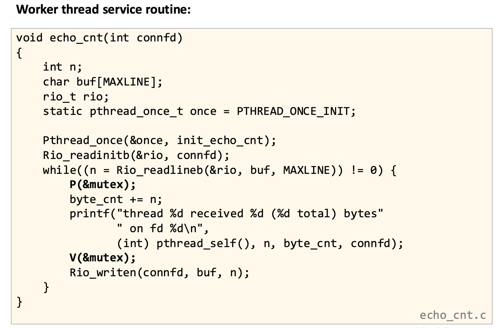

이 구조는 **prethreaded concurrent server**로, 서버 시작 시 미리 여러 개의 worker thread를 만들어두고, 하나의 master thread가 `accept()`로 클라이언트 연결을 받아 그 연결 소켓(fd)을 공유 버퍼(sbuf)에 넣으면, worker thread들이 이 버퍼에서 fd를 꺼내 실제 서비스를 처리하는 producer–consumer 구조다; 구체적으로 main에서는 `sbuf_init`으로 버퍼를 초기화하고 여러 worker를 생성한 뒤 무한 루프에서 `accept → sbuf_insert`만 수행하며, 각 worker는 `sbuf_remove`로 연결을 하나 가져와 `echo_cnt`로 데이터를 읽고 다시 쓰는 echo 서비스를 수행하고 종료(close)한다; 이때 `byte_cnt` 같은 전역 상태는 여러 스레드가 동시에 접근하므로 `sem_t mutex`와 P/V 연산(= `sem_wait`/`sem_post`)으로 보호해 race condition을 막고, `pthread_once`를 통해 초기화가 한 번만 일어나도록 보장한다; 결과적으로 accept와 request 처리를 분리해 accept는 빠르게 계속 받고, 실제 I/O 작업은 여러 worker가 병렬로 처리하여 높은 동시성을 얻는 구조다.

## Readers-Writers Problem

Readers-Writers 문제는 공유 데이터에 대해 읽기(read)와 쓰기(write)가 동시에 일어날 때의 동기화 문제로, reader는 데이터를 읽기만 하므로 여러 스레드가 동시에 접근해도 되지만 writer는 데이터를 변경하므로 반드시 단독으로 접근해야 한다는 제약을 가진다; 따라서 핵심은 “reader는 병렬 허용, writer는 완전 배타”를 어떻게 조화시키느냐이며, 실제 시스템(예약 시스템, 웹 캐시 등)에서 매우 자주 등장한다; 이에 따라 세 가지 대표 변형이 있는데, 첫 번째(reader 우선)는 writer가 기다리고 있어도 기존/새로운 reader들을 계속 통과시켜 reader 지연을 최소화하지만 writer starvation이 발생할 수 있고, 두 번째(writer 우선)는 writer가 대기 중이면 이후 reader들을 막아 writer를 빠르게 실행시키지만 이번엔 reader starvation 가능성이 생기며, 세 번째(공정성)는 FIFO 같은 순서를 가정해 reader와 writer를 공평하게 처리하려는 방식이다; 결국 이 문제는 단순 mutual exclusion을 확장한 형태로, “동시성 vs 공정성 vs starvation 방지” 사이에서 어떤 정책을 선택하느냐가 핵심이다.

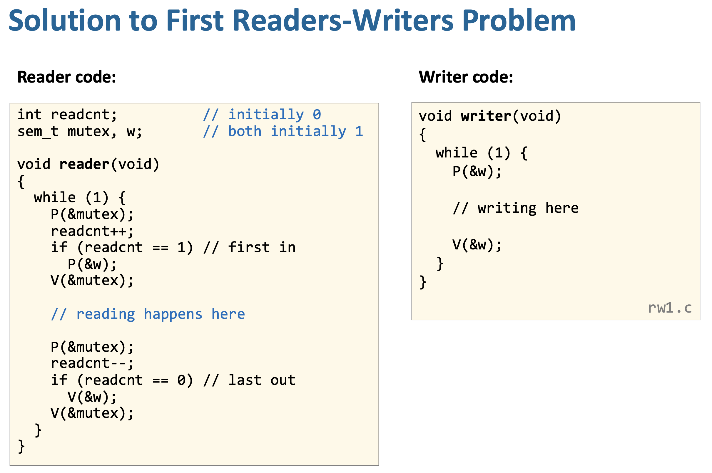

이 코드는 **reader 우선(first readers-writers)** 해법으로, 핵심은 여러 reader는 동시에 접근 가능하지만 writer는 완전히 배타적으로 접근하도록 하면서 reader를 최대한 기다리지 않게 만드는 것이다; `readcnt`는 현재 읽고 있는 reader 수를 의미하고 `mutex`는 이 값을 보호하며, `w`는 writer(또는 reader 집합 전체)가 공유 자원에 접근할 때 사용하는 락인데, reader가 들어올 때 `mutex`로 `readcnt`를 증가시키고 만약 첫 번째 reader라면 `P(w)`를 호출해 writer를 막아버린 뒤 이후 reader들은 `w`를 건드리지 않고 그냥 동시에 읽는다; 읽기가 끝나면 다시 `mutex`로 `readcnt`를 감소시키고 마지막 reader가 나갈 때(`readcnt == 0`)만 `V(w)`를 호출해 writer가 들어올 수 있게 해주며, writer는 단순히 `P(w)`로 자원을 독점한 뒤 작업하고 `V(w)`로 풀어준다; 결과적으로 reader가 한 명이라도 존재하는 동안 writer는 접근할 수 없고, reader는 writer가 기다리고 있어도 계속 들어올 수 있기 때문에 reader 지연은 최소화되지만 writer는 계속 밀려서 starvation이 발생할 수 있는 구조다.

## Thread Safety

Thread safety란 여러 스레드가 동시에 같은 함수를 호출해도 항상 올바른 결과를 보장하는 성질로, 멀티스레드 환경에서는 모든 함수가 이를 만족해야 한다는 것이 핵심이다; thread-unsafe 함수는 보통 네 가지 유형으로 나뉘는데, 공유 변수에 대한 동기화 없이 접근하는 경우(경쟁 상태 발생), 호출 간 상태를 유지하는 경우(static/global 상태가 꼬임), static 변수의 주소를 반환하는 경우(여러 스레드가 같은 메모리 참조), 그리고 내부적으로 thread-unsafe 함수를 호출하는 경우가 있다; 결국 문제의 본질은 “여러 스레드가 동시에 실행될 때도 상태가 깨지지 않도록 보장할 수 있느냐”이며, 이를 위해 mutex, semaphore 같은 동기화 기법이나 thread-local storage, 재진입 가능한(reentrant) 함수 설계 등을 사용한다.

- **Class-1 thread-unsafe Function** : Class 1 thread-unsafe 함수는 여러 스레드가 공유 변수(shared variable)를 동시에 읽고 쓰는데도 이를 보호하지 않아 race condition이 발생하는 경우를 의미하며, 예를 들어 전역 카운터를 여러 스레드가 동시에 증가시키면 값이 덮어써지거나 누락되는 문제가 생긴다; 해결 방법은 해당 공유 변수를 다루는 구간(critical section)에 대해 semaphore나 mutex를 사용해 P/V(또는 lock/unlock)로 한 번에 하나의 스레드만 접근하도록 만드는 것이며, 이렇게 하면 correctness는 보장되지만 대신 lock 획득/해제 비용과 대기 때문에 성능이 저하될 수 있다는 trade-off가 존재한다.

- **Class-2 thread-unsafe Function** : Class 2 thread-unsafe 함수는 여러 번 호출되는 동안 내부 상태(static/global)를 유지하는데, 이 상태를 여러 스레드가 동시에 공유하면서 업데이트하면 값이 섞이거나 덮어써져 잘못된 결과가 나오는 경우를 의미하며, 대표적으로 `rand()`처럼 static 변수 `next`를 사용해 난수를 생성하는 함수가 여기에 해당한다; 여러 스레드가 동시에 `rand()`를 호출하면 `next` 값이 서로 간섭하면서 예측 불가능한 결과가 발생한다; 해결 방법은 상태를 함수 내부에 숨겨두지 말고 호출자가 명시적으로 전달하도록 바꾸는 것으로, `rand_r()`처럼 상태를 포인터 인자로 받아 각 스레드가 독립적인 seed/state를 사용하게 하면 공유 상태가 사라져 thread-safe해진다; 대신 이 방식은 프로그래머가 각 스레드별 상태(seed)를 직접 관리해야 한다는 부담이 생기는 trade-off가 있다.

​	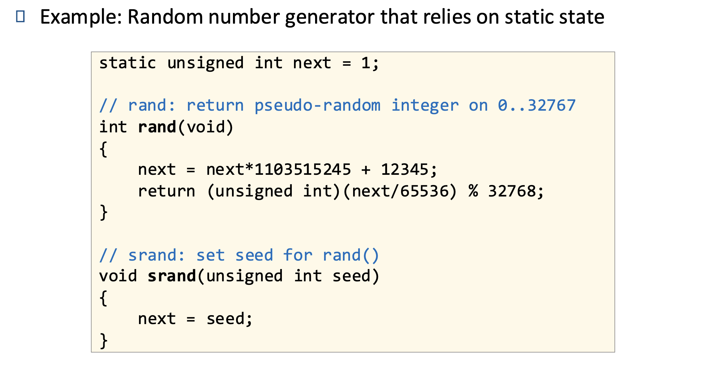

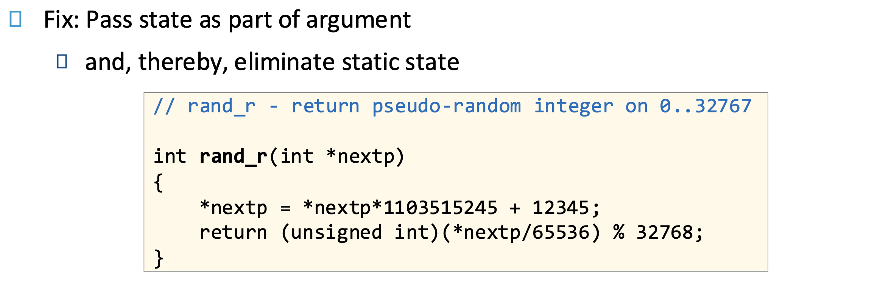

- **Class-3 thread-unsafe Function** : Class 3 thread-unsafe 함수는 내부의 static 변수 주소를 그대로 반환하는 경우로, 여러 스레드가 동일한 메모리를 공유하게 되어 한 스레드가 값을 덮어쓰면 다른 스레드 결과까지 깨지는 문제가 생기며 `ctime()`이나 `gethostbyname()`이 대표적이다; 해결 방법은 두 가지인데, 첫 번째는 함수 인터페이스를 바꿔 호출자가 결과를 저장할 버퍼를 직접 넘기게 하는 방식으로 아예 공유 static 메모리를 제거하는 것이고, 두 번째는 lock-and-copy 방식으로, 내부 static 결과를 mutex로 보호하면서 잠깐 접근한 뒤 호출자가 제공한 private 버퍼로 복사해 반환하는 것이다; 이 방식은 기존 함수 수정 없이 비교적 간단히 적용 가능하지만 lock 비용이 추가되고, 근본적으로는 “공유된 static 메모리를 직접 노출하지 않는다”는 설계가 가장 안전한 해결이다.

  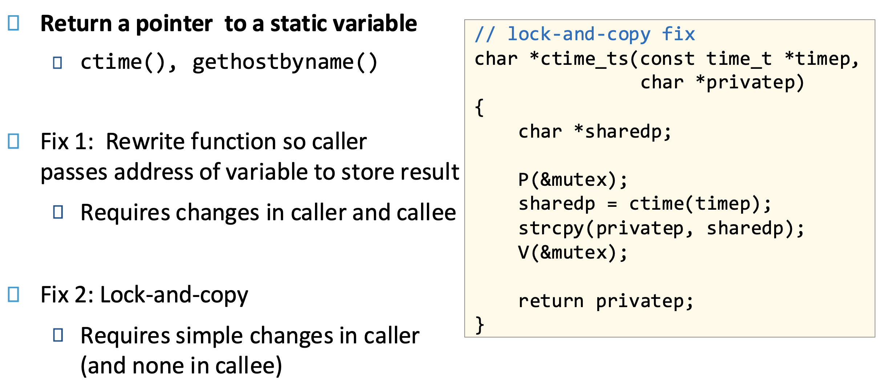

- **Class-4 thread-unsafe Function** : Class 4 thread-unsafe 함수는 내부에서 thread-unsafe 함수를 호출하는 경우로, 한 함수라도 안전하지 않으면 그걸 호출하는 상위 함수 전체도 자동으로 thread-unsafe가 된다는 점이 핵심이다; 예를 들어 내부에서 `ctime()`이나 공유 상태를 건드리는 함수들을 호출하면 그 호출 시점에서 race condition이 발생할 수 있다; 해결 방법은 두 가지인데, 가장 좋은 방법은 애초에 thread-safe 함수만 사용하도록 코드를 바꾸는 것이고, 그게 어렵다면 해당 unsafe 함수 호출 구간과 그 결과로 공유되는 데이터 접근을 mutex 등으로 보호하는 것이다; 결국 “함수의 안전성은 호출 그래프 전체에 전파된다”는 점을 이해하는 것이 중요하다.

**Reentrant 함수**는 여러 스레드가 동시에 호출해도 **공유 변수에 전혀 의존하지 않고**, 각 호출이 서로 독립적으로 동작하는 함수로, thread-safe 함수의 더 강한 형태라고 보면 된다; 즉 thread-safe는 “동기화를 통해 안전”할 수도 있지만, reentrant는 애초에 공유 상태가 없어서 락 같은 동기화가 필요 없다는 점이 핵심이다; 그래서 Class-2처럼 내부 static 상태를 쓰는 함수는 reentrant로 바꿔야만 근본적으로 안전해질 수 있으며 `rand()` → `rand_r()`처럼 상태를 외부에서 전달받는 구조가 대표적이다; 또한 실제로는 표준 C 라이브러리 함수 대부분과 Unix 시스템 콜은 thread-safe하게 구현되어 있지만, `ctime`, `gethostbyname`, `rand`처럼 내부 static 상태를 쓰는 일부 함수는 thread-unsafe라서 `_r` 형태의 reentrant 버전을 사용해야 한다; 정리하면 reentrant $\subset$ thread-safe 관계이며, 멀티스레드 환경에서 가장 이상적인 함수는 공유 상태 없이 동작하는 reentrant 함수다.

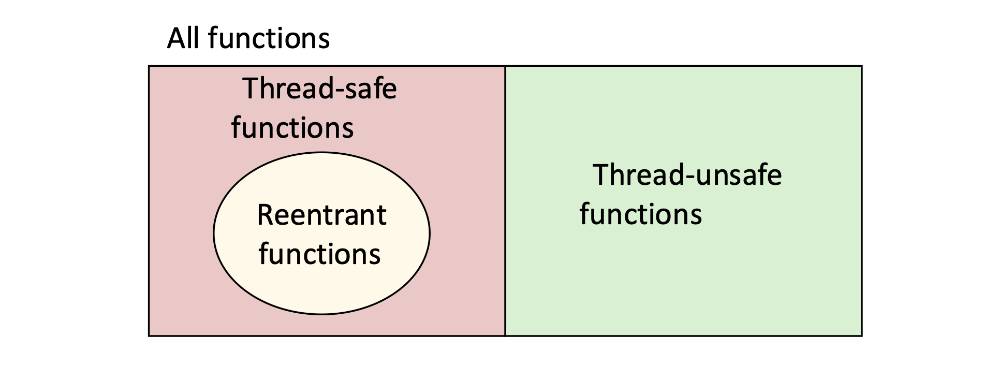

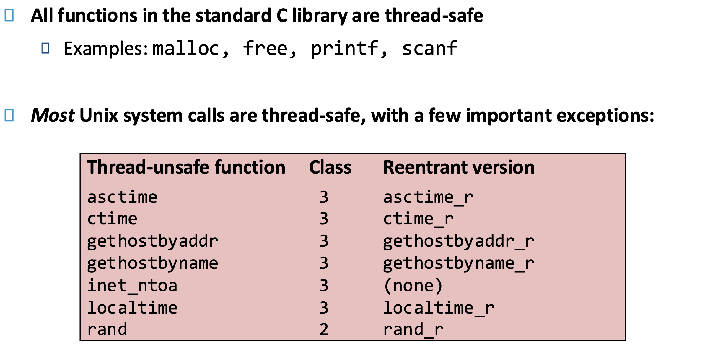

## Dead Lock

지금까지는 모두 race condition을 어떻게 해결하는지에 대한 이야기였다. 이제 dead lock에 대해 알아보자.

deadlock은 프로세스(또는 스레드)가 절대 만족되지 않을 조건을 기다리면서 영원히 진행하지 못하는 상태를 말한다. 전형적인 상황은 두 스레드가 각각 두 자원 A, B를 모두 필요로 할 때, 하나는 A를 먼저 잡고 B를 기다리고, 다른 하나는 B를 먼저 잡고 A를 기다리면서 서로가 서로를 막아 무한 대기에 빠지는 경우이다. 세마포어 코드 예시에서도 각 스레드가 서로 다른 순서로 mutex[0], mutex[1]을 획득하려 하기 때문에 한 스레드는 s0을 잡고 s1을 기다리고, 다른 스레드는 s1을 잡고 s0을 기다리는 순환 대기가 발생해 cnt 증가 코드까지 도달하지 못하고 멈추게 된다. 이런 문제는 자원 획득 순서를 모든 스레드에서 동일하게 강제하거나, 한 번에 모든 자원을 획득하도록 설계하는 등으로 예방할 수 있다.

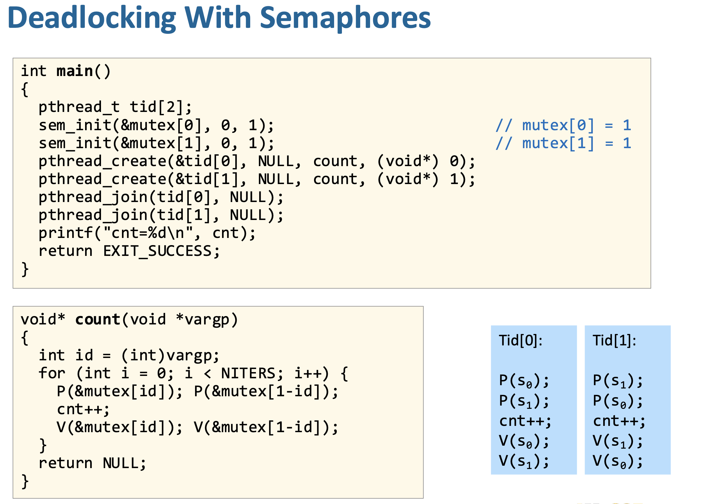

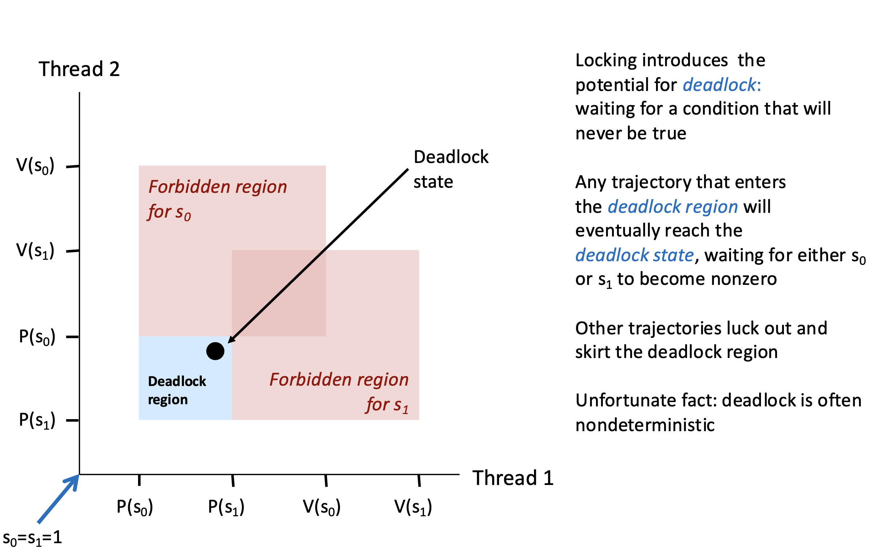

deadlock을 피하는 핵심 방법 중 하나는 모든 스레드가 공유 자원을 항상 같은 순서로 획득하게 만드는 것이다. 이전 코드에서는 Tid[0]은 s0 → s1 순서로 잡고, Tid[1]은 s1 → s0 순서로 잡아서 서로 반대 자원을 기다리는 순환 대기가 생길 수 있었다. 수정된 코드에서는 두 스레드 모두 P(&mutex[0])을 먼저 하고, 그 다음 P(&mutex[1])을 하므로 한 스레드가 mutex[0]을 잡으면 다른 스레드는 처음부터 mutex[0]에서 기다리게 되고, mutex[1]을 잡은 채 mutex[0]을 기다리는 상황이 생기지 않는다. release 순서는 보통 deadlock 방지의 핵심은 아니며, 중요한 것은 acquire 순서다. 다만 일반적으로는 마지막에 얻은 락을 먼저 푸는 방식, 즉 s1 → s0 순서로 해제하면 구조가 깔끔하고 안전하다.

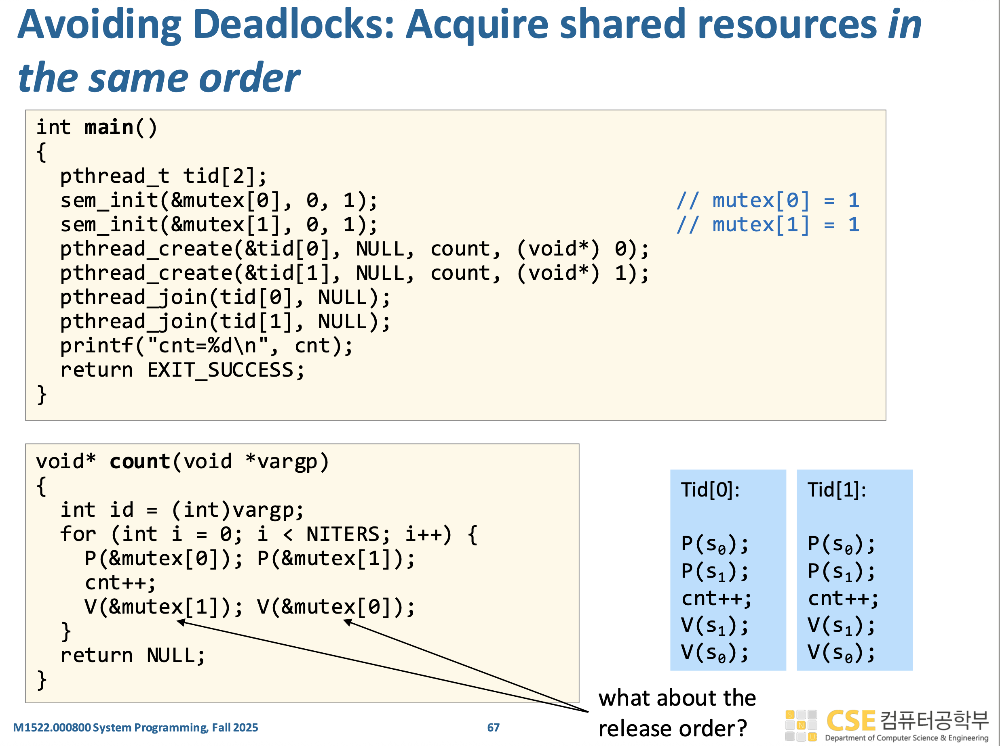

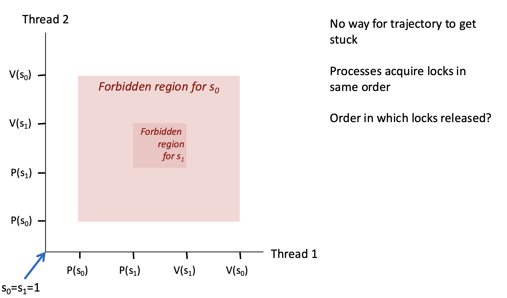

이 그림은 두 스레드가 동일한 순서로 락을 획득하면 deadlock이 발생할 수 있는 경로 자체가 사라진다는 것을 상태 공간(trajectory) 관점에서 보여준다. 가로축은 Thread 1의 실행 단계(P(s0) → P(s1) → V(s1) → V(s0)), 세로축은 Thread 2의 실행 단계를 나타내며, 두 스레드 모두 s0을 먼저 획득하고 그 다음 s1을 획득하도록 강제되어 있다. 빨간 영역은 “금지된 상태”로, 예를 들어 한 스레드가 s1을 잡고 있으면서 다른 스레드가 s0을 잡는 식의 서로 반대 순서로 락을 들고 있는 상황(즉, 순환 대기 가능 상태)을 의미하는데, 동일한 순서로 acquire하도록 하면 이런 상태 자체에 도달할 수 없게 된다. 따라서 어떤 실행 interleaving이 나오더라도 두 스레드가 서로가 가진 락을 기다리는 상황이 구조적으로 불가능해져 deadlock이 예방된다. release 순서는 이 그림에서 핵심 요소는 아니며, 중요한 것은 acquire 단계에서 순서를 통일해 “서로 교차된 락 보유 상태”로 들어가지 못하게 막는 것이다.

