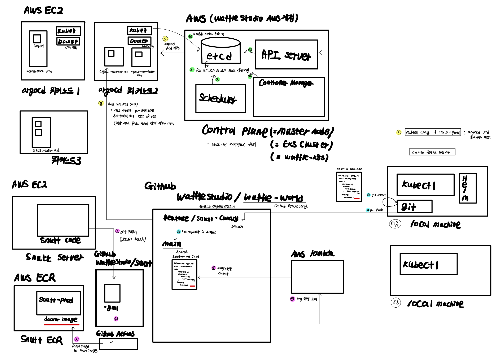

In this post, Waffle Infra team's workflow is recorded.


# Info

- <a href = "https://www.notion.so/kubectl-WIP-1be70e37e9c7813ea1d2ec16a8ec4140"> kubcetl 이용 가이드 notion </a>
- <a href = "https://wafflestudio.slack.com/archives/C07M61YEC67/p1753510056358299?thread_ts=1753444424.909539&cid=C07M61YEC67"> kubectl admind 명령어 사용시 주의사항 thread </a>
- <a href=" https://www.notion.so/Infra-1be70e37e9c7819d940ef5e28d0d57fa"> 인프라팀 notion </a>
- <a href=" https://www.notion.so/1be70e37e9c781d6ba2ed55ad2ca19c3"> 와플 notion </a>
- <a href="https://github.com/orgs/wafflestudio/people"> 와플 깃헙 orgnaization </a>
- <a href="https://argocd.wafflestudio.com/applications/argocd/snutt-ev-batch-dev?view=tree&resource="> 와플 argo cd </a>


# Workflow

조금 더 구체적인 내용은 <a href = "https://arcstone09.github.io/study/2025-10-12-waffle-9"> 여기 </a> 참고.

#### GitOps

- Git 저장소의 상태를 진짜 클러스터의 상태로 유지시키는 운영 방식. 쿠버네티스 클러스터의 모든 설정(Deployment, Service, Ingress 등)을 Git 저장소에 코드로 관리하고 그 Git의 원하는 상태(desired state)를 자동으로 클러스터에 동기화하는 개념. kubernetes 환경의 “원하는 상태(Desired State)”를 **Git 저장소에 기록**하고, 실제 클러스터 상태가 이와 다를 경우 **자동으로 동기화(Sync)** 하는 개념
- Kubernetes 환경의 상태를 Git 저장소로 관리한다는 **운영 철학 및 방법론**이다.

#### Argo CD

- GitOps를 실제로 구현해주는 **CD (Continuous Delivery, 지속 배포) 도구**

- Git 저장소에 있는 Kubernetes manifest나 Helm Chart를 감시(watch)하다가, 변경이 감지되면 해당 버전을 클러스터에 **자동으로 반영(배포)**.

  - Argo CD는 **UI, CLI, API**를 통해 배포 현황, Sync 상태 등을 시각적으로 관리할 수 있다.

- Argo CD는 Control Plane(마스터 노드)에 설치되는 게 아니라, Kubernetes 클러스터 내부의 일반 워크 노드(Worker Node)들 중 하나에
  **Pod**로 배포되어 실행된다. 단일 pod이 아니라, `argocd-server`, `argocd-repo-server`, `argocd-application-controller` 등의 **Pod** 들로 구성되어 있다. 

- Argo CD의 동작 순서는 다음과 같다.

  - 로컬에서 argocd pod을 정의한 `install.yaml` 파일을 만들고 이를 kubectl 명령어를 통해 API 서버로 전송한다. 

    ```bash
    kubectl apply -f install.yaml
    ```

  - k8s control palne에서 워커 노드에 argo cd pod들을 배정하고 실행되기 시작한다.

  - Argo CD의 **`argocd-application-controller`** Pod는 내부적으로 주기적으로 `repoURL`을 **pull (git fetch)** 한다.

    - `targetRevision`(`main`, `release`, 특정 tag 등)에 변경이 생기면 이를 감지한다.

    - 즉, **GitHub Webhook**을 안 써도, **polling 방식**으로 자동 감지한다.

  - Diff 계산

    - 새로 가져온 Git의 매니페스트(Helm template 포함)를 렌더링한다.

    - 클러스터 내 현재 상태(`kubectl get all -o yaml`) 와 비교(diff) 한다.

    ```bash
    Git manifest: deployment.yaml (replicas: 3)
    Cluster: deployment.apps/myapp (replicas: 2)
    → 차이 발견 (OutOfSync)
    ```

  - Sync (자동배포) 

    - `syncPolicy.automated`가 설정되어 있으면, Argo CD가 자동으로 다음을 수행한다.

    ```
    kubectl apply -f <manifest-from-git>
    ```

    - 즉, **kubectl을 대신 실행하는 컨트롤러**라고 보면 된다.
    - 그 결과 실제 클러스터 상태가 Git 상태와 일치하게 된다.

#### Helm

- Helm은 Kubernetes 매니페스트(YAML)들을 묶어서 관리·배포할 수 있게 해주는 패키지 매니저이다. k8s에서 개별 리소스 정의 파일 (YAML)을 묶어주는 역할을 한다. 로컬에 설치하여 kubectl 처럼 클라이언트로 사용하면 된다.

  

#### CI / CD

- **CI (Continuous Integration)** :  지속적인 통합

  - 개발자 여러 명이 동시에 코드를 바꿔도, Git에 push 하는 순간 자동으로 **빌드와 테스트**가 돌아서 코드가 항상 통합 가능한 상태로 유지되게 하는 것이다. 

  - **Github Actions** 를 통해 실현 가능하다. Github Actions는 GitHub이 자체적으로 제공하는 클라우드 자동화 서비스이다. 

    프로젝트 루트에 `.github/workflows/ci.yml` 파일을 만들어서 아래와 같이 작성한다 (예시).

    ```bash
    name: CI Example
    on:
      push:
        branches: [ main ]
    jobs:
      build:
        runs-on: ubuntu-latest  # GitHub이 제공하는 가상머신 환경
        steps:
          - name: Checkout code
            uses: actions/checkout@v4
          - name: Run tests
            run: |
              pip install -r requirements.txt
              pytest
    ```

    내가 GitHub에 코드를 push하면, GitHub이 자체적으로 제공하는 “가상 머신 (runner)”을 자동으로 띄워서 거기서 위 파일에서 지정한 명령어(`docker build`, `pytest`, `npm run build` 등)를 대신 실행해준다. 이미지를 **Docker Hub** 나 **ECR** 등에 푸시하는 역할도 수행할 수 있다. 

    ❗**ECR** 은 Amazon Elastic Container Registry의 약자로, AWS 에서 제공하는 완전관리형 컨테이너 레지스트리 서비스이다.
    
    

- **CD (Continuous Delivery / Continuous Deployment)** : 지속적인 배포

  ```bash
  Developer → git push
      ↓
  GitHub Actions 실행 (GitHub 클라우드에서)
      ↓
  1. 코드 빌드
  2. Docker 이미지 생성
  3. DockerHub에 push
  4. Kubernetes manifest 업데이트
  5. Git에 커밋(push) # 
      ↓
  Argo CD가 Git 변경 감지
      ↓
  Argo CD가 Kubernetes 클러스터에 자동 배포
      ↓
  앱이 클러스터(워커 노드)에서 실제 실행
  ```

  Argo CD는 위에서 알아봤듯이**“Git에 저장된 YAML(매니페스트)”**을 기준으로 배포한다. 즉, Argo CD는 **Docker 이미지가 빌드되었다는 사실을 직접 모르고**,**Git 레포의 YAML 파일이 바뀌었는지만 감시**한다. 그래서 GitHub Actions은 빌드 후 아래와 같이 동작한다. 

  1. 새 Docker 이미지 버전(`:sha` or `:tag`)을 만든다.

     ```
     docker build -t myapp:abc123 .
     docker push myrepo/myapp:abc123
     ```

  2. GitHub Actions이 `deployment.yaml` 같은 매니페스트를 자동으로 수정한다. (Wafflestudio에서는 AWS lamda에서 ECR push를 감지하여 lambda 코드가 github API를 통해 자동으로 deployment.yaml을 수정하여 main에 commit. 이 때, waffle-world-bot github 계정 이용.)

     ```
     containers:
       - name: myapp
         image: myrepo/myapp:abc123
     ```

  3. 그 YAML을 **자동으로 commit & push** 한다.

     ```bash
     git config user.name "github-actions"
     git config user.email "actions@github.com"
     git add .
     git commit -m "Update image tag to abc123"
     git push
     ```


지금까지 논의한 전 과정은 아래 그림과 같다. 



