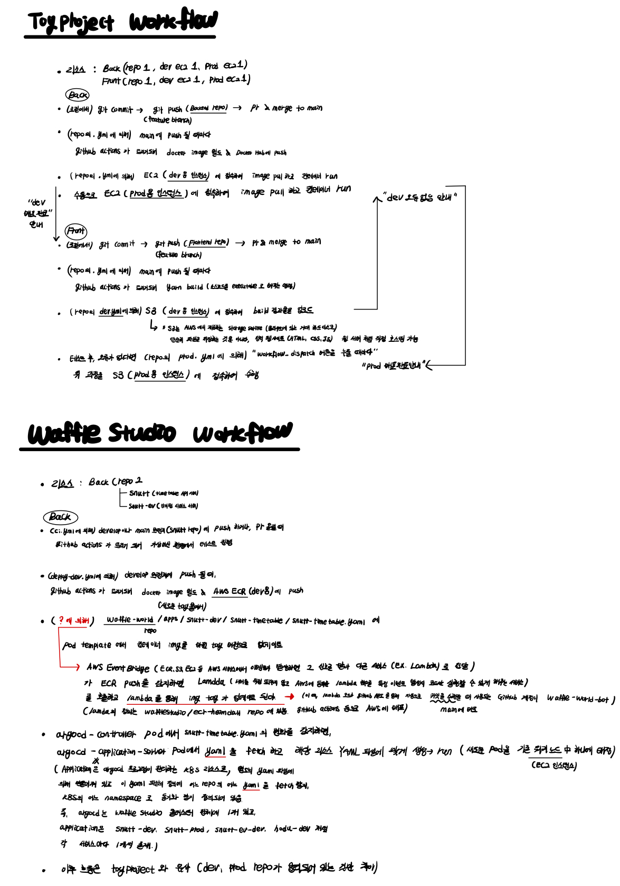
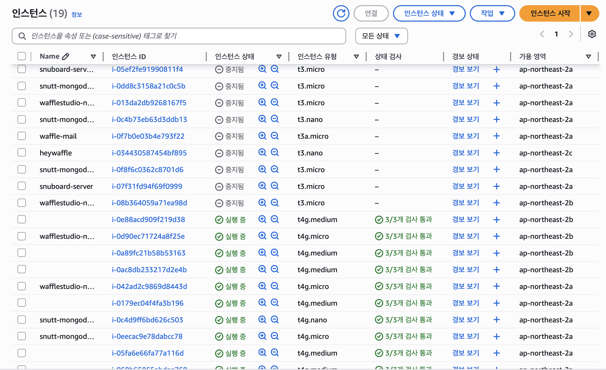

In this post, process of Cleaning up unused secrets, EBS volumes, and EC2 instances in Infra team is recorded.


# Workflow

기본적인 wafflestudio의 workflow는 <a href = "https://arcstone09.github.io/study/2025-10-10-waffle-8"> 여기 </a> 참고.

Toyproject에서의 workflow와 Waffle studio의 workflow 절차를 정리하면 아래와 같다. 




# Task description

- 비용 절감을 위해 Wafflestudio에서 안쓰는 secret, ebs volume, ec2 인스턴스 지우기 


# Task process

## Unused Resource Check

- 현재 waffluestudio에서 사용중인 EC2 인스턴스는 19개로 10개가 실행 중, 9개가 실행 중지 상태이다. 

  

- EBS volume 인스턴스는 21개로 19개가 실행 중(in-use), 2개가 실행 가능 상태(available)이다. In-use는 연결된 ec2가 있는 경우 있고 available은 없는 경우이다. 
- Secret manager 인스턴스는 ??개로 ??가 사용 중, ??가 비사용 중이다.


## AWS, Kubectl setting

- 다음의 명령어로 AWS CLI를 설치한다. 

  ```bash
  curl "https://awscli.amazonaws.com/AWSCLIV2.pkg" -o "AWSCLIV2.pkg"
  sudo installer -pkg AWSCLIV2.pkg -target /
  ```

  AWS에서 발급받은 Access key와 secret access key를 입력한다.
  
  ```bash
  aws configure
  AWS Access Key ID [None]: AKIA***************
  AWS Secret Access Key [None]: wJalrXUtn***************
  Default region name [None]: ap-northeast-2
  Default output format [None]: json
  ```
  
  아래 명령어를 통해 AWS 계정 정보가 잘 나오는지 확인한다.
  
  ```bash
  aws sts get-caller-identity
  ```
  
- 다음의 명령어로 kubectl에 AWS 클러스터를 등록한다.

  ```bash
  aws eks update-kubeconfig --region ap-northeast-2 --name wafflestudio-cluster
  ```
  
  다음 명령어를 통해 파일을 확인하여 name을 간단하게 wafflestudio-cluster로 바꾼다. current-context도 바꾼다.
  
  ``` bash
  vim ~/.kube/config
  
  - context:
      cluster: arn:aws:eks:ap-northeast-2:405906814034:cluster/wafflestudio-cluster
      user: arn:aws:eks:ap-northeast-2:405906814034:cluster/wafflestudio-cluster
    name: wafflestudio-cluster
  current-context: wafflestudio-cluster
  ```
  
   ❗️kubectl 클러스터를 전환시, 아래 명령어를 사용한다.
  
  ```bash
  kubectl config use-context <context-name>
  ```
  
- 다음의 명령어로 k9s(kubectl 명령을 시각적으로 탐색할 수 있는 CLI TUI 도구)를 설치한다.

  ```bash
  brew install derailed/k9s/k9s
  ```

## EC2 deleteing

|           ID            |            Name             |                Team                 | EKS 연동 여부 | 삭제 가능 여부 | EBS 연결 여부 /  Delete on termination 여부 / EBS 실행 중 여부 |
| :---------------------: | :-------------------------: | :---------------------------------: | :-----------: | :------------: | ------------------------------------------------------------ |
| **i-05ef2fe91990811f4** |     snuboard-server-old     |              snuboard               |       X       |     **O**      | O / O / O                                                    |
| **i-0dd8c3158a21c0c5b** |  snutt-mongodb-production   |                urban                |       X       |     **O**      | O / O / O                                                    |
| **i-013da2db9268167f5** | wafflestudio-nat-instance-a |           nat-instance-a            |       X       |     **X**      |                                                              |
| **i-0c4b73eb63d3ddb13** |  snutt-mongodb-development  |                urban                |       X       |     **O**      | O / X / O                                                    |
| **i-0f7b0e03b4e793f22** |         waffle-mail         |         wafflestudio (운영)         |       X       |     문의중     | O / (O, X) / O                                               |
| **i-034430587454bf895** |          heywaffle          | wafflestudio<br />(인터널 프로덕트) |       X       |     **O**      | O / X / O                                                    |
| **i-0f8f6c0362c8701d6** |  snutt-mongodb-prod-backup  |                                     |       X       |     **O**      | O / X / O                                                    |
| **i-07f31fd94f69f0999** |          snuboard           |           snuboard-server           |       X       |     **O**      | O / O / O                                                    |
| **i-08b364059a71ea98d** | wafflestudio-nat-instance-b |                                     |       X       |     **X**      |                                                              |

EKS 클러스터가 직접 관리하는 노드라면, 해당 EC2에 **자동으로 다음 태그**가 붙는다. 

```bash
kubernetes.io/cluster/<cluster-name> = owned
```

다음의 명령어를 수행하여 ec2 인스턴스에 연결된 ebs volume이 ec2 삭제 시 자동으로 함께 삭제되는 지 여부를 확인한다.

```bash
aws ec2 describe-instances --instance-ids i-0f7b0e03b4e793f22 \  
--query "Reservations[].Instances[].BlockDeviceMappings[].Ebs.DeleteOnTermination"
```

다음의 명령어를 수행한다.

```bash
aws ec2 terminate-instances --instance-ids i-xxxxxxxxxxxx
```


## EBS Volume deleting

|            ID             | Team | EC2 연결 여부                                     | 단일 ec2 연결 여부 | 삭제 가능 여부 |
| :-----------------------: | ---- | ------------------------------------------------- | ------------------ | -------------- |
| **vol-0f6441f66eccca3c6** | ?    | X                                                 |                    | ?              |
| **vol-014474aad5d524f7b** | ?    | X                                                 |                    | ?              |
|   vol-0b708bc7ec92d700d   |      | **i-05ef2fe91990811f4** snuboard-server-old       | O                  | O              |
|   vol-0e8d193325cdaee30   |      | **i-0dd8c3158a21c0c5b** snutt-mongodb-production  | O                  | O              |
|   vol-02c16d2d24f599be2   |      | **i-0c4b73eb63d3ddb13** snutt-mongodb-development | O                  | O              |
|   vol-04d9da01d37ea89c5   |      | **i-0f7b0e03b4e793f22** waffle-mail               | O                  |                |
|   vol-0c61b0ceabc2b0431   |      | **i-0f7b0e03b4e793f22** waffle-mail               | O                  |                |
|   vol-0bdf71f0489748074   |      | **i-034430587454bf895** heywaffle                 | O                  | O              |
|   vol-02b154c0e2261dec2   |      | **i-0f8f6c0362c8701d6** snutt-mongodb-prod-backup | O                  | O              |
|   vol-0f1ead6ce648926a7   |      | **i-07f31fd94f69f0999** snuboard                  | O                  | O              |

ec2에 연결된 ebs의 경우 혹시 여러 ec2에 연결되어 있을 수 있기 때문에 삭제 전 아래 커맨드로 확인한다.

```bash
aws ec2 describe-volumes --volume-ids vol-XXXXXX \
  --query "Volumes[].Attachments[].InstanceId"
```


다음의 명령어를 수행한다.

```bash
aws ec2 delete-volume --volume-id vol-XXXXXXX --region ap-northeast-2
```


## Secret manager deleting

다음의 명령어로 올해 한 번도 접근되지 않은 scret manager의 목록을 조회한다.

```bash
aws secretsmanager list-secrets \                                                                             
  --query "SecretList[?LastAccessedDate<='2025-01-01T00:00:00Z'].[Name,LastAccessedDate]" \
  --output table \
  --region ap-northeast-2
```

|              ID              |   Team    | 삭제 가능 여부 |
| :--------------------------: | :-------: | :------------: |
|    **dev/waffle-account**    |  운영팀   |    문의 중     |
|   **local/waffle-account**   |  운영팀   |    문의 중     |
|  **dev/feelin-core-server**  |     ?     |       ?        |
| **dev/feelin-social-server** |     ?     |       ?        |
|       **dev/truffle**        | 트러플 팀 |    문의 중     |
|       **prod/truffle**       | 트러플 팀 |    문의 중     |
|     **dev/ggzz-server**      |     ?     |       ?        |

7일의 유예기간 이후 삭제되도록 한다.

```bash
aws secretsmanager delete-secret \
  --secret-id ecr-image-tag-updater \
  --recovery-window-in-days 7 \
  --region ap-northeast-2
```


## 문의

안녕하세요. 인프라팀입니다. 저희가 비용절감을 위해 사용하지 않는 ec2, ebs, secret을 삭제하고 있습니다.
혹시 snutt 팀에서 아래 리소스들 사용하지 않으신다면 삭제해도 괜찮을지 문의드립니다!

- ec2 instance 
  - **i-0dd8c3158a21c0c5b** (snutt-mongodb-production)
  - **i-0c4b73eb63d3ddb13** (snutt-mongodb-development)
  - **i-0f8f6c0362c8701d6** (snutt-mongodb-prod-backup)
- 위 인스턴스들에 함께 연결된 EBS `vol-0e8d193325cdaee30`, `vol-02c16d2d24f599be2`, `vol-02b154c0e2261dec2` 도 삭제해도 괜찮을까요? 확인 주시면 `aws ec2 terminate-instances`, `aws ec2 delete-volume` 커맨드로 리소스 삭제하겠습니다. (전달 완료)


안녕하세요. 인프라팀입니다. 저희가 비용절감을 위해 사용하지 않는 ec2, ebs, secret을 삭제하고 있습니다.
혹시 snu board 팀에서 아래 리소스들 사용하지 않으신다면 삭제해도 괜찮을지 문의드립니다!

- ec2 instance 
  - **i-05ef2fe91990811f4** (snuboard-server-old)
  - **i-07f31fd94f69f0999** (snuboard)
- 위 인스턴스들에 함께 연결된 EBS `vol-0b708bc7ec92d700d` , `vol-0f1ead6ce648926a7`도 삭제해도 괜찮을까요? 확인 주시면 `aws ec2 terminate-instances`, `aws ec2 delete-volume` 커맨드로 리소스 삭제하겠습니다. (전달 완료)


안녕하세요. 인프라팀입니다. 저희가 비용절감을 위해 사용하지 않는 ec2, ebs, secret을 삭제하고 있습니다.
혹시 아래 리소스들 사용하지 않으신다면 삭제해도 괜찮을지 문의드립니다! 확인 주시면 `aws ec2 terminate-instances`, `aws ec2 delete-volume` 커맨드로 리소스 삭제하겠습니다. (전달 완료)

- ec2 instance 
  - **i-0f7b0e03b4e793f22** (waffle-mail)
- ebs
  - vol-04d9da01d37ea89c5
  - vol-0c61b0ceabc2b0431
- secret manager
  - **dev/waffle-account** 
  - **local/waffle-account**  


안녕하세요. 인프라팀입니다. 저희가 비용절감을 위해 사용하지 않는 ec2, ebs, secret을 삭제하고 있습니다.
혹시 인터널 프로덕트 팀에서 아래 리소스들 사용하지 않으신다면 삭제해도 괜찮을지 문의드립니다!

- ec2 instance 
  - **i-034430587454bf895** (heywaffle)
- 위 인스턴스에 함께 연결된 EBS `vol-0bdf71f0489748074` 도 삭제해도 괜찮을까요? 확인 주시면 `aws ec2 terminate-instances`, `aws ec2 delete-volume` 커맨드로 리소스 삭제하겠습니다. (전달완료)


안녕하세요. 인프라팀입니다. 저희가 비용절감을 위해 사용하지 않는 ec2, ebs, secret을 삭제하고 있습니다.
혹시 트러플 팀에서 아래 리소스들 사용하지 않으신다면 삭제해도 괜찮을지 문의드립니다! 확인주시면 `aws secretsmanager delete-secret` 커맨드로 삭제하겠습니다. (전달 완료)

- secret manager

  - **dev/truffle**       

  - **prod/truffle**      

  

와커톤 , 뮤직, 


// ToDo.

1. available ebs 주인 announce/general에 공지하여 삭제
2. 운영팀에서 waffle-mail 삭제 가능 연락 받기
3. 인스턴스, ebs 삭제 (자동 삭제 안되는 ebs는 직접 삭제)
4. secret manager 3개 팀 확인

